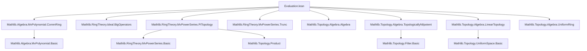

### Technical Brief: Evaluation of Multivariate Power Series in Lean 4

---

#### **1. Key Definitions & Theorems**

| Name | Type / Signature | Purpose |
|------|------------------|---------|
| `HasEval a` | `σ → S → Prop` | Bundles two necessary conditions for evaluating power series at `a`: topological nilpotence of each `a s`, and `a s → 0` along the cofinite filter. |
| `hasEvalIdeal` | `Ideal (σ → S)` | The set of all `a : σ → S` satisfying `HasEval a`, shown to be an ideal. |
| `eval₂ f φ a` | `MvPowerSeries σ R → (R →+* S) → (σ → S) → S` | Evaluation of `f` at `a` via extension from polynomials; defined piecewise using density. |
| `eval₂Hom hφ ha` | `Continuous φ → HasEval a → MvPowerSeries σ R →+* S` | The evaluation map as a **ring homomorphism**, constructed via uniform continuity and density. |
| `aeval ha` | `HasEval a → MvPowerSeries σ R →ₐ[R] S` | Evaluation map as an **algebra homomorphism**, using the algebra structure `R → S`. |
| `eval₂_eq_tsum hφ ha f` | `hφ : Continuous φ → ha : HasEval a → f : MvPowerSeries σ R` | Shows evaluation equals the sum over monomials:  
  $$
  \text{eval₂}(f, φ, a) = \sum'_{d : σ →₀ ℕ} φ(\text{coeff}_d f) \cdot \prod_{s} (a\,s)^{d(s)}
  $$ |
| `aeval_eq_sum ha f` | `ha : HasEval a → f : MvPowerSeries σ R` | Same as above, but for algebra evaluation:  
  $$
  \text{aeval}(f) = \sum'_{d} (\text{coeff}_d f) \cdot \prod_{s} (a\,s)^{d(s)}
  $$ |
| `uniformContinuous_eval₂ hφ ha` | `UniformContinuous (eval₂ φ a)` | Uniform continuity of evaluation under hypotheses. |
| `continuous_eval₂ hφ ha` | `Continuous (eval₂ φ a)` | Continuity follows from uniform continuity. |
| `hasSum_eval₂ hφ ha f` | `HasSum (fun d ↦ φ(coeff d f) * prod ...) (eval₂ f φ a)` | Evaluation is the sum of its monomial evaluations (in the sense of `HasSum`). |
| `aeval_unique hε` | `Continuous ε → (∀ p, ε p = p.aeval a) → ε = aeval ha` | Uniqueness of algebra evaluation under continuity and agreement on polynomials. |

---

#### **2. Naming Conventions**

- **Prefixes**:
  - `hasEval_`: properties of admissible evaluation points (`hasEvalIdeal`, `mem_hasEvalIdeal_iff`, `HasEval.pow`, etc.)
  - `eval₂_`: evaluation-related definitions and lemmas (`eval₂_coe`, `eval₂_X`, `eval₂_eq_tsum`, etc.)
  - `aeval_`: algebra evaluation (`aeval_coe`, `aeval_eq_sum`, `aeval_unique`, etc.)
  - `continuous_`, `uniformContinuous_`: continuity/uniform continuity of evaluation maps.

- **Suffixes**:
  - `_Hom`: ring/algebra homomorphism version (`eval₂Hom`, `aeval`)
  - `_def`: definition lemmas (`hasEval_def`)
  - `_coe`: coercion compatibility (`eval₂_coe`, `aeval_coe`)
  - `_unique`, `_map`: uniqueness or functoriality lemmas.

- **Notable patterns**:
  - `ha : HasEval a`, `hφ : Continuous φ` are standard hypotheses.
  - `ha.map hφ` appears when pushing forward evaluation conditions along continuous ring maps.

---

#### **3. Tactic Stack**

| Tactic | Usage Frequency | Purpose |
|--------|-----------------|---------|
| `simp` / `simp_rw` | Very High | Simplify using definitional equalities, especially `eval₂_coe`, `aeval_coe`, `eval₂_X`, `eval₂_C`. |
| `rw` | High | Rewrite using lemmas like `eval₂_eq_tsum`, `coe_eval₂Hom`, `hasSum_eval₂`. |
| `ext` | Medium | Prove extensionality of functions/homomorphisms. |
| `apply` / `exact` | Medium | Apply lemmas like `uniformContinuous_of_continuousAt_zero`, `hasSum_of_monomials_self`. |
| `cases` / `split_ifs` | Medium | Handle case analysis in `eval₂` definition. |
| `filter_upwards` | Medium | Prove filter convergence statements (e.g., `tendsto_zero`). |
| `convert` | Medium | Transfer `HasSum` along continuous maps. |
| `aesop` / `linarith` | Low | Not used heavily; proofs are mostly algebraic/topological. |
| `set_option backward.privateInPublic true` | Once | To allow private instances in public context (for uniform structures on `MvPolynomial`). |

---

#### **4. Proof Logic**

The logical flow follows a **density + uniform continuity** strategy:

1. **Define admissible evaluation points** (`HasEval`) via topological nilpotence and cofinite convergence.
2. **Show `HasEval` is an ideal** (`hasEvalIdeal`) to support algebraic manipulations.
3. **Equip `MvPolynomial σ R` with induced uniform structure** from `MvPowerSeries σ R`.
4. **Prove `MvPolynomial.eval₂Hom φ a` is uniformly continuous** under `Continuous φ` and `HasEval a`, using:
   - Ideal basis of neighborhoods (via `IsLinearTopology`).
   - Finiteness of support of polynomials.
   - Topological nilpotence to control high powers.
5. **Extend uniformly continuously to `MvPowerSeries`** using `IsDenseInducing.extendRingHom`.
6. **Verify coherence** with polynomial evaluation (`eval₂_coe`), and derive:
   - Continuity/uniform continuity of full evaluation.
   - Series expansion (`eval₂_eq_tsum`, `aeval_eq_sum`).
   - Functoriality (`comp_eval₂`, `comp_aeval`).
   - Uniqueness (`eval₂_unique`, `aeval_unique`).

Induction is not used; instead, the proofs rely on:
- Filter convergence arguments (`tendsto_zero`, `eventually_mem`).
- Properties of ideals and topological nilpotence.
- Uniform continuity and density to lift from polynomials.

---

#### **5. Imports & Dependencies**

| Module | Role |
|--------|------|
| `Mathlib.Algebra.MvPolynomial.CommRing` | Basic structure of multivariate polynomials as commutative rings. |
| `Mathlib.RingTheory.Ideal.BigOperators` | Ideal operations and sums over finite sets. |
| `Mathlib.RingTheory.MvPowerSeries.PiTopology` | Product (Pi) topology on `MvPowerSeries`. |
| `Mathlib.RingTheory.MvPowerSeries.Trunc` | Truncation operations and related lemmas. |
| `Mathlib.Topology.Algebra.Algebra` | Topological algebra basics. |
| `Mathlib.Topology.Algebra.TopologicallyNilpotent` | Topological nilpotence and its properties. |
| `Mathlib.Topology.Algebra.LinearTopology` | Linear topology (basis of neighborhoods by ideals). |
| `Mathlib.Topology.Algebra.UniformRing` | Uniform structures on rings and modules. |

---

#### **6. Mermaid Diagrams**

##### **Dependency Graph (Module-Level)**



##### **Overview of Theory Flow**

```mermaid
flowchart LR
  subgraph Setup
    R[CommRing R] & S[CommRing S]
    φ[R →+* S]
    a[σ → S]
  end

  subgraph Admissibility
    HasEval[HasEval a]
    Ideal[hasEvalIdeal : Ideal (σ → S)]
  end

  subgraph Extension
    Poly[MvPolynomial σ R]
    Pow[MvPowerSeries σ R]
    Uniform[UniformStructure]
    Dense[IsDenseInducing coe]
    Extend[IsDenseInducing.extend]
  end

  subgraph Evaluation
    eval₂[eval₂ : MvPowerSeries → S]
    eval₂Hom[eval₂Hom : RingHom]
    aeval[aeval : AlgHom]
  end

  subgraph Properties
    tsum[eval₂ = tsum of monomials]
    cont[Continuous / Uniformly Continuous]
    uniq[Uniqueness]
    func[Functoriality]
  end

  Setup --> HasEval
  HasEval --> Ideal
  Poly -->|coerce| Pow
  Uniform --> Dense
  Dense --> Extend
  Extend --> eval₂
  eval₂ --> eval₂Hom
  eval₂ --> aeval
  eval₂Hom --> cont
  eval₂ --> tsum
  eval₂ --> uniq
  eval₂ --> func
```

---

#### **7. Summary**

This module formalizes the **evaluation theory of multivariate power series** in a general topological-algebraic setting. It extends polynomial evaluation to power series via density and uniform continuity, under precise topological conditions (`HasEval`). Key contributions include:

- A clean characterization of admissible evaluation points (`HasEval`).
- Construction of evaluation as both ring and algebra homomorphisms.
- Explicit series expansion (`eval₂_eq_tsum`).
- Continuity, uniform continuity, and uniqueness properties.

The formalization is highly structured, leveraging Lean’s `uniformSpace`, `topologicalSpace`, and `ideal` infrastructure to ensure correctness in non-discrete settings (e.g., formal power series rings).
