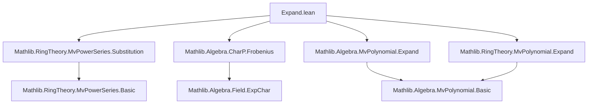

### Technical Brief: `Expand.lean` — Multivariate Power Series Expansion

---

#### **1. Key Definitions & Theorems**

| Name | Type / Signature | Purpose |
|------|------------------|---------|
| `expand` | `MvPowerSeries σ R →ₐ[R] MvPowerSeries σ R` | Algebra homomorphism replacing each `X i` by `X i ^ p`. |
| `expand_C` | `expand p hp (C r) = C r` | Constants are fixed under expansion. |
| `expand_X` | `expand p hp (X i) = X i ^ p` | Action on generators. |
| `expand_monomial` | `expand p hp (monomial d r) = monomial (p • d) r` | Expansion scales exponents by `p`. |
| `expand_one` | `expand 1 one_ne_zero = id` | Identity scaling factor yields identity map. |
| `map_expand` | `map f (expand p hp φ) = expand p hp (map f φ)` | Compatibility with base ring maps. |
| `expand_mul_eq_comp` | `expand (p * q) = expand p ∘ expand q` | Functoriality: expansion by `p*q` = expand by `q`, then `p`. |
| `coeff_expand_smul` | `(expand p hp φ).coeff (p • m) = φ.coeff m` | Coefficient correspondence under scaling support. |
| `coeff_expand_of_not_dvd` | `¬ p ∣ m i ⇒ (expand p hp φ).coeff m = 0` | Only multiples of `p` in exponents survive. |
| `support_expand_subset` / `support_expand` | `(expand p hp φ).support ⊆ φ.support.image (p • ·)` | Support scales exactly by `p`. |
| `order_expand` | `(expand p hp φ).order = p • φ.order` | Order (lowest degree) scales linearly. |
| `expand_eq_expand` | `expand p hp ↑φ = (φ.expand p : MvPowerSeries σ R)` | Coincidence with `MvPolynomial.expand`. |
| `trunc'_expand` | `trunc' (p • n) (expand p hp φ) = (trunc' n φ).expand p` | Truncation commutes with expansion. |
| `map_frobenius_expand` | `(f.expand p).map frobenius = f ^ p` | In characteristic `p`, expansion + Frobenius = Frobenius power. |
| `map_iterateFrobenius_expand` | `map (iterateFrobenius n) (expand (p^n) f) = f ^ p^n` | Iterated Frobenius compatibility. |

---

#### **2. Naming Conventions**

- **Prefixes**:
  - `expand_`: for definitions and properties of the expansion map.
  - `coeff_expand_`: for coefficient-level behavior.
  - `map_expand`: for interaction with ring homomorphisms.
  - `trunc'_expand`: for truncation compatibility.
- **Suffixes**:
  - `_subset`, `_eq`: for inclusion/equality lemmas.
  - `_apply`: for pointwise evaluation versions.
  - `_comp`: for composition/functoriality lemmas.
- **Variables**:
  - `p`, `q`: scaling factors (nonzero naturals).
  - `hp`, `hq`: proofs of nonzeroness.
  - `φ`, `f`: generic power series.
  - `d`, `m`, `n`: finitely supported exponent functions (`σ →₀ ℕ`).

---

#### **3. Tactic Stack**

Frequent tactics used in proofs:
- `simp` / `simp only`: for simplifying definitions (`expand`, `coeff`, `subst`, `monomial`, etc.).
- `ext1`: extensionality on generators or functions.
- `rw`: rewriting using lemmas like `coeff_expand_smul`, `expand_X`, `substAlgHom_X`.
- `conv_lhs`: for targeted rewriting in complex expressions.
- `by_cases` / `by_contra`: case analysis on divisibility or equality.
- `obtain ⟨d, hd⟩`: existential unpacking.
- `simp_rw`: for repeated rewriting with `simp`-friendly lemmas.
- `aesop`: for automated reasoning in simple goals (e.g., `order_le`, `le_of_mul_lt_mul_left'`).
- `exact`, `refine`, `apply`: for direct proof construction.
- `congr`: for congruence closure (e.g., in `map_expand`).

---

#### **4. Proof Logic**

The proofs follow a **structured, modular pattern**:

1. **Definition via substitution**:
   - `expand` is defined as `substAlgHom (HasSubst.X_pow hp)`, leveraging existing substitution machinery.

2. **Base cases & generator behavior**:
   - Prove behavior on constants (`C r`) and generators (`X i`) first.

3. **Extension to monomials & general series**:
   - Use `substAlgHom_monomial` and `Finsupp` properties to lift to monomials.
   - General series follow by continuity (as limits of truncations) or coefficient-wise reasoning.

4. **Support & coefficient analysis**:
   - Key lemmas (`coeff_expand_smul`, `coeff_expand_of_not_dvd`) rely on:
     - Divisibility arguments (`¬ p ∣ m i ⇒ coeff = 0`)
     - Finsupp support manipulation (`d = p • m` iff `p ∣ d i` for all `i`)

5. **Functoriality & composition**:
   - `expand_mul_eq_comp` uses `subst_comp_subst_apply` and `subst_pow`.
   - `map_expand` uses `map_subst`.

6. **Compatibility with truncation & polynomials**:
   - `trunc'_expand` uses case analysis on divisibility and truncation definitions.

7. **Characteristic `p` theory**:
   - `map_frobenius_expand` uses `eq_iff_frequently_trunc'_eq` and truncation lemmas.
   - `map_iterateFrobenius_expand` uses induction + `expand_mul_eq_comp`.

---

#### **5. Imports & Dependencies**

| Module | Role |
|--------|------|
| `Mathlib.RingTheory.MvPowerSeries.Substitution` | Provides `substAlgHom`, `HasSubst`, substitution machinery. |
| `Mathlib.Algebra.CharP.Frobenius` | Frobenius endomorphism and iterates. |
| `Mathlib.Algebra.MvPolynomial.Expand` | `MvPolynomial.expand` for comparison and lifting. |
| `Mathlib.RingTheory.MvPolynomial.Expand` | Additional polynomial expansion lemmas (e.g., `coeff_expand_smul`). |

> **Note**: The file bridges `MvPolynomial` and `MvPowerSeries`, using truncation to relate them.

---

#### **6. Mermaid Diagrams**

##### **Dependency Graph (Module-Level)**



##### **Overview of Theory Flow**

```mermaid
flowchart LR
  A[MvPowerSeries σ R] -->|substAlgHom| B[expand p hp]
  B --> C[Algebra Homomorphism]
  C --> D[Support scaling: supp(expand φ) = p • supp φ]
  C --> E[Coefficient shift: coeff_{p•m}(expand φ) = coeff_m(φ)]
  C --> F[Functoriality: expand(p*q) = expand(p) ∘ expand(q)]
  C --> G[Char p: expand(p) + Frobenius = (−)^p]
  G --> H[Iterated Frobenius: expand(p^n) ↦ (−)^{p^n}]
  A -->|trunc'| I[MvPolynomial]
  I -->|expand| J[MvPowerSeries]
  J -->|coeff| K[Divisibility conditions]
```

---

#### **7. Summary**

This module formalizes the **expansion operation** on multivariate power series — a fundamental endomorphism scaling exponents by a nonzero natural `p`. It establishes:

- **Algebraic structure**: `expand` is an `R`-algebra homomorphism.
- **Support & coefficient behavior**: Only `p`-scaled exponents survive; coefficients are preserved under scaling.
- **Functoriality**: `expand(p*q) = expand(p) ∘ expand(q)`.
- **Compatibility**: With base change (`map`), truncation, and polynomial embedding.
- **Characteristic `p` theory**: Links expansion to Frobenius, yielding `f.expand p ↦ f^p` under `ExpChar R p`.

It serves as a bridge between `MvPolynomial` and `MvPowerSeries`, enabling transfer of properties and supporting deeper results in positive characteristic.
