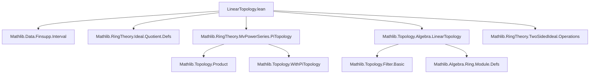

### Technical Brief: `LinearTopology.lean` in `MvPowerSeries`

---

#### **1. Key Definitions & Theorems**

| Name | Type / Signature | Purpose |
|------|------------------|---------|
| `basis` | `σ : Type* → R : Type* [Ring R] → TwoSidedIdeal R × (σ →₀ ℕ) → TwoSidedIdeal (MvPowerSeries σ R)` | Constructs a two-sided ideal of multivariate power series whose coefficients vanish or lie in a given ideal for exponents ≤ a bound. |
| `mem_basis_iff` | `f ∈ basis σ R Jd ↔ ∀ e ≤ Jd.2, coeff e f ∈ Jd.1` | Characterizes membership in `basis` via coefficient conditions. |
| `basis_le` | `(Jd.1 ≤ Ke.1) → (Ke.2 ≤ Jd.2) → basis σ R Jd ≤ basis σ R Ke` | Monotonicity of `basis` w.r.t. ideal inclusion and bound weakening. |
| `basis_le_iff` | `K ≠ ⊤ → (basis σ R ⟨J, d⟩ ≤ basis σ R ⟨K, e⟩) ↔ J ≤ K ∧ e ≤ d` | Converse monotonicity under non-top-ideal assumption. |
| `hasBasis_nhds_zero` | `(𝓝 0).HasBasis (fun ⟨J, d⟩ ↦ J ∈ 𝓝 0) (fun ⟨J, d⟩ ↦ basis _ _ ⟨J, d⟩)` | Shows that `basis` ideals form a neighborhood basis of 0 for the product topology when `R` is linearly topologized. |
| `IsLinearTopology.mk_of_hasBasis'` (instances) | `IsLinearTopology (MvPowerSeries σ R) (MvPowerSeries σ R)` and its opposite | Proves left/right linearity of the topology on `MvPowerSeries σ R` using `hasBasis_nhds_zero`. |
| `isTopologicallyNilpotent_of_constantCoeff` | `(IsTopologicallyNilpotent (constantCoeff f)) → IsTopologicallyNilpotent f` | Lifts topological nilpotence from constant term to full series. |
| `isTopologicallyNilpotent_iff_constantCoeff` | `Tendsto (fun n ↦ f ^ n) atTop (nhds 0) ↔ IsTopologicallyNilpotent (constantCoeff f)` | Equivalence between convergence of powers to 0 and constant coefficient being topologically nilpotent. |

---

#### **2. Naming Conventions**

- **Prefixes**:
  - `basis_`: for constructions and properties of the basis ideals.
  - `mem_`: membership characterizations.
  - `isTopologicallyNilpotent_`: for properties related to topological nilpotence.
- **Suffixes**:
  - `_iff`: biconditional characterizations.
  - `_le`: monotonicity or inclusion lemmas.
  - `_mk_of_hasBasis'`: instance construction via basis criteria.
- **Structure**:
  - `⟨J, d⟩` notation for pairs in `TwoSidedIdeal R × (σ →₀ ℕ)`.
  - `Jd.1`, `Jd.2`: projection of pair components.

---

#### **3. Tactic Stack**

| Tactic | Usage Frequency | Purpose |
|--------|-----------------|---------|
| `simp` / `simp_rw` | High | Simplify goals using definitional equalities, especially `coeff`, `map_add`, `coeff_mul`, `constantCoeff_map`. |
| `rw` | High | Rewrite using lemmas like `mem_basis_iff`, `map_pow`, `coeff_zero`. |
| `exact` / `apply` | Medium | Apply known facts (e.g., `J.zero_mem`, `add_mem`, `mul_mem_left`). |
| `intro` / `rintro` | Medium | Introduce hypotheses and destruct conjunctions/pairs. |
| `convert` | Low | Align goals with known lemmas (e.g., `convert hf _ ...`). |
| `classical` | Low | Enable classical reasoning for equivalence proofs. |
| `by_contra` | Low | For contradiction arguments in `basis_le_iff`. |
| `Finset`-related tactics (`sup`, `antidiagonal`, `le_trans`) | Medium | Reason about finite sums and exponent bounds. |
| `simpa` | Medium | Simplify and discharge goals using assumptions. |

---

#### **4. Proof Logic**

- **Structure of proofs**:
  - **Basis properties**: Prove ideal axioms directly (e.g., `basis` definition), then use `simp` and `rw` to reduce membership conditions.
  - **Monotonicity (`basis_le`, `basis_le_iff`)**:
    - Use `forall_imp` and `le_trans` for forward direction.
    - For backward direction, construct explicit elements (e.g., `C x`, `monomial e x`) to test ideal inclusion.
  - **Neighborhood basis (`hasBasis_nhds_zero`)**:
    - Use `nhds_pi` to reduce to product topology basis.
    - Apply `IsLinearTopology.hasBasis_twoSidedIdeal.pi_self.to_hasBasis`.
    - Use `Finset.sup` and `finite_Iic` to relate bounds and ideals.
  - **Topological nilpotence**:
    - Use `tendsto_iff_coeff_tendsto` to reduce to coefficient-wise convergence.
    - Apply `coeff_eq_zero_of_constantCoeff_nilpotent` to lift nilpotence from constant term.
    - Use `map_pow`, `constantCoeff_map`, and `Ideal.Quotient.eq_zero_iff_mem` to connect powers and quotients.

- **Induction / recursion**: Not used directly; proofs rely on algebraic properties and filter/basis arguments.

---

#### **5. Imports & Dependencies**

| Import | Role |
|--------|------|
| `Mathlib.Data.Finsupp.Interval` | For finite support functions (`σ →₀ ℕ`) and interval bounds (`Iic d`). |
| `Mathlib.RingTheory.Ideal.Quotient.Defs` | For quotient ring constructions and nilpotence criteria. |
| `Mathlib.RingTheory.MvPowerSeries.PiTopology` | Product topology structure on `MvPowerSeries`. |
| `Mathlib.Topology.Algebra.LinearTopology` | Core definitions: `IsLinearTopology`, neighborhood bases of 0. |
| `Mathlib.RingTheory.TwoSidedIdeal.Operations` | Ideal operations and membership lemmas. |

---

#### **6. Mermaid Diagrams**

##### **Dependency Graph (Module Level)**



##### **Theory Overview (Module Internal)**

```mermaid
graph TD
  MvPowerSeries[ MvPowerSeries σ R ]
  LinearTopology[ LinearTopology on MvPowerSeries ]

  MvPowerSeries --> LinearTopology

  subgraph BasisConstruction
    basis[ basis σ R Jd ]
    mem_basis_iff[ mem_basis_iff ]
    basis_le[ basis_le ]
    basis_le_iff[ basis_le_iff ]
  end

  subgraph Topology
    hasBasis_nhds_zero[ hasBasis_nhds_zero ]
    IsLinearTopology_left[ IsLinearTopology (MvPowerSeries) ]
    IsLinearTopology_right[ IsLinearTopologyᵐᵒᵖ (MvPowerSeries) ]
  end

  subgraph Nilpotence
    isTopologicallyNilpotent_of_constantCoeff[ lift nilpotence ]
    isTopologicallyNilpotent_iff_constantCoeff[ equivalence ]
  end

  LinearTopology --> BasisConstruction
  LinearTopology --> Topology
  LinearTopology --> Nilpotence
```

---

#### **7. Summary**

This module establishes that the product topology on multivariate power series `MvPowerSeries σ R` is linear when `R` is linearly topologized. It constructs an explicit neighborhood basis of 0 using ideals cutting off low-degree terms and controlling coefficients modulo ideals in `R`. It further characterizes topological nilpotence of a series in terms of its constant coefficient, yielding a clean convergence criterion for powers of series.

The formalization leverages:
- `TwoSidedIdeal` to encode coefficient constraints,
- `finsupp` to handle finite exponent support,
- `WithPiTopology` for the product topology,
- `IsLinearTopology` to encode compatibility of multiplication with the topology.

It sets the stage for further module-theoretic generalizations (e.g., `M⟦X⟧` over `R⟦X⟧`) as noted in the docstring.
