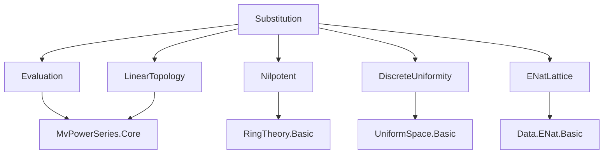
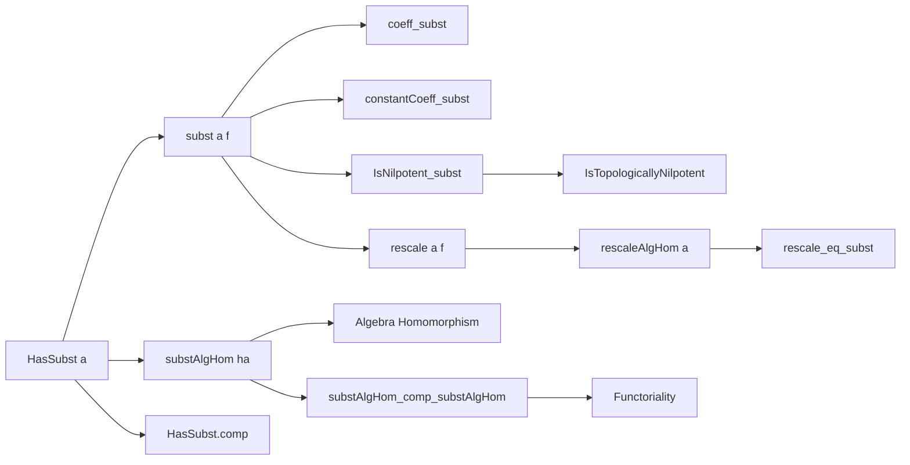
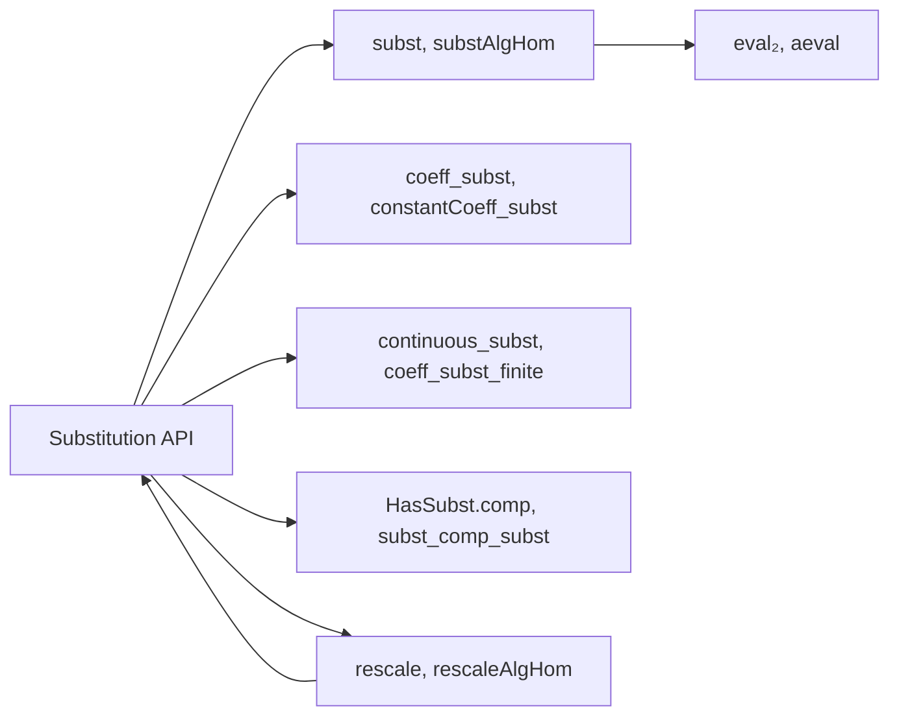

### Technical Brief: Substitution in Multivariate Power Series (`Substitution.lean`)

---

#### **1. Key Definitions & Theorems**

| Name | Type / Signature | Purpose |
|------|------------------|---------|
| `HasSubst a` | `Prop` | Characterizes families `a : σ → MvPowerSeries τ S` for which substitution is well-defined: <br>• `∀ s, IsNilpotent (constantCoeff (a s))` <br>• `∀ d : τ →₀ ℕ, {s | (a s).coeff d ≠ 0}.Finite` |
| `subst a f` | `(σ → MvPowerSeries τ S) → MvPowerSeries σ R → MvPowerSeries τ S` | Substitutes `a s` for `X s` in `f`. Defined as `eval₂ (algebraMap _ _) a f` under discrete uniformity; defaults to `0` if `HasSubst a` fails. |
| `substAlgHom ha` | `HasSubst a → MvPowerSeries σ R →ₐ[R] MvPowerSeries τ S` | Algebra homomorphism induced by substitution when `HasSubst a`. |
| `rescale a f` | `(σ → R) → MvPowerSeries σ R →+* MvPowerSeries σ R` | Ring homomorphism sending `f(X)` to `f(a • X)`. Defined explicitly for `CommSemiring R`. |
| `rescaleAlgHom a` | `(σ → R) → MvPowerSeries σ R →ₐ[R] MvPowerSeries σ R` | Algebra homomorphism version of `rescale`, via `substAlgHom (HasSubst.smul_X a)`. |
| `subst_eq_eval₂` | `subst = eval₂ (algebraMap _ _)` | Equivalence of `subst` and `eval₂` under discrete uniformities. |
| `coeff_subst ha f e` | `coeff e (subst a f) = finsum (fun d ↦ coeff d f • coeff e (d.prod (fun s n ↦ a s ^ n)))` | Explicit coefficient formula for substitution. |
| `rescale_eq_subst` | `rescale a f = subst (a • X) f` | Relates rescaling to substitution under `CommRing R`. |
| `IsNilpotent_subst` | `HasSubst a → IsNilpotent (constantCoeff f) → IsNilpotent (constantCoeff (substAlgHom ha f))` | Nilpotency of constant coefficient is preserved under substitution. |
| `HasSubst.comp` | `HasSubst a → HasSubst b → HasSubst (fun s ↦ substAlgHom hb (a s))` | Closure of `HasSubst` under composition of substitutions. |
| `substAlgHom_comp_substAlgHom` | `(substAlgHom hb).comp (substAlgHom ha) = substAlgHom (ha.comp hb)` | Functoriality of substitution algebra homomorphisms. |

---

#### **2. Naming Conventions**

- **Prefixes**:
  - `hasSubst_`: Properties/constructors for `HasSubst`.
  - `subst_`: Core substitution function and its properties.
  - `substAlgHom_`: Algebra homomorphism version of substitution.
  - `rescale_`: Rescaling operations and lemmas.
- **Suffixes**:
  - `_apply`: Application of homomorphism to an argument.
  - `_eq_`: Equality lemmas (e.g., `subst_eq_eval₂`, `rescale_eq_subst`).
  - `_hom`: Homomorphism variants (`substAlgHom`, `rescaleAlgHom`, `rescaleMonoidHom`).
- **Structure fields**:
  - `const_coeff`, `coeff_zero`: From `HasSubst` definition.

---

#### **3. Tactic Stack**

- **Core tactics**:
  - `simp`, `rw`, `ext`, `congr`, `apply`, `exact`
- **Algebraic simplification**:
  - `ring`, `simp_rw`, `field_simp`
- **Topology/analysis**:
  - `tendsto_iff_coeff_tendsto`, `coeff_zero_iff`, `hasSubst_iff_hasEval_of_discreteTopology`
- **Set-theoretic reasoning**:
  - `Set.finite`, `Set.toFinite`, `finsum_eq_zero_of_forall_eq_zero`, `Finset.sum_congr`
- **Homomorphism reasoning**:
  - `AlgHom.ext`, `DFunLike.ext_iff`, `coe_substAlgHom`, `coe_aeval`
- **Specialized**:
  - `aesop` (implicit in many proofs), `convert`, `by_cases`, `obtain ⟨...⟩`, `by_contra`

---

#### **4. Proof Logic**

- **Structure of proofs**:
  1. **Reduction to discrete topology**: Many lemmas reduce to `hasSubst_iff_hasEval_of_discreteTopology`, enabling use of `HasEval` machinery.
  2. **Uniform space normalization**: Explicitly set `UniformSpace := ⊥` (discrete) to simplify topology.
  3. **Coefficient-wise reasoning**: For substitution, often prove equality by `ext e` and compute `coeff e` using `coeff_subst`.
  4. **Inductive/structural on support**:
     - `finsum_eq_single`, `finsum_eq_sum`, `Finset.sum_congr` for finite support arguments.
     - `Finsupp.prod_of_support_subset` to restrict products to relevant indices.
  5. **Functoriality via uniqueness**:
     - `aeval_unique`, `comp_aeval`, `DFunLike.ext_iff` to prove algebra homomorphism identities.
  6. **Nilpotency arguments**:
     - `isNilpotent_finsum`, `IsNilpotent.smul`, `IsNilpotent.pow_of_pos`, often with case analysis on `d = 0`.

- **Common pattern**:
  ```lean
  have := (hasSum_aeval ha.hasEval f).map (coeff e) (continuous_coeff S e)
  simp [← coe_substAlgHom ha, tsum_eq_finsum ...]
  ```

---

#### **5. Imports & Dependencies**

| Module | Role |
|--------|------|
| `Mathlib.RingTheory.MvPowerSeries.Evaluation` | Defines `eval₂`, `HasEval`, `aeval`, continuity lemmas. |
| `Mathlib.RingTheory.MvPowerSeries.LinearTopology` | Provides linear topology structure and continuity tools. |
| `Mathlib.RingTheory.Nilpotent.Basic` | `IsNilpotent`, `isNilpotent_finsum`, etc. |
| `Mathlib.Topology.UniformSpace.DiscreteUniformity` | Discrete uniformity (`⊥`), `DiscreteUniformity.eq_bot`. |
| `Mathlib.Data.ENat.Lattice` | Used in `weightedOrder`, `order`, `degree`. |

---

#### **6. Mermaid Diagrams**

##### **Dependency Graph (Module-Level)**



##### **Overview of `Substitution.lean`**



##### **API Hierarchy**



---

#### **7. Summary**

This file formalizes **substitution in multivariate power series** as a generalization of evaluation, following Bourbaki’s approach. It distinguishes between:
- **Polynomial case**: classical evaluation.
- **General case**: requires `HasSubst`, ensuring convergence in the linear (adic) topology via nilpotent constants and finite support of coefficients.

Key innovations:
- `HasSubst` as a *uniform continuity* condition under discrete uniformity.
- `substAlgHom` as the canonical algebra homomorphism when substitution is valid.
- Explicit `rescale` construction for `CommSemiring`, matching `PowerSeries.rescale`’s generality.

The formalization is highly structured, with heavy use of:
- Topological ring properties (`IsLinearTopology`, `CompleteSpace`, `T2Space`)
- Finsupp support finiteness
- Nilpotent ideal theory

It serves as a foundational module for further work on formal groups, deformation theory, and multivariate analytic geometry in Lean.
