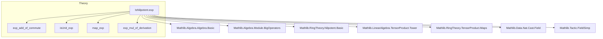
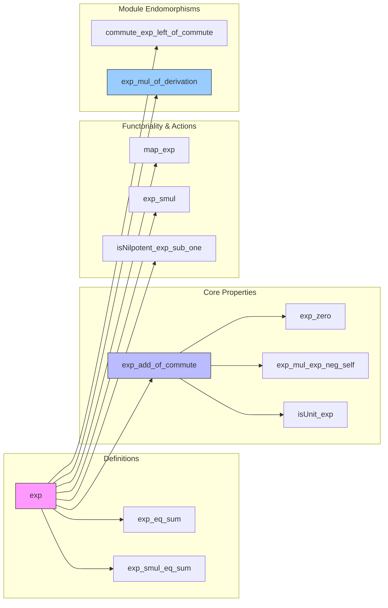

### Technical Brief: Exponential Map on Nilpotent Elements in ℚ-Algebras

---

#### **1. Key Definitions & Theorems**

| Name | Type / Signature | Purpose |
|------|------------------|---------|
| `exp` | `exp : A → A` | Defines the exponential map for nilpotent elements in a ℚ-algebra $A$, via finite sum: $\sum_{i=0}^{n-1} \frac{1}{i!} a^i$, where $n = \text{nilpotencyClass}(a)$. |
| `exp_eq_sum` | `a ^ k = 0 ⇒ exp a = ∑ i ∈ range k, (i ! : ℚ)⁻¹ • a ^ i` | Shows that the exponential sum truncates at any $k$ such that $a^k = 0$. |
| `exp_smul_eq_sum` | `(a ^ k) • m = 0 ⇒ exp a • m = ∑ i ∈ range k, (i ! : ℚ)⁻¹ • (a ^ i) • m` | Extends the exponential action to modules: action of `exp a` on $m$ truncates similarly. |
| `exp_add_of_commute` | `Commute a b ∧ IsNilpotent a ∧ IsNilpotent b ⇒ exp(a + b) = exp a * exp b` | Core property: exponential turns addition into multiplication for *commuting* nilpotents. |
| `exp_zero` | `exp 0 = 1` | Normalization at zero. |
| `exp_mul_exp_neg_self` / `exp_neg_mul_exp_self` | `IsNilpotent a ⇒ exp a * exp (-a) = 1` and vice versa | Shows `exp(-a)` is a two-sided inverse of `exp a`. |
| `isUnit_exp` | `IsNilpotent a ⇒ IsUnit (exp a)` | Consequence: exponential of a nilpotent is always a unit. |
| `map_exp` | `f(exp a) = exp(f a)` for ring homomorphisms $f$ | Functoriality: exponential commutes with ℚ-algebra homomorphisms. |
| `exp_smul` | `exp(g • a) = g • exp a` for multiplicative monoid action | Compatibility with scalar action. |
| `isNilpotent_exp_sub_one` | `IsNilpotent a ⇒ IsNilpotent (exp a - 1)` | Shows `exp a - 1` is nilpotent (useful for pro-unipotent structures). |
| `commute_exp_left_of_commute` | `fN ∘ g = g ∘ fM ⇒ exp fN ∘ g = g ∘ exp fM` | Lifts exponential to module endomorphisms under intertwining. |
| `exp_mul_of_derivation` | `exp D (x * y) = exp D x * exp D y` for derivation $D$ | Exponential of a nilpotent derivation acts as an algebra automorphism (like flow of vector field). |

---

#### **2. Naming Conventions**

- **Prefixes**:
  - `exp_`: all definitions and theorems related to the exponential map.
  - `isNilpotent_`: properties of nilpotent elements or derived from nilpotency.
  - `commute_`: results about commuting elements or maps.
- **Suffixes**:
  - `_eq_sum`: equality with truncated sum.
  - `_of_commute`: requires commutativity.
  - `_left_of_commute` / `_right_of_commute`: for left/right actions under intertwining.
  - `_mul`, `_add`, `_neg`: structural behavior (multiplicative, additive, inverse).
- **Other**:
  - `map_`: functoriality under homomorphisms.
  - `smul_`: behavior under module actions.

---

#### **3. Tactic Stack**

Frequently used tactics in proofs:

| Tactic | Role |
|--------|------|
| `rcases` / `obtain` | Extract nilpotency witnesses (`⟨n, hn⟩`). |
| `rw [exp_eq_sum ...]` | Replace `exp` with finite sum using nilpotency. |
| `sum_congr`, `sum_bij`, `sum_sigma'` | Manipulate multi-dimensional sums (e.g., binomial expansion). |
| `simp_rw`, `simp only`, `simp` | Simplify using definitions, especially with `mem_range`, `mem_filter`, `smul`, `pow`. |
| `norm_cast`, `field` | Handle rational coefficients and factorial inverses. |
| `omega`, `lia`, `linarith` | Solve arithmetic inequalities (e.g., bounds on nilpotency class). |
| `exact sum_eq_zero fun ... ↦ ?_` | Prove sums vanish by showing each term is zero. |
| `calc` / `have ... := by calc` | Chain equalities in structured fashion (used heavily in `exp_add_of_commute`). |
| `ext` | Extensionality for linear maps. |
| `map_rat_smul`, `smul_assoc`, `mul_smul_comm` | Rewriting lemmas for scalar multiplication. |

---

#### **4. Proof Logic**

The core logical flow (especially in `exp_add_of_commute`) is:

1. **Truncation via nilpotency**: Use `exp_eq_sum` to reduce infinite series to finite sums using bounds from nilpotency classes.
2. **Binomial expansion**: Expand $(a + b)^i$ using `Commute.add_pow`, then reorganize double sums.
3. **Index manipulation**:
   - Filter the product index set $[0, 2N] \times [0, 2N]$ into regions where terms vanish (e.g., $i > N$ or $j > N$).
   - Show vanishing via `pow_eq_zero_of_le` and nilpotency.
4. **Reindexing sums**:
   - Use `sum_bij` or `sum_sigma'` to convert between sum over $i + j \le 2N$ and product of ranges.
5. **Factorial identities**:
   - Use `Nat.choose_eq_factorial_div_factorial` and divisibility of factorials to match coefficients.
6. **Factorization**:
   - Recognize resulting double sum as product of two single sums (`sum_mul_sum`).
7. **Conclusion**: Match with `exp a * exp b`.

For module-theoretic results (`commute_exp_left_of_commute`, `exp_mul_of_derivation`), the logic lifts via:
- Tensor product constructions (`lTensor`, `rTensor`).
- Functoriality (`map_exp`) and commutation properties.
- Application of earlier lemmas (`exp_add_of_commute`, `commute_exp_left_of_commute`).

---

#### **5. Imports & Scope**

**Primary Dependencies**:
- `Mathlib.Algebra.Algebra.Basic`, `Bilinear`: foundational algebra.
- `Mathlib.Algebra.Module.*`: module theory, big operators, rational modules.
- `Mathlib.LinearAlgebra.TensorProduct.Tower`: tensor product over rings, used in derivation case.
- `Mathlib.RingTheory.TensorProduct.Maps`: maps on tensor products.
- `Mathlib.RingTheory.Nilpotent.Basic`: nilpotency class, powers, etc.
- `Mathlib.Data.Nat.Cast.Field`: rational field embedding, factorial inverses.
- `Mathlib.Tactic.FieldSimp`: simplification in fields (e.g., for rational coefficients).

**Scope**:  
This module formalizes the exponential map in the context of **nilpotent elements in ℚ-algebras**, with extensions to:
- Module actions,
- Linear endomorphisms,
- Derivations on non-unital rings.

It serves as a stepping stone for:
- Pro-unipotent group theory,
- Lie theory over ℚ (e.g., exponential map from nilpotent Lie algebras),
- Deformation theory (where $e^D$ acts as gauge transformations).

---

#### **6. Mermaid Diagrams**

##### **Dependency Graph (Top-Level)**

##### **Overview of File Structure**

---

#### **7. Summary**

This file formalizes the **exponential map on nilpotent elements in ℚ-algebras**, establishing its algebraic properties (e.g., homomorphism property for commuting nilpotents, invertibility, compatibility with homomorphisms and actions). It serves as a foundational tool for Lie-theoretic and deformation-theoretic applications in Lean, especially where nilpotent structures arise (e.g., in characteristic zero). The proofs rely heavily on finite truncation, binomial expansions, and careful index manipulation — all verified rigorously in Lean’s dependent type theory.
