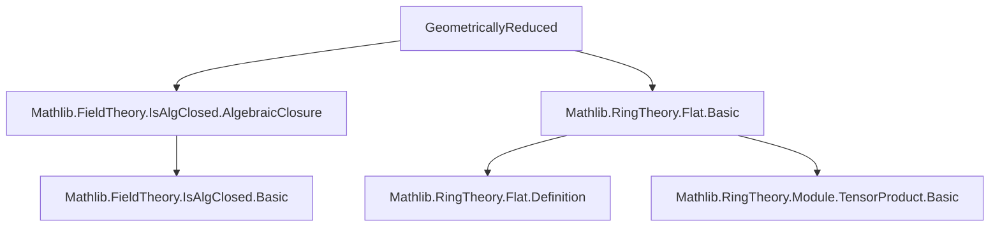

**Technical Brief: `GeometricallyReduced.lean`**

---

### 1. **Key Definitions & Theorems**

| Name | Type / Signature | Purpose |
|------|------------------|---------|
| `IsGeometricallyReduced` | `class IsGeometricallyReduced [Field k] [Ring A] [Algebra k A] : Prop` | Defines a `k`-algebra `A` as *geometrically reduced* iff $ \overline{k} \otimes_k A $ is reduced, where $ \overline{k} = \text{AlgebraicClosure } k $. |
| `isReduced_of_isGeometricallyReduced` | `[IsGeometricallyReduced k A] → IsReduced A` | Shows that geometrically reduced implies reduced (via base change along $ k \hookrightarrow \overline{k} $). |
| `IsGeometricallyReduced.of_injective` | `(f : A →ₐ[k] B) → Function.Injective f → IsGeometricallyReduced k B → IsGeometricallyReduced k A` | Pulls back geometric reducedness along injective algebra maps. |
| `IsGeometricallyReduced.of_forall_fg` | `(h : ∀ B : Subalgebra k A, B.FG → IsGeometricallyReduced k B) → IsGeometricallyReduced k A` | If all *finitely generated* $k$-subalgebras of $A$ are geometrically reduced, then $A$ is. |
| `instance isReduced_of_isAlgebraic_of_isGeometricallyReduced` | `[Field K] [Algebra k K] [IsAlgebraic k K] [IsGeometricallyReduced k A] → IsReduced (K ⊗[k] A)` | Extends reducedness from algebraic closure to *any* algebraic field extension. |

---

### 2. **Naming Conventions**

- **Prefixes**:
  - `isReduced_...`: Properties about reducedness (e.g., `isReduced_of_injective`).
  - `IsGeometricallyReduced...`: Class and lemmas about the main notion.
- **Suffixes**:
  - `_of_...`: Implication direction (e.g., `of_injective`, `of_forall_fg`).
  - `_tensorProduct`: Tensor product constructions (e.g., `isReduced_algebraicClosure_tensorProduct`).
- **Structure**:
  - `Algebra.TensorProduct.map f g`: Tensor map induced by $f, g$.
  - `includeRight`, `includeLeft`: Canonical inclusions into tensor products.

---

### 3. **Tactic Stack**

| Tactic | Usage |
|--------|-------|
| `simp_rw` | Rewriting with definitional equivalences (e.g., `isGeometricallyReduced_iff`). |
| `exact` | Finishing proofs with a direct instance or lemma. |
| `⟨...⟩` | Constructor for inductive propositions/classes (here, `IsGeometricallyReduced`). |
| `isReduced_of_injective` | Core proof pattern: reducedness descends along injective maps. |
| `Module.Flat.*_preserves_injective_linearMap` | Uses flatness (e.g., `lTensor_preserves_injective_linearMap`, `rTensor_preserves_injective_linearMap`) to lift injectivity to tensor maps. |
| `FaithfulSMul.algebraMap_injective` | To prove injectivity of structure maps. |

---

### 4. **Proof Logic**

- **General pattern**:
  1. Reduce to checking reducedness of a tensor product.
  2. Use injectivity of a map into a known reduced ring (often $ \overline{k} \otimes_k A $).
  3. Apply `isReduced_of_injective`, verifying injectivity via flatness or faithful flatness.
- **`of_forall_fg`**:
  - Uses a global characterization: reducedness of a module is equivalent to reducedness of all its finitely generated submodules (via `IsReduced.tensorProduct_of_flat_of_forall_fg`).
  - Relies on flatness of $ \overline{k} $ over $ k $ (since algebraic closures are flat).
- **`of_injective`**:
  - Base change preserves injectivity of algebra maps under flat base change (here, $ \overline{k} $ is flat over $ k $).

---

### 5. **Imports**

| Import | Purpose |
|--------|---------|
| `Mathlib.FieldTheory.IsAlgClosed.AlgebraicClosure` | Provides `AlgebraicClosure k`, its universal property (`lift`), and that it’s algebraically closed and algebraic over $k$. |
| `Mathlib.RingTheory.Flat.Basic` | Provides flatness results: `lTensor_preserves_injective_linearMap`, `rTensor_preserves_injective_linearMap`, and `Flat.algebra_of_isAlgebraic`. |

---

### 6. **Mermaid Diagrams**

#### **Dependency Graph (Module-Level)**



#### **Conceptual Overview (Theory Flow)**

```mermaid
flowchart LR
  A[Commutative k-algebra A] -->|definition| B[IsGeometricallyReduced k A]
  B -->|iff| C[AlgebraicClosure k ⊗[k] A is reduced]
  C -->|flatness| D[Injectivity of structure maps]
  D -->|isReduced_of_injective| E[Reducedness of tensor products]
  B -->|of_injective| F[Subalgebras / monomorphisms]
  B -->|of_forall_fg| G[Finitely generated subalgebras]
  G -->|local-global principle| C
```

---

### 7. **Open Questions / TODOs**

- **Equivalence with Stacks definition**: The Stacks Project defines geometrically reduced as $ K \otimes_k A $ reduced for *all* field extensions $ K/k $. This file only proves it for algebraic extensions (`instance`), and the full equivalence is pending.
- **Full extension result**: Prove `IsGeometricallyReduced k A → ∀ (K : Type*) [Field K] [Algebra k K], IsReduced (K ⊗[k] A)`.

--- 

Let me know if you'd like the corresponding Lean code annotated with proof strategy or a formalization roadmap for the remaining TODO.
