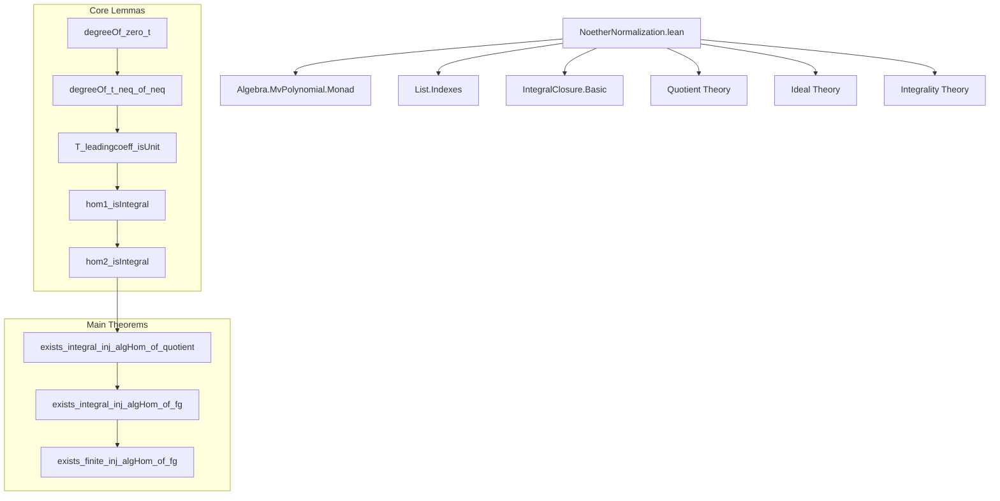
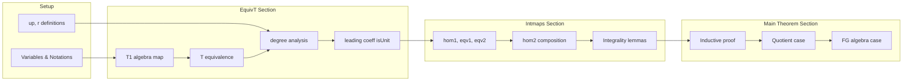

### Technical Brief: `NoetherNormalization.lean`

---

#### **1. Key Definitions & Theorems**

| Name | Type / Signature | Purpose |
|------|------------------|---------|
| `up` | `2 + f.totalDegree` | A sufficiently large integer used to ensure distinct monomial degrees under transformation. |
| `r` | `fun i ↦ up ^ i.1` | Exponent function assigning powers of `up` to variables for the Noether normalization map. |
| `T1 c` | `MvPolynomial (Fin (n+1)) k →ₐ[k] MvPolynomial (Fin (n+1)) k` | Algebra map sending `X₀ ↦ X₀`, `Xᵢ ↦ Xᵢ + c • X₀^(up^i)` for `i ≠ 0`. |
| `T` | `AlgEquiv ...` | Algebra equivalence induced by `T1 1` with inverse `T1 (-1)`. |
| `degreeOf_zero_t` | `((T f) (monomial v a)).degreeOf 0 = ∑ i, r i * v i` | Computes degree in `X₀` after applying `T`. |
| `degreeOf_t_neq_of_neq` | `v ≠ w ⇒ (T f (monomial v (coeff v f))).degreeOf 0 ≠ ...` | Ensures distinct monomials get distinct degrees in `X₀` under `T`. |
| `T_leadingcoeff_isUnit` | `f ≠ 0 ⇒ IsUnit ((finSuccEquiv (T f f))).leadingCoeff` | Shows that after applying `T`, the leading coefficient (in `X₀`) becomes invertible. |
| `hom1` | `MvPolynomial (Fin n) k →ₐ[MvPolynomial (Fin n) k] ...` | Homomorphism into a quotient where the image of `f` becomes monic in `X`. |
| `hom1_isIntegral` | `f ∈ I ∧ f ≠ 0 ⇒ hom1 f I .IsIntegral` | Proves `hom1` is integral due to monic polynomial in the ideal. |
| `eqv1`, `eqv2` | `≃ₐ[k]` | Natural algebra isomorphisms linking various quotient constructions. |
| `hom2` | `MvPolynomial (Fin n) k →ₐ[k] MvPolynomial (Fin (n+1)) k ⧸ I` | Composition of `hom1`, `eqv1`, `eqv2`; integral by transitivity. |
| `hom2_isIntegral` | `f ∈ I ∧ f ≠ 0 ⇒ hom2 f I .IsIntegral` | Integral property of `hom2`. |
| `exists_integral_inj_algHom_of_quotient` | `I ≠ ⊤ ⇒ ∃ s ≤ n, ∃ g : MvPolynomial (Fin s) k →ₐ[k] ..., injective ∧ integral` | Main inductive step for Noether normalization on quotients of multivariate polynomial rings. |
| `exists_integral_inj_algHom_of_fg` | `[Algebra.FiniteType k R] ⇒ ∃ s, ∃ g : MvPolynomial (Fin s) k →ₐ[k] R, injective ∧ integral` | **Noether Normalization Lemma**: existence of integral injective map from a polynomial subring. |
| `exists_finite_inj_algHom_of_fg` | Same as above but with `g.Finite` instead of `g.IsIntegral` | Stronger version: finite (i.e., module-finite) extension. |

---

#### **2. Naming Conventions**

- **Prefixes**:
  - `T`, `T1`: Transformation maps used to prepare polynomials for normalization.
  - `hom1`, `hom2`: Homomorphisms used in constructing integral extensions.
  - `eqv1`, `eqv2`: Equivalences (isomorphisms) between quotient algebras.
  - `up`, `r`: Helper functions for degree control.
- **Suffixes**:
  - `_isIntegral`: Predicate that a map is integral.
  - `_isUnit`: Predicate that an element is invertible.
  - `_neq_of_neq`: Inequality derived from inequality of inputs.
  - `_of_...`: Construction from specific data (e.g., `of_quotient`, `of_fg`).
- **General patterns**:
  - `quotientEquivAlg`: Constructs algebra isomorphisms from ideal maps.
  - `kerLiftAlg`: Lifts algebra homomorphisms through quotients.
  - `aeval`, `algebraMap`, `map`, `comp`: Standard algebraic constructions.

---

#### **3. Tactic Stack**

Frequently used tactics in this file:

| Tactic | Usage |
|--------|-------|
| `simp` / `simp only` | Simplifying expressions involving `aeval`, `map`, `quotient`, `AlgEquiv`, etc. |
| `rw` / `rw [...] at` | Rewriting using lemmas like `degreeOf_zero_t`, `T_leadingcoeff_isUnit`. |
| `ext` / `Funext` | Proving extensionality of functions or algebra homomorphisms. |
| `cases` / `Fin.cases` | Case analysis on `Fin` indices. |
| `grind` | Custom tactic for solving linear arithmetic over natural numbers (used in `lt_up`). |
| `ring` / `linarith` / `lia` | Solving polynomial or linear arithmetic goals. |
| `apply` / `exact` | Applying lemmas or hypotheses directly. |
| `have`, `replace`, `obtain` | Introducing intermediate results. |
| `congrArg`, `congrFun` | Congruence reasoning for equality of functions/maps. |
| `by_contra` | Proof by contradiction. |
| `set` | Introducing local definitions (e.g., `set h := ...`). |
| `algebraize` | Custom tactic for simplifying algebraic equalities (used in `exists_finite_inj_algHom_of_fg`). |

---

#### **4. Proof Logic**

The proof follows a **structured inductive strategy**:

1. **Base case (`n = 0`)**:
   - Trivial: `MvPolynomial (Fin 0) k ≅ k`, and the quotient is either `k` or zero.
   - If `I ≠ ⊤`, then `k/I` is a field extension of `k`, and identity map works.

2. **Inductive step (`n+1`)**:
   - If `I = 0`, then inclusion of `k[X₀,...,Xₙ]` into itself suffices.
   - Otherwise:
     - Pick nonzero `f ∈ I`.
     - Apply transformation `T` to make `f` monic in `X₀` after change of variables.
     - Construct `hom2 : k[X₀,...,Xₙ₋₁] → k[X₀,...,Xₙ]/I`, which is integral.
     - Use induction on `ker(hom2)` in `k[X₁,...,Xₙ]`.
     - Lift the inductive map via `kerLiftAlg` and compose with the inductive map to get final injective integral map.

3. **Key lemmas**:
   - `degreeOf_t_neq_of_neq`: Ensures `T` separates monomials by degree in `X₀`.
   - `T_leadingcoeff_isUnit`: Makes the leading coefficient invertible ⇒ monic after scaling.
   - `hom1_isIntegral`, `hom2_isIntegral`: Propagate integrality through compositions and quotients.

4. **Final generalization**:
   - For any finitely generated `k`-algebra `R`, write `R ≅ MvPolynomial (Fin n) k / I`.
   - Apply `exists_integral_inj_algHom_of_quotient` to `I`.
   - Use `quotientKerAlgEquivOfSurjective` to transfer back to `R`.

---

#### **5. Imports**

| Module | Purpose |
|--------|---------|
| `Mathlib.Algebra.MvPolynomial.Monad` | Multivariate polynomial ring structure, monad operations. |
| `Mathlib.Data.List.Indexes` | Indexing and list manipulation utilities. |
| `Mathlib.RingTheory.IntegralClosure.IsIntegralClosure.Basic` | Basic theory of integral elements and closures. |

Additional imports implied by usage:
- `Mathlib.Algebra.Algebra.Equiv`
- `Mathlib.Algebra.Algebra.Quotient`
- `Mathlib.RingTheory.Ideal.Quotient`
- `Mathlib.RingTheory.Monic`
- `Mathlib.Data.Fintype.Basic`
- `Mathlib.Data.Finsupp.Basic`
- `Mathlib.Data.Nat.Basic` (especially `up ^ i` arithmetic)

---

#### **6. Mermaid Diagrams**

##### **Dependency Graph (High-Level)**

##### **Overview of File Structure**

---

#### **7. Theory Context**

- **Mathlib Scope**: Part of the `Mathlib` library for formalized mathematics, specifically under `RingTheory` and `Algebra`.
- **Mathematical Context**:
  - Generalizes the classical Noether normalization lemma from commutative algebra.
  - Used as a stepping stone to Hilbert’s Nullstellensatz and dimension theory.
  - Works in the generality of **finitely generated algebras over fields**, not necessarily domains.
- **Formalization Highlights**:
  - Uses `MvPolynomial` to handle multivariate polynomials uniformly.
  - Leverages `AlgEquiv`, `Quotient`, and `IsIntegral` to manage algebraic structures.
  - Avoids coordinate-specific arguments via `Fin (n+1)` indexing.

---

#### **8. TODO & Future Work**

- Set `s = KrullDim R` in final theorems (currently only `s ≤ n`).
- Extend to graded rings or Noetherian rings.
- Formalize consequences: dimension theory, Nullstellensatz, going-down theorems.

--- 

Let me know if you'd like a **dependency graph of lemmas** or a **proof script trace** for a specific lemma.
