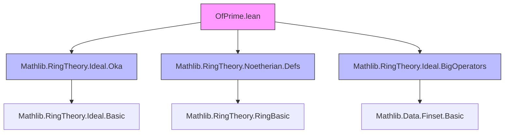

**Technical Brief: `OfPrime.lean` — Formalization of Cohen’s Theorem in Lean 4**

---

### 1. KEY DEFINITIONS & THEOREMS

| Name | Type / Signature | Purpose |
|------|------------------|---------|
| `FG` | `Ideal R → Prop` | Predicate asserting that an ideal is *finitely generated* (i.e., belongs to the class `FG`). Defined via `Submodule.fg`. |
| `IsOka` | `(Ideal R → Prop) → Prop` | Predicate for *Oka families*: families of ideals closed under certain extension and colon conditions (used to lift properties from prime ideals to all ideals). |
| `isOka_fg` | `IsOka (FG (R := R))` | Proof that the family of finitely generated ideals forms an Oka family. Core technical lemma enabling Cohen-type arguments. |
| `IsNoetherianRing.of_prime` | `(∀ I : Ideal R, I.IsPrime → I.FG) → IsNoetherianRing R` | Main theorem: if *all prime ideals* are finitely generated, then *every ideal* is finitely generated — i.e., $R$ is Noetherian. Formalizes Cohen’s Theorem 2 from [cohen1950]. |
| `IsNoetherianRing.of_prime_ne_bot` | `(∀ I : Ideal R, I.IsPrime → I ≠ ⊥ → I.FG) → IsNoetherianRing R` | Variant: it suffices to assume finite generation for *non-zero prime ideals only*. Handles the zero ideal separately (which is always fg). |

---

### 2. NAMING CONVENTIONS

- **Predicates**: `FG`, `IsPrime`, `IsOka` — uppercase, camel-case, often noun-like.
- **Theorems**:
  - `isOka_*`: properties of Oka families (`isOka_fg`).
  - `IsNoetherianRing.of_*`: structural lemmas for proving Noetherianity via conditions on special ideals.
- **Variables & Hypotheses**:
  - `H`, `hC₁`, `hC₂`, `hI`, `h`, `hG`, `J_mem_C`, `G_subset_J` — standard Lean naming for hypotheses.
  - `r`, `p`, `i`, `s`, `k` — generic ring/ideal elements or index functions.
- **Proof steps**:
  - `H k : ∃ r : R, ∃ p ∈ I, r * a + p = f k` — local auxiliary lemma naming (`H` + index).
  - `choose!` for dependent choice with proof relevance.

---

### 3. TACTIC STACK

| Tactic | Frequency | Role |
|--------|-----------|------|
| `obtain` / `rcases` | High | Extract existential witnesses (e.g., finite generating sets). |
| `rw` / `simp_rw` | Very High | Rewrite using definitions (`submodule_span_eq`, `span_le`, etc.). |
| `simp only` | High | Simplify with precise lemmas (e.g., `coe_union`, `span_union`, `Pi.smul_apply`). |
| `ring` / `ring_nf` | Medium | Normalize polynomial expressions in rings. |
| `exact` / `refine` | High | Complete proofs or introduce structured goals. |
| `le_antisymm` | Medium | Prove equality of ideals via mutual inclusion. |
| `cases` / `obtain ⟨...⟩` | Medium | Decompose disjunctions/conjunctions (e.g., `(eq_or_ne I ⊥).elim`). |
| `aesop` | Not present | Not used — proofs are highly constructive and ideal-theoretic. |

---

### 4. PROOF LOGIC

**Overall Strategy** (Cohen’s Theorem):

1. **Reduce to Oka family**: Show `FG` is an Oka family (`isOka_fg`).
2. **Apply Oka’s criterion**: Use `isOka_fg.forall_of_forall_prime'`, which states:
   > If a family $\mathcal{F}$ is Oka and contains all prime ideals, then $\mathcal{F}$ contains *all* ideals.
3. **Handle directed suprema**: In the proof of `of_prime`, given a directed collection $C$ of ideals containing a finite set $G$, show that $\bigcup C = \bigsqcup C$ (i.e., the supremum) is finitely generated by constructing generators from those of members of $C$.
4. **Constructive generation**:
   - Use finite generating families for $I$ and $I : a$ (colon ideal).
   - Combine generators via sums and scalar multiples to generate the sup ideal.
5. **Zero ideal case** (in `of_prime_ne_bot`): Handle separately since $\bot$ is trivially fg.

**Key logical flow in `isOka_fg`**:
- Assume $I + (a) \in FG$ and $(I : a) \in FG$.
- Extract finite generators $f : \text{Fin } n \to R$ for $I + (a)$ and $i : \text{Fin } m \to R$ for $(I : a)$.
- For each generator $f_k$, write $f_k = r_k \cdot a + p_k$ with $p_k \in I$.
- Show $I + (a)$ is generated by $\{p_k\} \cup \{a \cdot i_j\}$.

---

### 5. IMPORTS & DEPENDENCIES

| Module | Role |
|--------|------|
| `Mathlib.RingTheory.Ideal.Oka` | Defines `IsOka` and Oka-family machinery (e.g., `forall_of_forall_prime'`). |
| `Mathlib.RingTheory.Noetherian.Defs` | Defines `IsNoetherianRing` (via `∀ I, I.FG`) and related notions. |
| `Mathlib.RingTheory.Ideal.BigOperators` | Provides lemmas for sums over finite sets, especially `sum_mem`, `sum_add_distrib`, etc. |

**Core dependencies**:
- `CommRing`, `Ideal`, `Submodule`, `Finset`, `Set`.
- Classical logic (`classical` tactic used in `isOka_fg`).

---

### 6. MERMAID DIAGRAMS

#### Dependency Graph (Module-Level)



#### Overview of Proof Structure

```mermaid
flowchart LR
  subgraph Theory
    Oka[IsOka FG] -->|isOka_fg| OkaCrit[Oka Criterion]
    PrimeFG[∀ prime I, I.FG] -->|H| OkaCrit
    OkaCrit -->|forall_of_forall_prime'| AllFG[∀ I, I.FG]
    AllFG --> IsNoetherian[IsNoetherianRing R]
  end

  subgraph Technical
    SupGen[Supremum generation] -->|constructive| Oka
    ColonIdeal[(I : a) fg] -->|colon ideal| SupGen
    SpanEq[span = ideal generated] -->|rewrites| SupGen
  end

  style OkaCrit fill:#9cf,stroke:#333
  style IsNoetherian fill:#9c9,stroke:#333
```

---

### 7. SUMMARY

This file formalizes **Cohen’s Theorem** (1950): *a commutative ring is Noetherian iff all its prime ideals are finitely generated*. It leverages the powerful **Oka family** framework to reduce universal quantification over all ideals to prime ideals — a classic technique in commutative algebra. The proof is highly constructive, relying on explicit generator constructions and careful manipulation of ideal operations (sum, colon, span). The variant `of_prime_ne_bot` shows that the zero ideal need not be assumed fg, as it is trivially so.

This formalization is foundational for further development of Noetherian ring theory in Mathlib, especially in contexts where primality is easier to verify than full Noetherianity (e.g., in constructive or homological settings).
