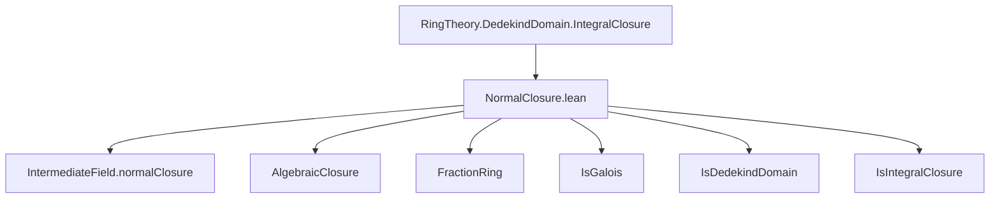
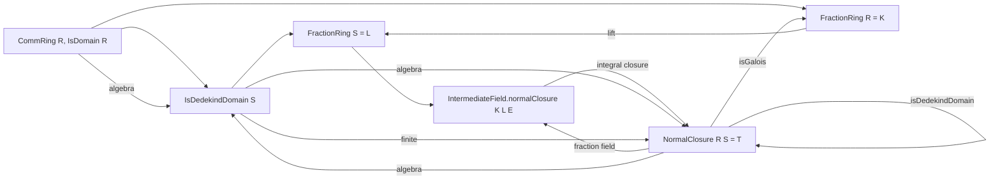

### Technical Brief: `NormalClosure.lean`

---

#### **1. Key Definitions & Theorems**

| Name | Type / Signature | Purpose |
|------|------------------|---------|
| `NormalClosure` | `def NormalClosure (R S : Type*) [...] : Type _` | Defines the *normal closure* $ T $ of an extension of domains $ R \subseteq S $ as the integral closure of $ S $ in the intermediate field `IntermediateField.normalClosure K L E`, where $ K = \mathrm{Frac}(R) $, $ L = \mathrm{Frac}(S) $, and $ E $ is the normal closure inside an algebraic closure. |
| `instance : IsGalois K (FractionRing T)` | `IsGalois K (FractionRing T)` | Proves that the field extension $ \mathrm{Frac}(T)/K $ is Galois. |
| `instance : IsDedekindDomain T` | `IsDedekindDomain T` | Shows that if $ S $ is a Dedekind domain, then so is $ T $. |
| `instance : IsFractionRing T E` | `IsFractionRing T E` | Establishes that $ E $ is the fraction field of $ T $, under finite extension assumptions. |
| `instance : IsIntegrallyClosed T` | `IsIntegrallyClosed T` | Shows $ T $ is integrally closed in its fraction field (under finite extension). |
| `instance : Algebra.IsSeparable L E` | `Algebra.IsSeparable L E` | Proves separability of $ E/L $ under perfectness of $ K = \mathrm{Frac}(R) $. |
| `instance : Module.Finite S T` / `Module.Finite R T` | `Module.Finite S T`, `Module.Finite R T` | Finite generation of $ T $ over $ S $ and $ R $, used for finite extension properties. |

---

#### **2. Naming Conventions**

- **Prefixes**:
  - `is_`: for properties (e.g., `IsDomain`, `IsIntegralClosure`, `IsGalois`, `IsDedekindDomain`, `IsIntegrallyClosed`, `IsSeparable`, `IsFractionRing`, `IsScalarTower`, `IsTorsionFree`, `FaithfulSMul`).
  - `algebraMap_`, `algebraEquiv_`: for canonical algebra maps and equivalences.
  - `fractionRing_`: for constructions involving fraction fields.
  - `integralClosure_`: for properties of integral closures.
- **Suffixes**:
  - `_of_`: e.g., `isFractionRing_of_finite_extension`, `isIntegrallyClosedOfFiniteExtension`, `isDedekindDomain` (no suffix, but used with arguments).
- **Abbreviations**:
  - `K`, `L`, `E`, `T`: used locally for $ \mathrm{Frac}(R) $, $ \mathrm{Frac}(S) $, `IntermediateField.normalClosure`, and `NormalClosure`, respectively.

---

#### **3. Tactic Stack**

- `simp_rw`: used in `IsGalois.of_equiv_equiv` proof to simplify commutative diagrams.
- `ext`: extensionality for ring/field homomorphisms.
- `inferInstanceAs`: to reuse existing typeclass instances for `integralClosure`.
- `exact`, `refine`, `apply`, `assumption`: standard for constructing instances.
- `comp`: for composing algebra maps (e.g., `algebraMap R S` then `algebraMap S T`).
- `symm`: for reversing equivalences (e.g., `algEquiv.symm`).
- `simpa using`: to discharge goals using simplification and a given fact.

---

#### **4. Proof Logic**

- **Construction Phase**:
  - Define `NormalClosure` as `integralClosure S E`, where `E` is the normal closure of $ L/K $ in an algebraic closure.
  - Build algebra structures and tower properties (`IsScalarTower`) using `algebraMap` compositions and `IsScalarTower.of_algebraMap_eq'`.
  - Prove torsion-freeness, faithfulness, and integrality via `integralClosure` lemmas.

- **Galois Property**:
  - Use `IsGalois.of_equiv_equiv` with algebra equivalences:
    - $ K \cong \mathrm{Frac}(R) $, $ \mathrm{Frac}(T) \cong E $.
  - Show commutativity of the diagram using `IsFractionRing.algEquiv_commutes`.

- **Dedekind Domain Property**:
  - Assume `IsDedekindDomain S`.
  - Use `IsIntegralClosure.finite` to get finite generation $ S \subseteq T $.
  - Apply `integralClosure.isDedekindDomain` to conclude $ T $ is Dedekind.

- **Separability & Integrally Closed**:
  - Under `PerfectField K`, use tower separability lemmas.
  - Use `integralClosure.isIntegrallyClosedOfFiniteExtension` for integrally closed.

---

#### **5. Imports**

- `Mathlib.RingTheory.DedekindDomain.IntegralClosure`: core definitions and lemmas about integral closures and Dedekind domains.

---

#### **6. Mermaid Diagrams**

##### **Dependency Graph (High-Level)**



##### **Overview of Construction Flow**



##### **Tower Structure**

```mermaid
graph LR
  R --> S --> T --> E
  K = Frac R --> L = Frac S --> Frac T --> E
  subgraph towers
    R -- algebra --> S
    S -- algebra --> T
    T -- algebra --> E
    R -- algebra --> K
    S -- algebra --> L
    T -- algebra --> Frac T
    K -- algebra --> L
    L -- algebra --> E
    Frac T -- algebra --> E
  end
```

---

#### **7. Summary**

This file formalizes the *normal closure* $ T $ of a domain extension $ R \subseteq S $, leveraging:
- Fraction fields and algebraic closures,
- Intermediate fields and normal closures,
- Integral closures to ensure integrality and Dedekind properties.

It is carefully engineered for performance: `NormalClosure` is defined as a type (not a `Subalgebra`) to avoid compilation slowdowns, and many instances are local to avoid global interference.

The key results are:
- $ \mathrm{Frac}(T)/\mathrm{Frac}(R) $ is Galois,
- $ T $ is Dedekind if $ S $ is,
- $ T $ is integrally closed and finite over $ S $ (under finite extension).

This serves as a foundational tool for arithmetic geometry and algebraic number theory in Lean.
