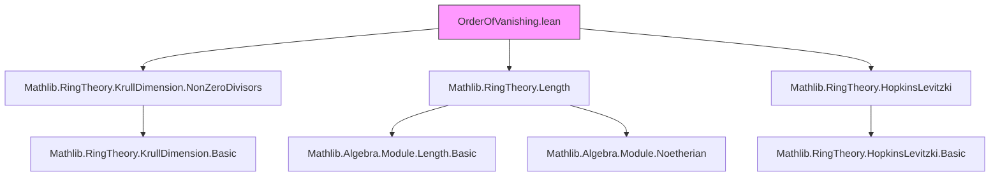
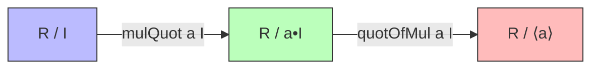

### Technical Brief: `OrderOfVanishing.lean`

---

#### **1. Key Definitions & Theorems**

| Name | Type / Signature | Purpose |
|------|------------------|---------|
| `ord R x` | `ℕ∞` | Defines the *order of vanishing* of `x : R` as the length of the $R$-module $R / \langle x \rangle$. |
| `ord_one` | `ord R 1 = 0` | Shows that the order of vanishing of the multiplicative identity is zero. |
| `Ideal.mulQuot a I` | `R ⧸ I →ₗ[R] R ⧸ (a • I)` | Linear map induced by multiplication by `a` on quotients. |
| `Ideal.mulQuot_injective` | `a ∈ nonZeroDivisors R ⇒ injective (mulQuot a I)` | Injectivity of multiplication-by-`a` map when `a` is a non-zero divisor. |
| `Ideal.quotOfMul a I` | `(R ⧸ a • I) →ₗ[R] R ⧸ ⟨a⟩` | Quotient map factoring through the ideal generated by `a`. |
| `Ideal.quotOfMul_surjective` | `surjective (quotOfMul a I)` | Surjectivity of the above quotient map. |
| `Ideal.exact_mulQuot_quotOfMul` | `exact (mulQuot a I) (quotOfMul a I)` | Exactness of the sequence $R/I \xrightarrow{a} R/aI \to R/\langle a\rangle$. |
| `ord_mul` | `b ∈ nonZeroDivisors R ⇒ ord(ab) = ord(a) + ord(b)` | Multiplicativity of order of vanishing under non-zero-divisor multiplication. |
| `ordMonoidWithZeroHom` | `R →*₀ ℤᵐ⁰` | A zero-preserving monoid homomorphism extending `ord` to all of `R`, mapping non-NZD elements to `0`. |
| `isFiniteLength_quotient_span_singleton` | Under Krull dim ≤ 1 and Noetherian, $R/\langle x\rangle$ has finite length if $x$ is a non-zero divisor. | Key finiteness condition enabling length-based definitions. |
| `ordFrac` | `K →*₀ ℤᵐ⁰` | Extension of `ord` to the fraction field $K$, via localization. |
| `ordFrac_eq_ord` | For nonzero $x \in R$, `ordFrac(algebraMap(x)) = ord(x)` | Compatibility of `ordFrac` with `ord` on the base ring. |
| `ordFrac_eq_div` | `ordFrac(a / b) = ord(a) / ord(b)` | Behavior of `ordFrac` on fractions. |

---

#### **2. Naming Conventions**

- **Prefixes**:
  - `ord_`: for order-of-vanishing related functions/lemmas (`ord`, `ord_one`, `ord_mul`, `ordMonoidWithZeroHom`, `ordFrac`, `ordFrac_eq_ord`, `ordFrac_eq_div`).
  - `mulQuot_`: for maps induced by multiplication on quotients.
  - `quotOfMul`: for quotient maps factoring through principal ideals.
- **Suffixes**:
  - `_injective`, `_surjective`, `_exact`: indicate properties of linear maps.
  - `_eq_...`: lemmas showing equality between constructions (e.g., `ordFrac_eq_ord`).
- **Module/LinearMap**:
  - `Submodule.mapQ`, `Submodule.factor`, `Submodule.mkQ`, `Submodule.ker_liftQ`: standard quotient/map constructions.
- **Ideal operations**:
  - `Ideal.span {x}`, `a • I`, `I • J`: standard ideal operations.

---

#### **3. Tactic Stack**

Frequent tactics used in proofs:

| Tactic | Usage |
|--------|-------|
| `simp` / `simp_all` | Simplifying goals using lemmas, especially `simp` lemmas like `ord_one`, `mulQuot`, `quotOfMul`. |
| `rw` | Rewriting using equalities (e.g., `mul_comm`, `lem`, `this`). |
| `exact` / `apply` | Applying known lemmas or constructing terms directly. |
| `have` / `suffices` | Introducing intermediate claims or reversing implication direction. |
| `congr` | Proving equality of function applications. |
| `ext` | Extensionality for sets/ideals/modules. |
| `cases` | Case analysis on hypotheses or inductive types. |
| `split_ifs` | Handling `if ... then ... else ...` expressions. |
| `all_goals` | Applying a tactic to all goals. |
| `ring` | Not explicitly used here, but `simp` + `rw` suffices for arithmetic in `ℕ∞`/`ℤ`. |
| `aesop` | Not used — proofs are mostly manual and structural. |

---

#### **4. Proof Logic**

- **Structure of proofs**:
  - **Induction/Exact sequences**: Many proofs rely on constructing short exact sequences (e.g., `exact_mulQuot_quotOfMul`) and applying `Module.length_eq_add_of_exact`.
  - **Localization & fraction field**: `ordFrac` is defined via universal property of localization (`lift₀`), requiring verification of unit condition on denominators.
  - **Finiteness conditions**: Crucial for ensuring `ord` takes finite values — uses `isFiniteLength_quotient_span_singleton`, which depends on Krull dimension ≤ 1 and Noetherian hypothesis.
  - **Non-zero-divisor assumptions**: Central to injectivity of multiplication maps and validity of `ord_mul`.

- **Typical flow**:
  1. Construct linear maps between quotients.
  2. Prove exactness/injectivity/surjectivity.
  3. Apply length-additivity lemma.
  4. Simplify using ideal arithmetic (e.g., $a \cdot \langle b \rangle = \langle ab \rangle$).
  5. Use localization properties to extend to fraction field.

---

#### **5. Imports & Dependencies**

| Import | Purpose |
|--------|---------|
| `Mathlib.RingTheory.KrullDimension.NonZeroDivisors` | Tools for Krull dimension and non-zero-divisors. |
| `Mathlib.RingTheory.Length` | Module length, finite length, Artinian/Noetherian criteria. |
| `Mathlib.RingTheory.HopkinsLevitzki` | Used implicitly via `isArtinian_of_surjective_algebraMap` and related lemmas. |

Other key imports (implicit via `Mathlib`):
- `Mathlib.Algebra.Module.Submodule.Quotient`
- `Mathlib.Algebra.Module.Length.Basic`
- `Mathlib.RingTheory.Localization.WithZero`
- `Mathlib.FieldTheory.IsFractionRing`

---

#### **6. Mermaid Diagrams**

##### **Dependency Graph (Module-Level)**



##### **Overview of Theory Flow**

```mermaid
flowchart LR
  R[Ring R] -->|nonZeroDivisors| NZD[nonZeroDivisors R]
  R -->|quotient| Q[R / ⟨x⟩]
  Q -->|length| L[Module.length R (R / ⟨x⟩)]
  L -->|ord| ORD[ord R x : ℕ∞]

  NZD -->|localization| K[Field K = Frac(R)]
  ORD -->|extension| ORD_Frac[ordFrac : K →*₀ ℤᵐ⁰]

  subgraph Finiteness
    ND[Noetherian R] & KD[KrullDimLE 1 R] & NZD --> FL[IsFiniteLength R (R / ⟨x⟩)]
  end

  FL -->|enables ord| ORD
```

##### **Exact Sequence Diagram**



---

#### **7. Summary**

This module formalizes the *order of vanishing* in commutative algebra, starting from a ring-theoretic definition via module length, extending it to a monoid homomorphism on the ring, and finally to the fraction field using localization. Key technical ingredients include:
- Exact sequences for additive behavior of `ord`,
- Finiteness conditions (Krull dim ≤ 1, Noetherian) to ensure `ord` is finite-valued,
- Non-zero-divisor hypotheses for injectivity and exactness.

The formalization is highly structured, with careful attention to algebraic properties (monoid homomorphism, compatibility with localization), and aligns with standard references like Stacks Project [02MD].

--- 

Let me know if you'd like a formalization roadmap or a comparison with other approaches (e.g., valuation-theoretic).
