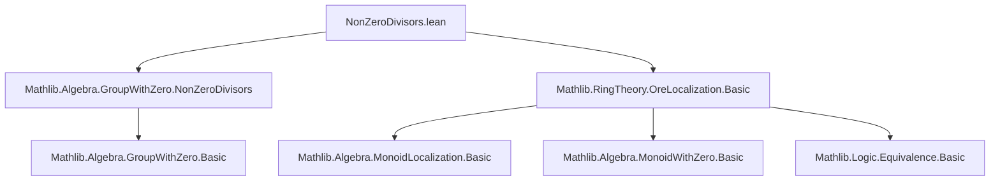

### Technical Brief: `NonZeroDivisors.lean` — Ore Localization over Non-Zero Divisors

---

#### **1. Key Definitions & Theorems**

| Name | Type / Signature | Purpose |
|------|------------------|---------|
| `nontrivial_of_nonZeroDivisorsLeft` | `(hS : S ≤ nonZeroDivisorsLeft R) → Nontrivial R[S⁻¹]` | Ensures the Ore localization is nontrivial if `S` lies in the left non-zero-divisors. |
| `nontrivial_of_nonZeroDivisorsRight` | `(hS : S ≤ nonZeroDivisorsRight R) → Nontrivial R[S⁻¹]` | Same as above, but for right non-zero-divisors. |
| `nontrivial_of_nonZeroDivisors` | `(hS : S ≤ R⁰) → Nontrivial R[S⁻¹]` | Combines both sides: if `S ⊆ R⁰` (the submonoid of non-zero-divisors), then localization is nontrivial. |
| `nontrivial` | `instance : Nontrivial R[R⁰⁻¹]` | Special case: when `R` is nontrivial and has no zero divisors, the Ore localization at `R⁰` is nontrivial. |
| `OreLocalization.inv` | `R[R⁰⁻¹] → R[R⁰⁻¹]` | Defines inversion on Ore fractions: $ (r /ₒ s)^{-1} = \begin{cases} 0 & \text{if } r = 0 \\ s /ₒ \langle r, \dots \rangle & \text{otherwise} \end{cases} $ |
| `inv_def` | `(r /ₒ s)⁻¹ = if r = 0 then 0 else s /ₒ ⟨r, ...⟩` | Explicit description of inversion on fractions. |
| `mul_inv_cancel` | `x ≠ 0 → x * x⁻¹ = 1` | Verifies multiplicative inverse property for nonzero elements. |
| `inv_zero` | `(0 : R[R⁰⁻¹])⁻¹ = 0` | Ensures inversion respects zero (convention $0^{-1} = 0$). |
| `GroupWithZero R[R⁰⁻¹]` | `instance` | Constructs a `GroupWithZero` structure on the Ore localization. |
| `CommGroupWithZero R[R⁰⁻¹]` | `instance` (in `CommMonoidWithZero` section) | Extends to a *commutative* `GroupWithZero` when `R` is commutative. |

---

#### **2. Naming Conventions**

- **Prefixes**:
  - `nontrivial_of_...`: Indicates sufficiency conditions for nontriviality.
  - `inv_...`: Pertains to inversion (e.g., `inv_def`, `inv_zero`, `mul_inv_cancel`).
- **Suffixes**:
  - `_left`, `_right`: Distinguish left/right variants (e.g., `nonZeroDivisorsLeft`, `nonZeroDivisorsRight`).
  - `_def`: Definition lemmas for operations (e.g., `inv_def`).
- **Notation**:
  - `R⁰`: Submonoid of non-zero-divisors in `R`.
  - `R[S⁻¹]`: Ore localization of `R` at `S`.
  - `/ₒ`: Ore fraction notation (e.g., `r /ₒ s`).
  - `⟨r, h⟩`: Proof-carrying pair (e.g., `⟨r, mem_nonZeroDivisors_of_ne_zero hr⟩`).

---

#### **3. Tactic Stack**

Frequently used tactics in proofs:
- `rw`, `simp`, `simp only`, `simp_rw`: Simplification and rewriting using definitions and lemmas.
- `induction`: Structural induction on Ore fractions (`induction x with | _ r s`).
- `by_cases`: Case analysis on equalities (e.g., `by_cases hr : r = 0`).
- `exfalso`: Deriving contradiction from `False`.
- `apply`, `intro`, `intro rfl`: Standard intro/apply for constructing proofs.
- `with_unfolding_all`: Unfolds all definitions before simplifying (used in `inv_def`, `mul_inv_cancel`).
- `ring` / `aesop`: Not present here — this file is heavily proof-term-driven, not tactic-heavy automation.

---

#### **4. Proof Logic**

- **Structure**: Modular, with two main sections:
  1. `MonoidWithZero`: General noncommutative case.
  2. `CommMonoidWithZero`: Commutative case (only instance declaration).
- **Proof Strategy**:
  - **Nontriviality**: Uses `nontrivial_iff` to construct two distinct elements via `one_ne_zero`.
  - **Inversion definition**: Constructed via `liftExpand`, ensuring well-definedness using Ore condition.
  - **Inverse properties**:
    - `inv_def`: Proven by unfolding definitions (`with_unfolding_all` + `rfl`).
    - `mul_inv_cancel`: Induction on `x`, reduce to fraction case, then simplify using `OreLocalization.mul_inv`.
    - `inv_zero`: Direct simplification using `zero_def` and `inv_def`.
  - **GroupWithZero instance**: Assembled from `inv_zero` and `mul_inv_cancel`.

---

#### **5. Imports**

| Import | Purpose |
|--------|---------|
| `Mathlib.Algebra.GroupWithZero.NonZeroDivisors` | Defines `nonZeroDivisors`, `nonZeroDivisorsLeft`, `nonZeroDivisorsRight`, and related lemmas. |
| `Mathlib.RingTheory.OreLocalization.Basic` | Provides basic Ore localization theory: `OreLocalization`, `OreLocalization.mk`, `OreLocalization.expand`, `OreLocalization.mul_inv`, etc. |

---

#### **8. Mermaid Diagrams**

##### **Dependency Graph (Module-Level)**



##### **Overview of File Structure**

```mermaid
flowchart LR
  subgraph "OreLocalization"
    A[MonoidWithZero R] --> B[OreSet S]
    B --> C[nontrivial_of_nonZeroDivisorsLeft]
    B --> D[nontrivial_of_nonZeroDivisorsRight]
    B --> E[nontrivial_of_nonZeroDivisors]
    C & D & E --> F[instance nontrivial]
    F --> G[inv : R[R⁰⁻¹] → R[R⁰⁻¹]]
    G --> H[inv_def]
    G --> I[mul_inv_cancel]
    G --> J[inv_zero]
    H & I & J --> K[GroupWithZero R[R⁰⁻¹]]
    
    subgraph "CommMonoidWithZero"
      K --> L[CommGroupWithZero R[R⁰⁻¹]]
    end
  end
```

##### **Theoretical Context**

- **Goal**: Construct a *group with zero* structure on the Ore localization $R[R^{0\,-1}]$, where $R$ is a monoid (or ring) with zero and no zero divisors.
- **Key Insight**: In a domain (no zero divisors), every nonzero element is a non-zero-divisor, so $R^0$ is a saturated multiplicative set, and Ore localization behaves like classical field of fractions.
- **Result**: $R[R^{0\,-1}]$ becomes a *division monoid* (group with zero), generalizing the field of fractions to noncommutative domains (Ore domains).

--- 

Let me know if you'd like a formalized summary in Lean or a diagram for the `OreLocalization` typeclass hierarchy.
