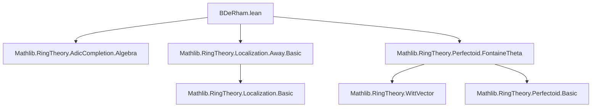

**Technical Brief: `BDeRham.lean` — de Rham Period Rings in Lean 4**

---

### 1. **Key Definitions & Theorems**

| Name | Type / Signature | Purpose |
|------|------------------|---------|
| `fontaineThetaInvertP` | `Localization.Away (p : 𝕎 R♭) →+* Localization.Away (p : R)` | Generalized Fontaine’s θ map, defined after inverting `p`. Extends the classical θ: `𝕎 R♭ → R` via localization. |
| `BDeRhamPlus` | `Type u` (defined as `AdicCompletion (ker fontaineThetaInvertP) (Localization.Away (p : 𝕎 R♭))`) | The *positive* de Rham period ring $\mathbb{B}_{dR}^+$: completion of the localized Witt vectors along the kernel of θ. |
| `BDeRham` | `Type u` (defined as `Localization (M := BDeRhamPlus R p) (Submonoid.closure ...)` ) | The *full* de Rham period ring $\mathbb{B}_{dR}$: obtained by inverting a generator of `ker θ` in $\mathbb{B}_{dR}^+$. |
| `AdicCompletion.instCommRing` | `CommRing (BDeRhamPlus R p)` | Ensures $\mathbb{B}_{dR}^+$ inherits a commutative ring structure. |

> **Note**: All definitions assume `R` is an `p`-adic complete commutative ring (with `p` non-unit), and implicitly that `R` is *perfectoid* (via `R♭`, the tilt, used in Witt vectors).

---

### 2. **Naming Conventions**

- **Prefixes**:
  - `fontaineTheta*`: Fontaine’s θ-related maps.
  - `BDeRham*`: de Rham period ring constructions.
- **Suffixes**:
  - `InvertP`: indicates localization/inversion of `p`.
  - `Plus` / bare name (`BDeRham`): distinguishes $\mathbb{B}_{dR}^+$ vs $\mathbb{B}_{dR}$.
- **Notation**:
  - `𝕎 A`: `WittVector p A`
  - `A♭`: `PreTilt A p`
  - `𝔹_dR^+(R)`, `𝔹_dR(R)`: LaTeX-style abbreviations for the rings.

---

### 3. **Tactic Stack**

| Tactic | Usage |
|--------|-------|
| `simpa` | In `fontaineThetaInvertP`, to simplify using `IsLocalization.Away.algebraMap_isUnit`. |
| `algebraMap` / `comp` | For constructing algebra maps (e.g., `algebraMap R _ .comp (fontaineTheta R p)`). |
| `Localization.awayLift` | Universal property of localization to define θ after inverting `p`. |
| `AdicCompletion.of` | Canonical map into the adic completion (used in `BDeRham` definition). |
| `Submonoid.closure` | To generate the multiplicative set for localization (invert generators of `ker θ`). |

No heavy automation (e.g., `aesop`, `ring`, `simp`) appears in the visible snippet — the focus is on *constructive algebraic definitions* using universal properties.

---

### 4. **Proof Logic (Emerging Pattern)**

- **Construction-first approach**: Definitions rely on *universal properties* (localization, adic completion) rather than explicit element-wise constructions.
- **Dependence on prior theory**:
  - `Localization.Away` and its algebra structure.
  - `AdicCompletion` and its ring structure.
  - `PreTilt` and `WittVector` (perfectoid input).
- **Future proof goals** (per TODO):
  - Show `ker θ` is principal → enables cleaner definition of $\mathbb{B}_{dR}$.
  - Prove $\mathbb{B}_{dR}^+$ is a DVR.
  - Extend θ to $\mathbb{B}_{dR}^+$ (currently only defined before completion).

---

### 5. **Imports & Dependencies**

| Module | Role |
|--------|------|
| `Mathlib.RingTheory.AdicCompletion.Algebra` | Provides `AdicCompletion` and its ring structure. |
| `Mathlib.RingTheory.Localization.Away.Basic` | For `Localization.Away`, used to invert `p`. |
| `Mathlib.RingTheory.Perfectoid.FontaineTheta` | Supplies `fontaineTheta`, `PreTilt`, and Witt vector machinery. |

> **Core theory context**: `p`-adic Hodge theory, perfectoid rings, Witt vectors, adic topology.

---

### 6. **Mermaid Diagrams**

#### **Dependency Graph (Module-Level)**



#### **Conceptual Overview of `BDeRhamPlus` Construction**

```mermaid
flowchart LR
  R[CommRing R, p-adic complete] --> R_flat[R♭ = PreTilt R p]
  R_flat --> W_R_flat[𝕎 R♭ = WittVector p R♭]
  W_R_flat --> LocAway_p[Localization.Away (p : 𝕎 R♭)]
  R --> fontaineTheta[fontaineTheta R p : 𝕎 R♭ → R]
  LocAway_p --> fontaineThetaInvertP[fontaineThetaInvertP : LocAway_p →+* LocAway_p[p⁻¹]]
  fontaineThetaInvertP --> ker_theta[ker fontaineThetaInvertP]
  LocAway_p & ker_theta --> AdicComp[BDeRhamPlus = AdicCompletion ker_theta LocAway_p]
```

#### **Relationship to Classical de Rham Rings**

```mermaid
flowchart LR
  R = O_Cp[R = ℤₚ^ur^̂ = 𝒪_{ℂₚ}] --> BDeRhamPlus_R[BDeRhamPlus R p]
  BDeRhamPlus_R --> classical_BdR_plus[Classical 𝔹_{dR}^+]
  BDeRhamPlus_R --> BDeRham_R[BDeRham R p]
  BDeRham_R --> classical_BdR[Classical 𝔹_{dR}]
  style R fill:#d4f7e2,stroke:#3a7d3a
  style classical_BdR_plus fill:#ffe4b5,stroke:#b8860b
  style classical_BdR fill:#ffe4b5,stroke:#b8860b
```

> **Note**: The file defines *generalized* period rings for arbitrary perfectoid `R`; the classical rings arise as the special case `R = 𝒪_{ℂₚ}`.

---

### 7. **Mathematical Context Summary**

- **Goal**: Formalize Fontaine’s period rings in Lean, enabling `p`-adic Hodge theory.
- **Key innovation**: Use *adic completion* along `ker θ` (not just `p`-adic topology), aligning with Scholze’s approach.
- **Future work**: Prove structural properties (DVR, principality of `ker θ`) to justify the current localization-based definition of $\mathbb{B}_{dR}$.

--- 

Let me know if you'd like the next step: formalization of the θ-extension to $\mathbb{B}_{dR}^+$, or verification of the DVR property under perfectoid hypotheses.
