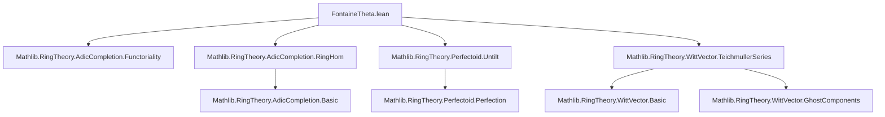

### Technical Brief: `FontaineTheta.lean`

---

#### **1. Key Definitions & Theorems**

| Name | Type | Purpose |
|------|------|---------|
| `fontaineThetaModPPow n` | `𝕎 R♭ →+* R ⧸ 𝔭 ^ (n + 1)` | Mod-$p^{n+1}$ approximation of Fontaine’s θ map; defined via ghost components and Frobenius twist. |
| `ghostComponentModPPow n` | `𝕎 (R ⧸ 𝔭) →+* R ⧸ 𝔭 ^ (n + 1)` | Lift of the $n$-th ghost component along the surjection $𝕎 R → 𝕎(R/𝔭)$. |
| `fontaineTheta` | `𝕎 R♭ →+* R` | Global Fontaine θ map, defined as the inverse limit of `fontaineThetaModPPow`. |
| `fontaineTheta_teichmuller` | `fontaineTheta (teichmuller p x) = x.untilt` | θ sends Teichmüller lifts to untilts — core structural property. |
| `fontaineTheta_surjective` (i.e., `surjective_fontaineTheta`) | `Function.Surjective (fontaineTheta)` | θ is surjective under the assumption that Frobenius is surjective on $R/pR$. |

---

#### **2. Naming Conventions**

- **Prefixes**:
  - `fontaineTheta*`: Main θ-related constructions.
  - `ghostComponent*`: Ghost component and its reductions.
  - `quotEquivOfEq_*`: Equivalence between quotients when ideals coincide.
- **Suffixes**:
  - `ModPPow`: Modulo $p^{n+1}$ version.
  - `mk`: Quotient map (`Ideal.Quotient.mk`).
  - `liftRingHom`: Construction via lifting ring homomorphisms through surjections.

---

#### **3. Tactic Stack**

- **Core tactics**:
  - `simp`, `rw`, `apply`, `intro`, `exact`, `cases`
  - `RingHom.ext`, `eq_of_apply_teichmuller_eq` (uniqueness via Teichmüller basis)
  - `Order.succ_strictMono.liftRingHom` (inverse limit construction)
- **Specialized**:
  - `pow_dvd_ghostComponent_of_dvd_coeff`: Key algebraic lemma for ghost components.
  - `ker_map_le_ker_mk_comp_ghostComponent`: Kernel containment for lifting.
  - `mk_pow_fontaineTheta`, `mk_fontaineTheta`: Projection lemmas for θ modulo powers of $p$.

---

#### **4. Proof Logic**

- **Structure**:
  1. **Mod-$p^{n+1}$ construction**:
     - Define `ghostComponentModPPow` by lifting the $n$-th ghost component using `RingHom.liftOfSurjective`.
     - Prove compatibility: `factorPowSucc_comp_fontaineThetaModPPow`.
  2. **Inverse limit**:
     - Use `Order.succ_strictMono.liftRingHom` to define `fontaineTheta` as the limit.
  3. **Properties**:
     - Compute θ on Teichmüller lifts using `teichmuller` and `untilt`.
     - Prove surjectivity via:
       - Description of θ mod $p$ in terms of `PreTilt.coeff 0`.
       - Surjectivity of Frobenius on $R/pR$ ⇒ surjectivity of coefficient map.
       - Use `surjective_of_mk_map_comp_surjective` + `IsHausdorff.eq_iff_smodEq`.

- **Inductive/structural reasoning**:
  - Relies on *Teichmüller basis* for uniqueness (e.g., `eq_of_apply_teichmuller_eq`).
  - Uses *adic completeness* and *Hausdorffness* for limit arguments.

---

#### **5. Imports & Dependencies**

| Module | Role |
|--------|------|
| `Mathlib.RingTheory.AdicCompletion.Functoriality` | Adic completion and functoriality. |
| `Mathlib.RingTheory.AdicCompletion.RingHom` | Ring homs compatible with adic topology. |
| `Mathlib.RingTheory.Perfectoid.Untilt` | Untilt construction for perfectoids. |
| `Mathlib.RingTheory.WittVector.TeichmullerSeries` | Teichmüller representatives and Witt vector basics. |

**Key abstractions used**:
- `WittVector p A`: Witt vectors over ring $A$.
- `PreTilt A p`: Pre-tilt of $A$ at prime $p$.
- `teichmuller p x`: Teichmüller lift of $x$.
- `untilt`: Map $R^♭ → R$ for untilting.
- `Ideal.span_singleton_pow p n`: Powers of the ideal $(p)$.

---

#### **6. Mermaid Diagrams**

##### **Dependency Graph (Module-Level)**



##### **Overview of Construction Flow**

```mermaid
flowchart LR
  R[CommRing R] --> F[PreTilt R p = R^♭]
  F --> W1[𝕎 R^♭]
  W1 --> Frob[𝕎(Frob^{-n})]
  Frob --> W2[𝕎 R^♭]
  W2 --> C0[𝕎(coeff₀)]
  C0 --> W3[𝕎(R/𝔭)]
  W3 --> gh[ghostComponentModPPow n]
  gh --> Q[R/𝔭^{n+1}]

  subgraph Limit
    W1 -->|inverse limit| θ[fontaineTheta : 𝕎 R^♭ →+* R]
  end

  θ -->|teichmuller| U[x ↦ x.untilt]
  θ -->|surj| S[Surjective if Frobenius on R/pR is surj.]
```

---

#### **7. Theoretical Context**

- **Goal**: Construct Fontaine’s θ map in the setting of *p-adically complete rings*, not necessarily perfectoid.
- **Significance**:
  - θ is foundational in *p-adic Hodge theory* and *perfectoid geometry*.
  - Provides a bridge between the tilt $R^♭$ (characteristic $p$) and $R$ (characteristic 0).
  - Surjectivity of θ is key to the “almost purity” and “deformation” perspectives.
- **Comparison**:
  - This definition matches the classical one via *cotangent complex* (per Bhatt’s notes), though equivalence is marked as *TODO*.

---

#### **8. Tags & References**

- **Tags**: `fontaine_theta_map`, `perfectoid_theory`, `p_adic_hodge_theory`, `witt_vectors`, `tilt`, `untilt`
- **References**:
  - Fontaine, *Sur Certains Types de Représentations p-Adiques* (1982)
  - Fontaine, *Le corps des périodes p-adiques* (1994)
  - Bhatt, *Lecture notes for a class on perfectoid spaces*, Remark 6.1.7

--- 

Let me know if you'd like a formalized summary in Lean docstring format or a dependency graph for internal lemmas.
