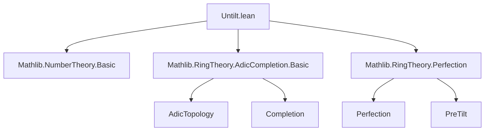
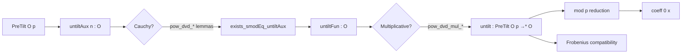
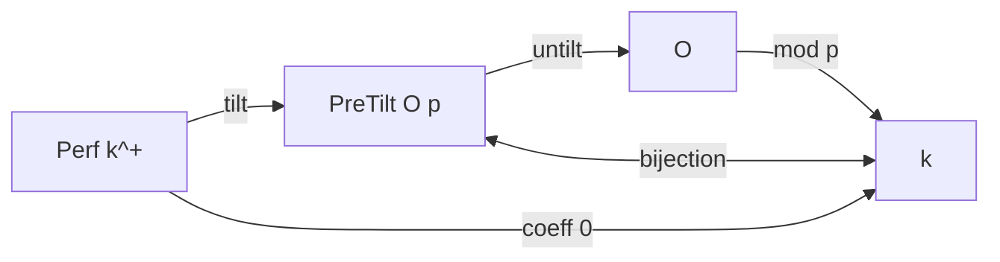

### Technical Brief: `Untilt.lean`

---

#### **1. Key Definitions & Theorems**

| Name | Type / Signature | Purpose |
|------|------------------|---------|
| `untiltAux` | `PreTilt O p → ℕ → O` | Auxiliary sequence: `(n+1)`-th term is $p^n$-th power of a lift of the $n$-th coefficient in $\operatorname{Perf}(O/p)$. |
| `untiltFun` | `PreTilt O p → O` | Underlying function of the untilt map, defined as the limit (via completeness) of `untiltAux`. |
| `untilt` | `PreTilt O p →* O` | Multiplicative map (monoid homomorphism) from `PreTilt O p` to $O$, under $p$-adic completeness. |
| `pow_dvd_untiltAux_sub_untiltAux` | `(p : O)^m ∣ x.untiltAux m - x.untiltAux n` for $m ≤ n$ | Key divisibility lemma ensuring Cauchy condition for `untiltAux`. |
| `pow_dvd_one_untiltAux_sub_one` | `(p : O)^m ∣ (1).untiltAux m - 1` | Special case for the unit element. |
| `pow_dvd_mul_untiltAux_sub_untiltAux_mul` | `(p : O)^m ∣ (x*y).untiltAux m - x.untiltAux m * y.untiltAux m` | Multiplicativity control for `untiltAux`. |
| `exists_smodEq_untiltAux` | `∃ y, ∀ n, x.untiltAux n ≡ y [SMOD I^n]` | Guarantees existence of limit under `IsPrecomplete`. |
| `mk_untilt_eq_coeff_zero` | `Ideal.Quotient.mk (⟨p⟩) (x.untilt) = coeff 0 x` | Core theorem: mod $p$ reduction of `untilt(x)` equals 0th coefficient of perfection. |
| `mk_comp_untilt_eq_coeff_zero` | `Ideal.Quotient.mk ⟨p⟩ ∘ untilt = coeff 0` | Functional form of above. |
| `untilt_iterate_frobeniusEquiv_symm_pow` | `untilt(((frobeniusEquiv)^{-n} x))^{p^n} = x.untilt` | Compatibility with Frobenius automorphism on `PreTilt`. |

---

#### **2. Naming Conventions**

- **Prefixes**:
  - `untiltAux`: auxiliary sequence for construction.
  - `untiltFun`: underlying function before verifying multiplicativity.
  - `untilt`: final multiplicative map.
- **Suffixes**:
  - `_smodEq_untiltFun`: congruence modulo powers of $(p)$.
  - `_sub_...`: differences controlled by powers of $p$.
  - `_pow`, `_mul`: indicate behavior under powers/multiplication.
- **`mk_...`**: often refers to quotient maps (`Ideal.Quotient.mk`).
- **`coeff n x`**: $n$-th component of $x \in \operatorname{PreTilt} O p$, i.e., element of $\operatorname{Perf}(O/p)$.

---

#### **3. Tactic Stack**

Frequent tactics used:
- `simp` / `simp only`: simplification with definitional equalities and lemmas.
- `rw`: rewriting using divisibility, congruence, and quotient lemmas.
- `refine`: constructing proofs with holes filled later.
- `calc`: chaining divisibility or congruence steps.
- `cases m with | zero | succ m`: induction on natural numbers.
- `nth_rw`: nth occurrence rewriting (e.g., to insert powers of 1).
- `exact`, `symm`, `trans`: basic proof combinators.
- `congr`: for functional extensionality or congruence closure.
- `IsHausdorff.eq_iff_smodEq`: characterizes equality via $p$-adic congruences.
- `Classical.choose` / `Classical.choose_spec`: for existential witnesses in noncomputable sections.

---

#### **4. Proof Logic**

- **Structure**:
  1. **Define `untiltAux`** as a sequence depending on lifts of perfection components.
  2. **Prove divisibility lemmas** (`pow_dvd_*`) to show the sequence is Cauchy modulo $p^n$.
  3. **Use completeness** (`IsPrecomplete`, `IsAdicComplete`) to extract limit (`untiltFun`).
  4. **Verify multiplicativity** using the divisibility lemmas and Hausdorffness of $p$-adic topology.
  5. **Prove key property** (`mk_untilt_eq_coeff_zero`) by comparing modulo $p$ and using base case $n=1$ of `untiltAux`.

- **Induction pattern**: mostly structural induction on `ℕ` (via `cases m`).
- **Congruence-based reasoning**: equality is shown via infinite congruence system modulo $p^n$.
- **Lifting via Quotient.out**: arbitrary lifts used in `untiltAux`, but independence is ensured by divisibility.

---

#### **5. Imports & Dependencies**

| Import | Role |
|--------|------|
| `Mathlib.NumberTheory.Basic` | Basic number theory, primes, divisibility. |
| `Mathlib.RingTheory.AdicCompletion.Basic` | `IsPrecomplete`, `IsAdicComplete`, `SMOD`, `SModEq`, $p$-adic topology. |
| `Mathlib.RingTheory.Perfection` | `Perf`, `frobenius`, `PreTilt`, `coeff`, `frobeniusEquiv`. |

---

#### **6. Mermaid Diagrams**

##### **Dependency Graph (Module-Level)**

##### **Overview of `Untilt.lean` Theory Flow**

##### **Relationship to Tilting Equivalence**

> *The untilt map provides the inverse direction of the tilting equivalence in the complete case.*

---

#### **7. Tags & Context**

- **Tags**: `Perfectoid`, `Tilting equivalence`, `Untilt`, `adic completion`, `perfection`, `frobenius`
- **Reference**: [Berkeley Lectures on $p$-adic Geometry] (MR4446467)
- **Status**: Formalized in Lean 4, part of the `mathlib` ecosystem.

--- 

Let me know if you'd like a formalized dependency graph (e.g., `.lean` imports tree) or a proof sketch of `mk_untilt_eq_coeff_zero`.
