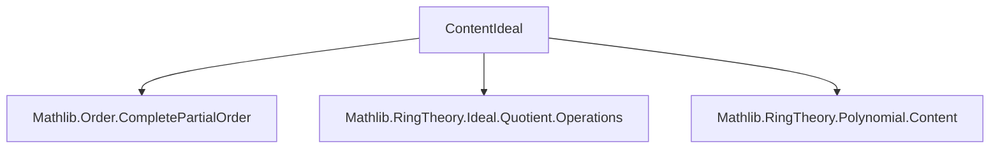
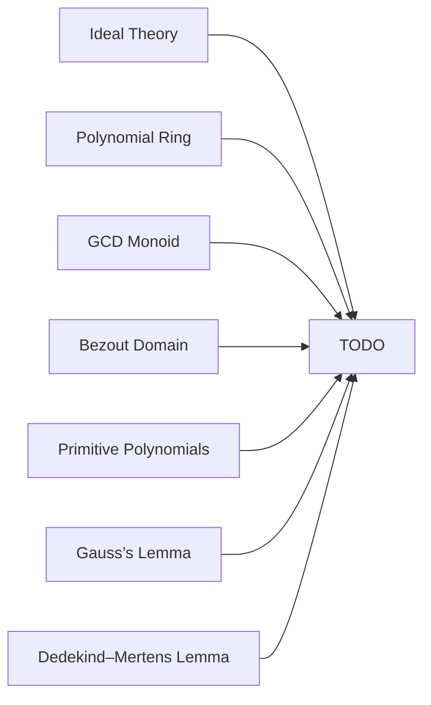

**Technical Brief: `ContentIdeal.lean`**

---

### **1. Key Definitions & Theorems**

| Name | Type / Signature | Purpose |
|------|------------------|---------|
| `contentIdeal` | `p.contentIdeal : Ideal R` | Defines the ideal generated by the coefficients of `p : R[X]`. |
| `contentIdeal_def` | `p.contentIdeal = span (p.coeffs)` | Definition equivalence (by reflexivity). |
| `contentIdeal_zero` | `(0 : R[X]).contentIdeal = ⊥` | Zero polynomial has zero ideal as content. |
| `contentIdeal_eq_bot_iff` | `p.contentIdeal = ⊥ ↔ p = 0` | Characterizes zero polynomials via content ideal. |
| `coeff_mem_contentIdeal` | `p.coeff n ∈ p.contentIdeal` | Every coefficient lies in the content ideal. |
| `contentIdeal_monomial` | `(monomial n r).contentIdeal = span {r}` | Content ideal of a monomial is principal generated by its coefficient. |
| `contentIdeal_C` | `(C r).contentIdeal = span {r}` | Content ideal of constant polynomial. |
| `contentIdeal_one` | `(1 : R[X]).contentIdeal = ⊤` | Unit polynomial has unit ideal. |
| `contentIdeal_FG` | `p.contentIdeal.FG` | Content ideal is finitely generated (by coefficients). |
| `contentIdeal_map_eq_map_contentIdeal` | `(p.map f).contentIdeal = p.contentIdeal.map f` | Compatibility with ring homomorphisms. |
| `contentIdeal_mul_le_mul_contentIdeal` | `(p * q).contentIdeal ≤ p.contentIdeal * q.contentIdeal` | Gauss’s Lemma (weak form): content of product ⊆ product of contents. |
| `contentIdeal_le_contentIdeal_of_dvd` | `p ∣ q ⇒ q.contentIdeal ≤ p.contentIdeal` | Divisibility implies reverse inclusion of content ideals. |
| `isPrimitive_of_contentIdeal_eq_top` | `p.contentIdeal = ⊤ ⇒ p.IsPrimitive` | Full content ideal ⇒ primitive polynomial. |
| `isPrimitive_iff_contentIdeal_eq_top` (under `IsBezout`) | `p.IsPrimitive ↔ p.contentIdeal = ⊤` | Equivalence in Bezout domains. |
| `contentIdeal_mul_eq_top_of_contentIdeal_eq_top` (in `Ring`) | `p.contentIdeal = ⊤ ∧ q.contentIdeal = ⊤ ⇒ (p * q).contentIdeal = ⊤` | Gauss’s Lemma (strong form): product of primitive polynomials is primitive. |
| `mul_contentIdeal_le_radical_contentIdeal_mul` | `p.contentIdeal * q.contentIdeal ≤ ((p * q).contentIdeal).radical` | Inclusion into radical (prelude to Dedekind–Mertens). |
| `contentIdeal_le_span_content` | `p.contentIdeal ≤ span {p.content}` | Content ideal ⊆ ideal generated by content (GCD domain). |
| `contentIdeal_eq_span_content_of_isPrincipal` | `p.contentIdeal.IsPrincipal ⇒ p.contentIdeal = span {p.content}` | In principal case, content ideal = ideal generated by content. |

---

### **2. Naming Conventions**

- **Prefixes**:
  - `contentIdeal_...`: all definitions and lemmas about content ideal.
  - `isPrimitive_...`: lemmas about primitive polynomials.
  - `coeff_mem_...`: membership of coefficients in content ideal.
  - `map_...`: behavior under ring homomorphisms.

- **Suffixes**:
  - `_le_...`: inclusion of ideals.
  - `_eq_top`: characterization of primitive polynomials.
  - `_of_...`: implication from hypothesis (e.g., `of_contentIdeal_eq_top`).
  - `_iff_...`: equivalence (e.g., `isPrimitive_iff_contentIdeal_eq_top`).

- **Notable patterns**:
  - `span {r}` for principal ideals generated by single elements.
  - `h_prin : ... .IsPrincipal` used to extract generator and divisibility facts.

---

### **3. Tactic Stack**

Frequently used tactics in proofs:

| Tactic | Role |
|--------|------|
| `simp` | Simplify definitions (`contentIdeal_def`, `coeff_mem_contentIdeal`, etc.). |
| `rw` | Rewrite using equalities (e.g., `contentIdeal_def`, `span_singleton_le_span_singleton`). |
| `apply` / `exact` | Apply lemmas or hypotheses directly. |
| `intro` / `rintro` | Introduce hypotheses or destruct conjunctions. |
| `aesop` | Automated reasoning for set/ideal membership and simplifications (e.g., in `contentIdeal_map_eq_map_contentIdeal`). |
| `convert` / `congr` | Congruence reasoning for equality of ideals. |
| `ext` | Extensionality for sets/ideals. |
| `le_antisymm` | Prove equality of ideals by double inclusion. |
| `calc` | Chain of inequalities/equalities (e.g., in `contentIdeal_mul_eq_top_of_contentIdeal_eq_top`). |
| `contrapose!` | Contrapositive reasoning (e.g., in `isPrimitive_iff_contentIdeal_eq_top`). |

---

### **4. Proof Logic**

- **Structure of proofs**:
  - Most proofs follow a *definition → simplification → inclusion/element chase* pattern.
  - For ideal inclusions: use `rw [span_le]`, then show each generator maps into target ideal.
  - For equivalences (`↔`): prove both directions separately; often one direction is trivial (`simp`), the other uses generator properties.
  - When `IsPrincipal` is assumed, extract generator and use `mem_iff_eq_smul_generator`.
  - In ring-theoretic settings (`Ring`, `CommRing`), radical and primality arguments appear (e.g., `radical_eq_sInf`, `mul_le` for prime ideals).
  - In GCD/Bezout contexts, use divisibility and gcd properties (`content_dvd_coeff`, `Finset.dvd_gcd_iff`).

- **Inductive or structural?**  
  No explicit induction on degree or coefficients — proofs rely on *coefficient-wise reasoning* and *ideal-theoretic properties*.

---

### **5. Imports**

| Module | Purpose |
|--------|---------|
| `Mathlib.Order.CompletePartialOrder` | Not directly used here, but may support ideal theory infrastructure. |
| `Mathlib.RingTheory.Ideal.Quotient.Operations` | Provides operations on ideals (e.g., `map`, `radical`, `mul`). |
| `Mathlib.RingTheory.Polynomial.Content` | Defines `content : R[X] → R` (GCD domain content); used in `contentIdeal_le_span_content` and `contentIdeal_eq_span_content_of_isPrincipal`. |

---

### **6. Mermaid Diagrams**

#### **Dependency Graph (Module-Level)**



#### **Overview of Theory Flow**

```mermaid
flowchart LR
  A[contentIdeal def] --> B[Basic properties]
  B --> C[Inclusion lemmas: contentIdeal_mul_le_mul_contentIdeal]
  B --> D[Primitive ⇔ contentIdeal = ⊤]
  C --> E[Gauss’s Lemma: contentIdeal_mul_eq_top_of_contentIdeal_eq_top]
  C --> F[Multiplication into radical: mul_contentIdeal_le_radical_contentIdeal_mul]
  D --> G[Bezout/GCD domain refinements]
  G --> H[contentIdeal = span {content} under principal/primitive assumptions]
```

#### **Conceptual Dependencies**



---

### **7. Summary**

This file formalizes the *content ideal* of a polynomial over a semiring/ring, establishing foundational properties and key lemmas such as Gauss’s Lemma in multiple forms (weak, strong, radical). It connects content ideal theory with primitivity, principal ideals, GCD domains, and Bezout domains. The proofs are largely algebraic and rely on coefficient-wise reasoning and ideal operations. The TODO item indicates future work on the Dedekind–Mertens lemma, a generalization of Gauss’s Lemma.

--- 

Let me know if you'd like a formalized dependency graph for Lean modules or a proof sketch of a specific theorem.
