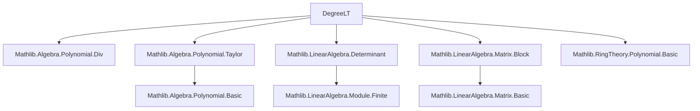

**Technical Brief: `DegreeLT.lean`**

---

### 1. **Key Definitions & Theorems**

| Name | Type / Signature | Purpose |
|------|------------------|---------|
| `Polynomial.degreeLT R n` | `Submodule R R[X]` | Submodule of polynomials over semiring `R` with degree `< n`. |
| `degreeLT.basis R n` | `Basis (Fin n) R R[X]_n` | Standard monomial basis: $X^i$ for $i < n$. |
| `degreeLT.basisProd R m n` | `Basis (Fin (m + n)) R (R[X]_m × R[X]_n)` | Product basis for direct sum of degree-bounded polynomial modules. |
| `degreeLT.addLinearEquiv R m n` | `R[X]_(m + n) ≃ₗ[R] R[X]_m × R[X]_n` | Linear equivalence induced by basis indexing; key for Sylvester matrix construction. |
| `degreeLT.addLinearEquiv_apply_fst / snd` | `f %ₘ X^m`, `f /ₘ X^m` | Explicit description of the equivalence: remainder and quotient w.r.t. $X^m$. |
| `taylorLinearEquiv R r n` | `R[X]_n ≃ₗ[R] R[X]_n` | Linear automorphism induced by Taylor shift $X \mapsto X + r$, preserving degree bound. |
| `det_taylorLinearEquiv` | `det = 1` | Determinant of the Taylor automorphism is 1 (unimodular). |

---

### 2. **Naming Conventions**

- **Submodule prefix**: `degreeLT` (short for *degree less than*).
- **Basis-related**:
  - `basis`, `basisProd`: standard and product bases.
  - `basis_val`, `basis_repr`: projection/representation lemmas.
- **Equivalence-related**:
  - `addLinearEquiv`, `addLinearEquiv_*`: linear equivalence between sum and product of degree-bounded modules.
  - `castAdd`, `natAdd`: indexing lemmas for `Fin` injections.
- **Taylor-related**:
  - `taylorLinearEquiv`, `taylor_mem_degreeLT`, `taylorEquiv`: shift automorphism and its interaction with degree bounds.
  - `det_taylorLinearEquiv`, `det_taylorLinearEquiv_toLinearMap`: determinant properties.

**Prefixes**:
- `is_`, `mem_`, `coeff_`, `degree_`, `X_pow_`, `taylor_`, `addLinear_`, `basis_`, `prod_`, `castAdd_`, `natAdd_`.

**Suffixes**:
- `_equiv`, `_linearEquiv`, `_repr`, `_val`, `_apply`, `_symm`, `_fst`, `_snd`.

---

### 3. **Tactic Stack**

Frequently used tactics in proofs:
- `rw` (rewrite with lemmas, especially `simp`-lemmas)
- `simp` / `simp only` (especially with `basis_repr`, `basis_val`, `coeff_X_pow`, `mem_degreeLT`)
- `refine`, `exact`, `apply`
- `ext` (extensionality for submodules/functions)
- `nth_rw` (nth rewrite)
- `nontriviality` (to assume nontrivial ring)
- `prod_ext`, `Subtype.ext`, `LinearEquiv.ext`, `Finsupp.ext`
- `calc` (for chain-of-equalities proofs)
- `rw [← ..., map_add, ...]` (algebraic manipulation)
- `simp [-...]` (to disable certain lemmas)

---

### 4. **Proof Logic**

- **Structure**: Most proofs follow a *basis-centric* strategy:
  1. Reduce to basis elements using `sum_repr` or `Basis.ext`.
  2. Compute action on basis elements via `basis_val`, `basis_repr`, `coeff_X_pow`, `taylor_X_pow`, etc.
  3. Use `simp`-lemmas and algebraic identities (`pow_add`, `mul_assoc`, `div_modByMonic_unique`, etc.).
- **Induction**: Not used explicitly here; instead, *basis decomposition* and *module properties* dominate.
- **Equivalence reasoning**: Many proofs use `LinearEquiv.ext`, `Subtype.ext`, or `Prod.ext` to reduce to component-wise equalities.
- **Determinant proofs**: Use `LinearMap.toMatrix`, upper-triangularity, and `Fintype.prod_eq_one`.

---

### 5. **Imports**

| Import | Purpose |
|--------|---------|
| `Mathlib.Algebra.Polynomial.Div` | Polynomial division, `%/ₘ`, `%ₘ`, `div_modByMonic_unique`. |
| `Mathlib.Algebra.Polynomial.Taylor` | Taylor shift `taylor r`, `taylorEquiv`, `taylor_X_pow`, etc. |
| `Mathlib.LinearAlgebra.Determinant` | Determinant of linear maps, `LinearMap.det_toMatrix`. |
| `Mathlib.LinearAlgebra.Matrix.Block` | Block matrices (likely for Sylvester matrix future work). |
| `Mathlib.RingTheory.Polynomial.Basic` | Basic polynomial algebra, `X`, `X_pow`, `coeff`, `degree`. |

---

### 6. **Mermaid Diagrams**

#### **Dependency Graph (Module-Level)**



#### **Conceptual Overview (File-Level)**

```mermaid
flowchart LR
  A[Polynomials of degree < n] --> B[Submodule R[X]_n]
  B --> C[Basis: monomials X^i]
  C --> D[Product basis for R[X]_m × R[X]_n]
  C --> E[Linear equivalence R[X]_(m+n) ≃ R[X]_m × R[X]_n]
  B --> F[Taylor shift automorphism]
  F --> G[Det = 1]
  E --> H[Sylvester matrix (future use)]
```

---

### 7. **Theory Scope**

- **Algebraic**: Polynomial modules over semirings/rings.
- **Linear Algebra**: Finite/free modules, bases, determinants, linear equivalences.
- **Computational**: Explicit representation via coefficients, division algorithm.
- **Future Use**: Foundation for Sylvester matrix and resultant theory (as noted in docstring).

---

### 8. **Notation**

- Scoped notation: `R[X]_n` for `Polynomial.degreeLT R n`.
- `i : Fin n` indexes basis elements.
- `⟨p, hp⟩` for elements of `R[X]_n` (submodule subtype).
- `taylor r f` for Taylor shift: $f(X) \mapsto f(X + r)$.

--- 

Let me know if you'd like a formalization roadmap for the Sylvester matrix or resultant theory built on top of this.
