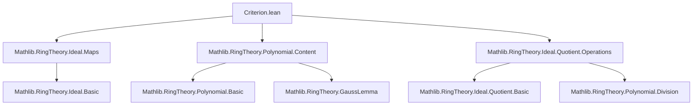

### Technical Brief: `Criterion.lean` — Generalized Eisenstein Irreducibility Criterion

---

#### **1. Key Definitions & Theorems**

| Name | Type / Signature | Purpose |
|------|------------------|---------|
| `generalizedEisenstein_aux` | `lemma` | Structural decomposition of divisors of `f` in terms of powers of `q`, with control over leading coefficients modulo `P`. |
| `generalizedEisenstein` | `theorem` | Main result: under hypotheses on `q`, `f`, and reduction modulo `P²`, `f` is irreducible in `R[X]`. |
| `irreducible_of_eisenstein_criterion` | `theorem` | Classic Eisenstein criterion as a corollary of `generalizedEisenstein`, using `q := X`. |
| `P` | `Ideal R := ker (algebraMap R K)` | Prime ideal in `R`, kernel of structure map to field `K`. |
| `q` | `R[X]` | Monic polynomial, irreducible (hence prime) in `K[X]`. |
| `f` | `R[X]` | Primitive polynomial, degree > 0, whose image in `K[X]` is a power of `q`. |
| `modByMonic q` | `R[X] → (R ⧸ (lead q)) [X]` | Division algorithm for monic divisors; used to define the `mod P²` condition. |

---

#### **2. Naming Conventions**

- **Prefixes**:
  - `generalizedEisenstein*`: for generalized criterion and its auxiliary lemmas.
  - `irreducible_of_*`: for irreducibility theorems derived from a criterion.
- **Suffixes**:
  - `_aux`: auxiliary lemmas used in main proofs.
  - `_map`: for maps under ring homomorphisms (e.g., `map`, `map_C`, `coeff_map`).
- **Variables**:
  - `P`, `q`, `f`, `g`, `h`: standard notation for ideals, polynomials, and factors.
  - `m`, `n`, `r`, `s`: indices and remainders in division or decomposition.

---

#### **3. Tactic Stack**

| Tactic | Usage Frequency | Purpose |
|--------|-----------------|---------|
| `simp` / `simp only` | Very High | Simplify goals using algebraic identities, `map_*`, `coeff_*`, `Ideal.*` lemmas. |
| `rw` | High | Rewrite using equalities like `hfmodP`, `hg`, `hh`, `h_eq`. |
| `exact` / `apply` | High | Apply lemmas like `dvd_pow_self`, `isUnit_or_isUnit`, `mem_ker`. |
| `by_cases` | Medium | Split on `m = 0`, `n = 0` in main proof. |
| `ext` | Medium | Extensionality for polynomial equality (coefficient-wise). |
| `ring` | Medium | Simplify polynomial expressions (e.g., `r := g - C g.leadingCoeff * q ^ m`). |
| `convert` | Low | Match goals up to definitional equality (e.g., `eval_zero`). |
| `exfalso` | Low | Derive contradiction from `¬P`. |
| `by_contra` | Low | Assume negation to derive contradiction. |

---

#### **4. Proof Logic**

The proof proceeds in two phases:

1. **Auxiliary Decomposition (`generalizedEisenstein_aux`)**:
   - Use primality of `q` in `K[X]` to deduce `g.map K ∣ q^p`.
   - Lift divisibility to `R[X]`: `g = C g.leadingCoeff * q^m + r`, with `r.map K = 0`.
   - Show `r` has coefficients in `P = ker(algebraMap R K)`.
   - If `m = 0`, then `g` is a unit (via primitivity).

2. **Main Irreducibility Proof (`generalizedEisenstein`)**:
   - Assume `f = g * h`.
   - Apply `generalizedEisenstein_aux` to both `g` and `h`, obtaining decompositions:
     ```
     g = C g.lC * q^m + r,   h = C h.lC * q^n + s
     ```
   - If both `m, n > 0`, then `f %ₘ q = (r * s) %ₘ q`.
   - Since `r, s` have coefficients in `P`, `r * s` has coefficients in `P²`.
   - Thus `f %ₘ q` maps to 0 in `(R ⧸ P²)[X]`, contradicting hypothesis `hfmodP2`.
   - Therefore, at least one of `m, n` is zero ⇒ one of `g, h` is a unit.

The classic criterion (`irreducible_of_eisenstein_criterion`) sets `q = X`, `K = Frac(R/P)`, and verifies all hypotheses using coefficient conditions.

---

#### **5. Imports & Dependencies**

| Import | Role |
|--------|------|
| `Mathlib.RingTheory.Ideal.Maps` | Ideal maps, especially `map`, `ker`, `Ideal.Quotient`. |
| `Mathlib.RingTheory.Polynomial.Content` | Primitivity (`IsPrimitive`), Gauss’s lemma, content. |
| `Mathlib.RingTheory.Ideal.Quotient.Operations` | Operations on quotients, especially `mk`, `modByMonic`, `map (mk I)`. |

Additional implicit dependencies:
- `Mathlib.FieldTheory.FractionField` (via `FractionRing`)
- `Mathlib.RingTheory.Polynomial.Basic` (for `modByMonic`, `natDegree`, `coeff`)
- `Mathlib.RingTheory.PrincipalIdealDomain` (for `irreducible_X`, `dvd_prime_pow`)
- `Mathlib.Algebra.Algebra.Content` (for `IsScalarTower`, `FaithfulSMul`)

---

#### **6. Mermaid Diagrams**

##### **Dependency Graph (Module-Level)**



##### **Theoretical Overview (Proof Structure)**

```mermaid
flowchart LR
  subgraph Definitions
    P[P := ker(algebraMap R K)]
    q[q ∈ R[X], monic, irreducible in K[X]]
    f[f ∈ R[X], primitive, deg > 0, f_K = c·q^p]
  end

  subgraph Hypotheses
    hfP[f.lC ∉ P]
    hfmodP[f_K = c·q^p]
    hfmodP2[(f %ₘ q) ∉ (R ⧸ P²)[X]]
  end

  subgraph Aux
    aux[generalizedEisenstein_aux]
  end

  subgraph Main
    main[generalizedEisenstein]
    classic[irreducible_of_eisenstein_criterion]
  end

  P -->|Prime| hfP
  q -->|Prime in K[X]| aux
  f -->|Structure| aux
  hfmodP2 -->|Contradiction| main
  aux --> main
  main --> classic
  classic -->|q = X, K = Frac(R/P)| hfP
```

---

#### **7. Future Work (from TODO)**

- Extend to `q = X - a`: relate condition to `f.derivative.eval a ∉ P²`.
- Cyclotomic polynomials `Φₚ(X)` for prime `p`: apply with `a = 1`.
- Generalize to non-monic `q`, `f`: localize at `P` to invert leading coefficients.
- Replace `P²` with *symbolic square* `P^(2)` for non-maximal `P`.

---

#### **8. Formalization Notes**

- Uses `modByMonic` instead of `mod` to avoid division-by-non-monic issues.
- Relies heavily on `map` and `coeff_map` to relate `R[X]` and `K[X]`.
- Primitivity (`IsPrimitive`) is critical to lift units from `K[X]` to `R[X]`.
- `FractionRing` is used to embed `R/P` into a field for applying `generalizedEisenstein`.

--- 

This file formalizes a powerful generalization of Eisenstein’s criterion, enabling irreducibility proofs for polynomials whose reduction modulo a prime ideal is a power of a prime polynomial — a key tool in algebraic number theory and algebraic geometry.
