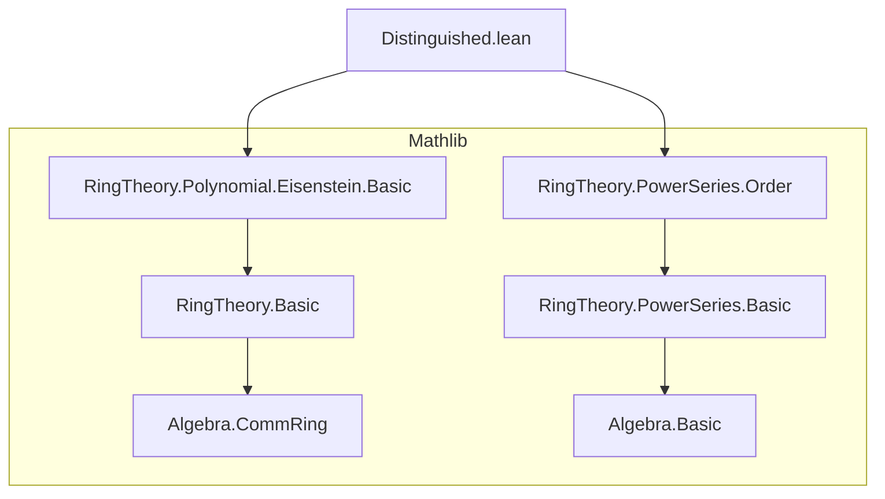
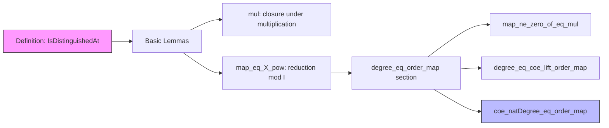

### Technical Brief: `Distinguished.lean`

---

#### **1. Key Definitions & Theorems**

| Name | Type / Signature | Purpose |
|------|------------------|---------|
| `Polynomial.IsDistinguishedAt` | `f : R[X] → I : Ideal R → Prop` | Predicate stating that `f` is *monic* and *weakly Eisenstein at `I`* — i.e., $ f = X^n + a_1 X^{n-1} + \dots + a_n $ with all $ a_i \in I $. |
| `Polynomial.IsDistinguishedAt.monic` | `hf.monic : f.Monic` | Extracts the monicity condition from a distinguished polynomial. |
| `Polynomial.IsDistinguishedAt.toIsWeaklyEisensteinAt` | `hf.toIsWeaklyEisensteinAt : f.IsWeaklyEisensteinAt I` | Forgets monicity to get the weak Eisenstein condition. |
| `mul` | `hf : f.IsDistinguishedAt I → hf' : f'.IsDistinguishedAt I → (f * f').IsDistinguishedAt I` | Product of two distinguished polynomials (at same ideal) is distinguished. |
| `map_eq_X_pow` | `hf : f.IsDistinguishedAt I → f.map (Ideal.Quotient.mk I) = X ^ f.natDegree` | Reduction modulo `I` sends a distinguished polynomial to a pure power of `X`. |
| `map_ne_zero_of_eq_mul` | `hf : g.IsDistinguishedAt I → h₀ ∉ I → f = g * h → f.map (Ideal.Quotient.mk I) ≠ 0` | If `h` has constant coefficient not in `I`, and `f = g * h`, then `f` mod `I` is nonzero. |
| `degree_eq_coe_lift_order_map` | `g.IsDistinguishedAt I → h₀ ∉ I → f = g * h → g.degree = (f.modI).order.lift ...` | Relates degree of `g` to the order (lowest nonzero power of `X`) of `f` modulo `I`. |
| `coe_natDegree_eq_order_map` | Same hypotheses as above, but concludes `g.natDegree = (f.modI).order` | Simplified version of the previous lemma using `natDegree`. |

---

#### **2. Naming Conventions**

- **Predicate prefix**: `IsDistinguishedAt` — follows Lean/Mathlib convention for properties (`IsX`).
- **Structure field names**: `monic`, `toIsWeaklyEisensteinAt` — standard for extended predicates.
- **Lemma naming**:
  - `map_eq_X_pow`: describes image under quotient map equals power of `X`.
  - `degree_eq_coe_lift_order_map`: indicates equality between degree and lifted order.
  - `coe_natDegree_eq_order_map`: uses coercion to simplify degree/order equality.
- **Variables**:
  - `f, h : R⟦X⟧` (power series), `g : R[X]` (polynomial) — standard in analysis of power series vs polynomials.
  - `I : Ideal R`, `distinguish : g.IsDistinguishedAt I` — typical for reasoning modulo an ideal.

---

#### **3. Tactic Stack**

- `simp` / `simp_rw`: heavily used for simplifying coefficients, maps, and quotient structures.
- `ext`: extensionality for power series/polynomials (coefficient-wise equality).
- `by_cases`: to split on equality of indices (e.g., `i = f.natDegree`).
- `rcases lt_or_gt_of_ne`: case analysis on strict inequalities.
- `apply_fun`: to apply a function (here, coefficient extraction) to both sides of an equation.
- `constructor`: for proving biconditionals or equalities in order definitions.
- `rw`, `exact`, `intro`, `apply`: standard proof scripting.
- `nontrivial_iff.mpr`: to establish nontriviality of ring `R` via two distinct elements.

No heavy automation (e.g., `aesop`, `linarith`) — proofs are mostly structural and coefficient-level.

---

#### **4. Proof Logic**

- **Structure**: Proofs are largely *coefficient-level* and *modular*:
  - Use `ext i` to reduce to coefficient-wise reasoning.
  - Split cases on whether index `i` equals the degree (`natDegree`) or not.
  - For `map_eq_X_pow`, use `eq_zero_iff_mem` to show lower coefficients vanish mod `I`.
  - For `map_ne_zero_of_eq_mul`, reduce to showing the coefficient at `natDegree(g)` is nonzero mod `I`, using `notMem`.
  - For `degree_eq_coe_lift_order_map`, prove two inequalities:
    - Show coefficients below `natDegree(g)` vanish (via `mapf` and `eq_zero_iff_mem`).
    - Show coefficient at `natDegree(g)` is nonzero (via `notMem` and `PowerSeries.coeff_X_pow_mul'`).
- **Induction**: Not used here — relies on direct coefficient analysis and properties of order/degree.

---

#### **5. Imports & Dependencies**

- **Core dependencies**:
  - `Mathlib.RingTheory.Polynomial.Eisenstein.Basic`: defines `IsWeaklyEisensteinAt`.
  - `Mathlib.RingTheory.PowerSeries.Order`: defines `order`, `coeff`, etc., for power series.
- **Open scopes**:
  - `Polynomial`, `PowerSeries`, `Ideal`, `Quotient` — for notation like `X`, `coeff`, `mod I`, etc.
- **Key abstractions**:
  - `Ideal.Quotient.mk I`: projection `R → R/I`.
  - `PowerSeries.order`: lowest index with nonzero coefficient.
  - `natDegree`, `degree`: polynomial degree notions.

---

#### **6. Mermaid Diagrams**

##### **Dependency Graph (Module-Level)**

##### **Overview of File Structure**

---

#### **7. Theory Context**

- **Goal**: Develop foundational theory of *distinguished polynomials*, which are central in local algebra (e.g., Weierstrass preparation, formal function theorem).
- **Role in larger theory**: Likely a stepping stone toward:
  - Formal Weierstrass preparation theorems.
  - Analysis of power series factorization modulo ideals.
  - Applications in deformation theory or local moduli problems.
- **Design philosophy**: Lean-style, minimal assumptions (`CommRing R`), explicit use of `Ideal.Quotient` and `PowerSeries.order`.

--- 

Let me know if you'd like a formalization roadmap or a comparison with Weierstrass preparation in Mathlib.
