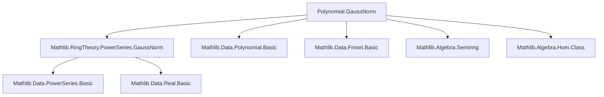
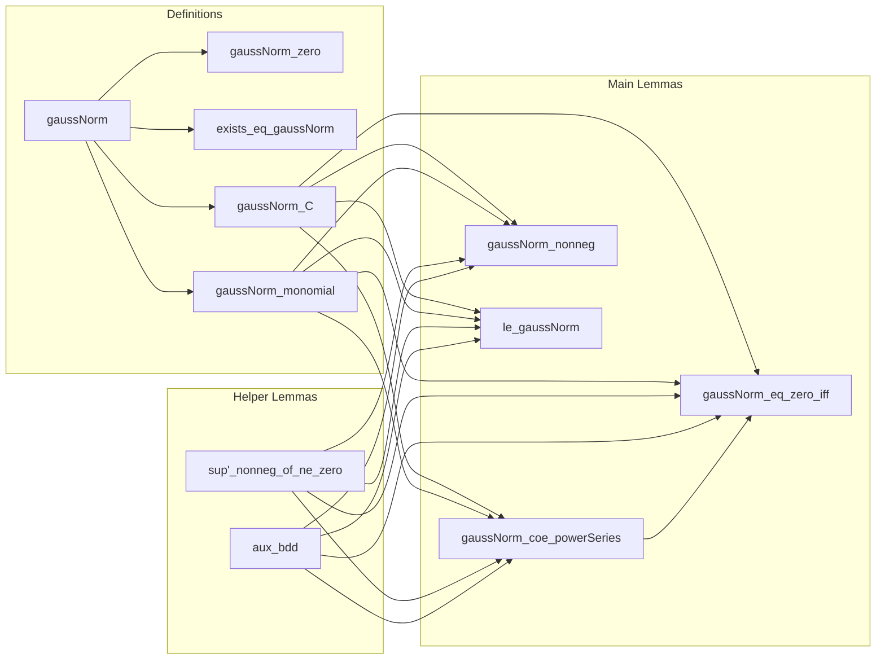

**Technical Brief: `GaussNorm.lean` (Polynomial Gauss Norm)**  
*Source: `Mathlib.RingTheory.PowerSeries.GaussNorm` (polynomial version)*  
*Author: Fabrizio Barroero (2025)*  
*License: Apache 2.0*

---

### 1. KEY DEFINITIONS & THEOREMS

| Name | Type / Signature | Purpose |
|------|------------------|---------|
| `gaussNorm` | `def gaussNorm (v : F) (c : ℝ) (p : R[X]) : ℝ` | Defines the Gauss norm of a polynomial `p` as the supremum of `v(p.coeff i) * c^i` over `i ∈ p.support`. |
| `gaussNorm_zero` | `gaussNorm v c 0 = 0` | Confirms the norm of the zero polynomial is zero. |
| `exists_eq_gaussNorm` | `∃ i, p.gaussNorm v c = v (p.coeff i) * c ^ i` | Guarantees the supremum is attained (since support is finite). |
| `gaussNorm_C` | `(C r).gaussNorm v c = v r` | Norm of a constant polynomial equals `v(r)`. |
| `gaussNorm_monomial` | `(monomial n r).gaussNorm v c = v r * c ^ n` | Norm of a monomial is `v(r) * c^n`. |
| `gaussNorm_coe_powerSeries` | `(p.toPowerSeries).gaussNorm v c = p.gaussNorm v c` | Compatibility: polynomial Gauss norm equals power series Gauss norm under mild assumptions (`v ≥ 0`, `c ≥ 0`). |
| `gaussNorm_eq_zero_iff` | `p.gaussNorm v c = 0 ↔ p = 0` (under `v x = 0 ↔ x = 0`, `c > 0`) | Characterizes when the norm vanishes — iff the polynomial is zero. |
| `gaussNorm_nonneg` | `0 ≤ p.gaussNorm v c` (under `v ≥ 0`, `c ≥ 0`) | Norm is nonnegative. |
| `le_gaussNorm` | `v (p.coeff i) * c ^ i ≤ p.gaussNorm v c` | Each term in the defining set is bounded above by the norm. |

---

### 2. NAMING CONVENTIONS

- **Prefixes**:
  - `gaussNorm_`: all definitions/lemmas related to the Gauss norm.
  - `coe_`: coercion-related lemmas (e.g., `gaussNorm_coe_powerSeries`, `coeff_coe`).
- **Suffixes**:
  - `_zero`: behavior on zero object.
  - `_C`: behavior on constant polynomials (`C r`).
  - `_monomial`: behavior on monomials.
  - `_iff`: equivalence characterizations (e.g., `gaussNorm_eq_zero_iff`).
- **Typeclass constraints**:
  - `[ZeroHomClass F R ℝ]`: ensures `v 0 = 0`.
  - `[NonnegHomClass F R ℝ]`: ensures `v ≥ 0`.
  - `[FunLike F R ℝ]`: allows `v : F` to act as a function `R → ℝ`.

---

### 3. TACTIC STACK

| Tactic | Usage Frequency | Purpose |
|--------|-----------------|---------|
| `simp` | Very High | Simplify using `@[simp]` lemmas, especially for `gaussNorm`, `support`, `coeff`, `sup'`. |
| `by_cases` | High | Split on `p = 0`, `p.support.Nonempty`, `r = 0`, etc. |
| `apply le_antisymm` | Medium | Prove equality of reals via double inequality (e.g., in `gaussNorm_coe_powerSeries`). |
| `intro` / `intro h` | Medium | Standard intro steps for implications. |
| `grind` | Low | Used in `aux_bdd` for automated reasoning over finite sets. |
| ` positivity` | Low | To prove nonnegativity of expressions involving `c ≥ 0`, `v ≥ 0`. |
| `rw`, `exact`, `use` | Medium | Rewriting, applying lemmas, constructing witnesses (e.g., in `exists_eq_gaussNorm`). |

---

### 4. PROOF LOGIC

- **Structure of proofs**:
  - **Case analysis** on whether the polynomial is zero or its support is nonempty.
  - **Finite supremum reasoning**: since `p.support` is finite, `sup'` is attained (`exists_eq_gaussNorm`).
  - **Reduction to power series**: many lemmas (e.g., `gaussNorm_coe_powerSeries`, `gaussNorm_eq_zero_iff`) are proved by:
    1. Reducing to the power series case via coercion (`toPowerSeries`).
    2. Applying known results from `PowerSeries.GaussNorm`.
    3. Verifying required assumptions (`BddAbove`, `c ≥ 0`, etc.).
  - **Monotonicity/positivity**: rely on `sup'_nonneg_of_ne_zero` and `aux_bdd` to ensure boundedness and nonnegativity.

- **Typical flow**:
  ```text
  [Assume v ≥ 0, c ≥ 0]
  → Split on p = 0 or not
  → Use finiteness of support to get max term
  → Compare with power series version
  → Apply known lemmas from PowerSeries
  → Conclude via le_antisymm or simp
  ```

---

### 5. IMPORTS & DEPENDENCIES

| Module | Role |
|--------|------|
| `Mathlib.RingTheory.PowerSeries.GaussNorm` | Defines Gauss norm for power series; used for comparison and lifting results. |
| `Mathlib.Algebra.Semiring` | Provides `Semiring R`, needed for polynomial ring `R[X]`. |
| `Mathlib.Data.Finset.Basic` | For `sup'`, `support`, `Finset` operations. |
| `Mathlib.Data.Real.Basic` | For `ℝ`, `sup`, `ciSup`, boundedness. |
| `Mathlib.Algebra.Hom.Class` | For `ZeroHomClass`, `NonnegHomClass`. |
| `Mathlib.Data.Polynomial.Basic` | For `coeff`, `support`, `monomial`, `C`, `toPowerSeries`. |
| `Mathlib.Data.PowerSeries.Basic` | For `PowerSeries`, `coeff`, `toPowerSeries`. |

---

### 6. MERMAID DIAGRAMS

#### Dependency Graph (High-Level)



#### Overview of File Structure



---

### 7. THEORY CONTEXT

- **Purpose**: Generalizes the "height" of a polynomial (max absolute value of coefficients) to arbitrary valued semirings.
- **Use Cases**:
  - Non-Archimedean analysis (e.g., Berkovich spaces).
  - Diophantine geometry (heights of polynomials).
  - Transfer of norm properties from polynomials to power series.
- **Key Insight**: The Gauss norm is a *finite* supremum (attained), making it computable in principle.

--- 

Let me know if you'd like a formalized dependency graph (e.g., `leanpkg` tree) or a comparison with `PowerSeries.GaussNorm`.
