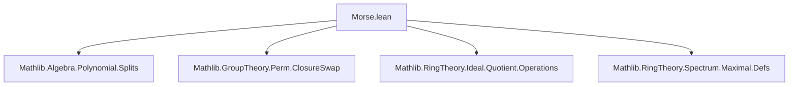
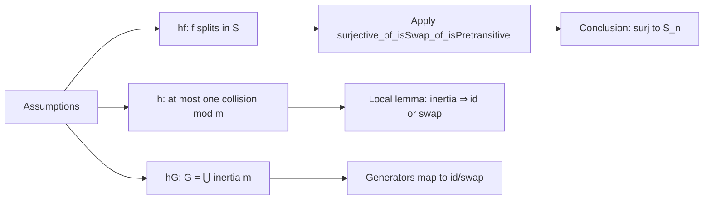

**Technical Brief: Morse Polynomials and Galois Groups in Lean 4**

---

### 1. **Key Definitions & Theorems**

| Name | Type / Signature | Purpose |
|------|------------------|---------|
| `Morse polynomial` (implicit) | — | A polynomial `f : R[X]` such that for every maximal ideal `m ⊆ S`, the number of roots of `f` in `S` modulo `m` differs by at most 1 from the number of roots in `S`. Formally: `(f.rootSet S).ncard ≤ (f.rootSet (S ⧸ m)).ncard + 1`. |
| `inertia G` | `Ideal S → AddSubgroup G` | For an ideal `p ⊆ S`, `p.toAddSubgroup.inertia G` is the subgroup of `G` fixing all roots modulo `p`. Used to capture local monodromy. |
| `MulAction.toPermHom` | `G → Perm (f.rootSet S)` | The homomorphism from the group `G` to permutations of the roots in `S`. |
| `Splits.toPermHom_apply_eq_one_or_isSwap_of_ncard_le_of_mem_inertia` | `∀ g ∈ p.toAddSubgroup.inertia G, ... = 1 ∨ IsSwap` | Core structural lemma: inertia elements act as identity or transposition on roots, under the “at most one collision mod `p`” condition. |
| `Splits.surjective_toPermHom_of_iSup_inertia_eq_top` | `Function.Surjective (MulAction.toPermHom G (f.rootSet S))` | Main theorem: if `G` acts *pretransitively* (i.e., transitively on roots) and is generated by inertia subgroups over all maximal ideals, then `G` surjects onto `S_n`. |

---

### 2. **Naming Conventions**

- **Prefixes**:
  - `to_`: e.g., `toPermHom`, `toAddSubgroup` — conversion functions.
  - `is_`: e.g., `IsPrime`, `IsSwap`, `IsPretransitive` — predicate properties.
  - `ncard`: cardinality of a finite set (used for root sets).
- **Suffixes**:
  - `_of_`: e.g., `of_ncard_le_of_mem_inertia`, `of_iSup_inertia_eq_top` — conditions or hypotheses.
  - `_apply`: e.g., `toPermHom_apply` — applied version of a homomorphism.
- **Notation**:
  - `•` for group action (`MulAction`).
  - `S ⧸ p` for quotient ring/algebra.
  - `π` for the canonical map `S → S ⧸ p`.

---

### 3. **Tactic Stack**

- `grind` — custom tactic (likely from `Mathlib.Tactic`) for solving equalities in algebraic structures.
- `simp only [...]` — targeted simplification using specific lemmas.
- `subst`, `split_ifs`, `ext`, `apply`, `intro`, `obtain`, `rw`, `have`, `exact`, `simpa`, `by_cases`, `classical`.
- `ring`, `aesop` — not present; this file relies on algebraic reasoning and `grind`.

---

### 4. **Proof Logic**

The proofs follow a **local-to-global strategy**:

1. **Local analysis** (per maximal ideal `m`):
   - Use the “at most one collision mod `m$” hypothesis to constrain the action of inertia elements.
   - Show inertia elements act as identity or transposition (via `Splits.toPermHom_apply_eq_one_or_isSwap_of_ncard_le_of_mem_inertia`).
   - Key step: reduce to analyzing how `g ∈ inertia` permutes roots modulo `m`, using the injectivity of the map on root sets modulo `m` except possibly one collision.

2. **Global conclusion**:
   - Assume `G` is generated by all inertia subgroups (`hG : ⨆ m, inertia m = ⊤`).
   - Use `surjective_of_isSwap_of_isPretransitive'` (a standard group-theoretic criterion): if a transitive group is generated by involutions that are transpositions, then it surjects onto `S_n`.
   - Apply the local result to show generators map to identity or transposition.

---

### 5. **Imports & Dependencies**

| Module | Role |
|--------|------|
| `Mathlib.Algebra.Polynomial.Splits` | `Splits`, `rootSet`, `aroots_def`, `image_rootSet_of_map_ne_zero`, etc. |
| `Mathlib.GroupTheory.Perm.ClosureSwap` | `surjective_of_isSwap_of_isPretransitive'`, `IsSwap`, transposition generation criteria. |
| `Mathlib.RingTheory.Ideal.Quotient.Operations` | `Ideal.Quotient.mkₐ`, `Ideal.Quotient.mk_eq_mk_iff_sub_mem`, algebra structure on quotients. |
| `Mathlib.RingTheory.Spectrum.Maximal.Defs` | `MaximalSpectrum`, `asIdeal`, `iSup`, `inertia` subgroups. |

---

### 6. **Mermaid Diagrams**

#### **Dependency Graph (File-Level)**

#### **Theoretical Overview (Module-Level)**

#### **Proof Structure (Theorem `surjective_toPermHom_of_iSup_inertia_eq_top`)**

---

### 7. **Future Work (from TODO)**

- **Number field case**: Use Minkowski’s theorem to deduce generation by inertia subgroups automatically.
- **Selmer polynomials**: Prove `X^n - X - 1` satisfies Morse condition and hence has Galois group `S_n`.

---

### 8. **References**

- Serre, *Topics in Galois Theory*, Section 4.4 — defines *Morse functions* in this context.

--- 

This file formalizes a classical technique in Galois theory: using local monodromy (inertia) to control global Galois groups, with Morse polynomials as the key class where the local data is simple enough (only transpositions) to force full symmetric groups.
