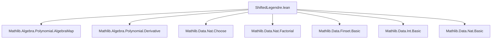
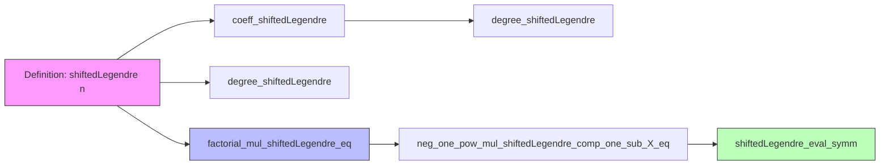

### Technical Brief: `ShiftedLegendre.lean`

---

#### **1. Key Definitions & Theorems**

| Name | Type / Signature | Purpose |
|------|------------------|---------|
| `shiftedLegendre` | `ℕ → ℤ[X]` | Defines the *n*-th shifted Legendre polynomial as an integer-coefficient polynomial via an explicit sum. |
| `factorial_mul_shiftedLegendre_eq` | `∀ n, (n ! : ℤ[X]) * shiftedLegendre n = derivative^[n] (X ^ n * (1 - X) ^ n)` | Analogue of **Rodrigues’ formula** for shifted Legendre polynomials; connects them to *n*-th derivatives of a combinatorial expression. |
| `coeff_shiftedLegendre` | `∀ n k, (shiftedLegendre n).coeff k = (-1)^k * n.choose k * (n + k).choose n` | Gives the explicit coefficient of $X^k$ in $P_n(X)$. |
| `degree_shiftedLegendre` | `∀ n, (shiftedLegendre n).degree = n` | Confirms the degree of the *n*-th shifted Legendre polynomial is exactly *n*. |
| `natDegree_shiftedLegendre` | `∀ n, (shiftedLegendre n).natDegree = n` | Same as above, but for natural degree (i.e., degree when nonzero). |
| `neg_one_pow_mul_shiftedLegendre_comp_one_sub_X_eq` | `∀ n, (-1)^n * (shiftedLegendre n).comp (1 - X) = shiftedLegendre n` | Functional symmetry: composition with $1 - X$ yields the same polynomial up to sign $(-1)^n$. |
| `shiftedLegendre_eval_symm` | `∀ n, aeval x (shiftedLegendre n) = (-1)^n * aeval (1 - x) (shiftedLegendre n)` | Evaluation symmetry: $P_n(x) = (-1)^n P_n(1 - x)$, a key symmetry property. |

---

#### **2. Naming Conventions**

- **Prefixes**:
  - `shiftedLegendre_`: for definitions and properties of the main object.
  - `factorial_mul_`, `coeff_`, `degree_`, `natDegree_`: standard polynomial metadata.
  - `eval_`: evaluation-related lemmas.
- **Suffixes**:
  - `_eq`: equality theorems (especially structural or defining ones).
  - `_comp`: composition with a polynomial (e.g., `1 - X`).
  - `_symm`: symmetry-related properties.

---

#### **3. Tactic Stack**

Frequently used tactics in proofs:
- `rw`, `simp`, `simp_rw`: for rewriting definitions and simplifying expressions.
- `congr`, `congr!`: for structural equality (especially in sums and derivatives).
- `calc`: for multi-step equational reasoning (used in `factorial_mul_shiftedLegendre_eq`).
- `ring`: for commutative ring simplifications (especially after coefficient extraction).
- `norm_cast`, `linarith`, `lia`: for arithmetic reasoning over integers and naturals.
- `symm`: to reverse equalities when needed.
- `nat_mul_inj'`: used to cancel factorial factors in proofs involving integer polynomials.

---

#### **4. Proof Logic**

- **Inductive or structural reasoning**: Proofs rely on *explicit coefficient analysis* and *derivative calculus* rather than induction on *n*.
- **Key proof strategy in `factorial_mul_shiftedLegendre_eq`**:
  1. Start from RHS: rewrite $X^n (1 - X)^n = (X - X^2)^n$.
  2. Expand via binomial theorem (`add_pow`).
  3. Apply *n*-th derivative termwise (`iterate_derivative_sum`).
  4. Use known formula for derivative of monomials (`iterate_derivative_X_pow_eq_smul`).
  5. Simplify combinatorial coefficients using factorial identities (`descFactorial_eq_div`, `add_choose`, `factorial_mul_factorial_dvd_factorial_add`).
  6. Match with definition of `shiftedLegendre n`.
- **Symmetry proofs** (`neg_one_pow_mul_shiftedLegendre_comp_one_sub_X_eq`, `shiftedLegendre_eval_symm`):
  - Use functional equation of derivative under substitution $X \mapsto 1 - X$.
  - Cancel factorial factors using injectivity of multiplication by nonzero integers (`nat_mul_inj'`).
  - Apply evaluation homomorphism properties (`aeval_comp`).

---

#### **5. Imports & Dependencies**

- **Core dependencies**:
  - `Mathlib.Algebra.Polynomial.AlgebraMap`: for `C : ℤ → ℤ[X]`, algebra maps.
  - `Mathlib.Algebra.Polynomial.Derivative`: for `derivative`, `iterate_derivative`, and related lemmas.
- **Implicit dependencies** (via `Polynomial` namespace and tactics):
  - `Mathlib.Data.Nat.Choose`: binomial coefficients.
  - `Mathlib.Data.Finset.Basic`, `BigOperators`: for sums over `Finset.range`.
  - `Mathlib.Data.Int.Basic`: for integer arithmetic, signs, powers.
  - `Mathlib.Data.Nat.Basic`, `Mathlib.Data.Nat.Factorial`: factorial, divisibility, choose identities.

---

#### **6. Mermaid Diagrams**

##### **Dependency Graph (Module-Level)**

##### **Theoretical Overview (Conceptual Flow)**

- **Legend**:
  - Pink: foundational definition.
  - Blue: structural properties (Rodrigues-type identity).
  - Green: symmetry and evaluation consequences.

---

#### **7. Summary**

This module formalizes the *shifted Legendre polynomials* over `ℤ[X]`, providing:
- A concrete combinatorial definition,
- A Rodrigues-type derivative characterization,
- Degree and coefficient analysis,
- A symmetry property under $x \mapsto 1 - x$.

It serves as a foundation for further work on orthogonal polynomials, approximation theory, or combinatorial identities involving binomial coefficients and derivatives. The proofs are largely computational, leveraging Lean’s powerful simplifier and arithmetic reasoning capabilities.
