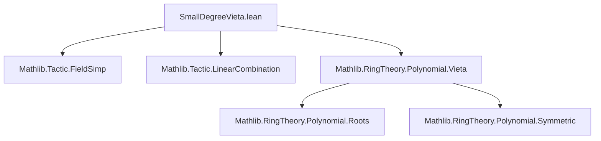

### Technical Brief: `SmallDegreeVieta.lean`

---

#### **1. Key Definitions & Theorems**

| Name | Type / Signature | Purpose |
|------|------------------|---------|
| `eq_quadratic_of_degree_le_two` | `{p : R[X]} → p.degree ≤ 2 → p = C (p.coeff 2) * X ^ 2 + C (p.coeff 1) * X + C (p.coeff 0)` | Expresses any polynomial of degree ≤ 2 over a semiring as its explicit coefficient expansion. |
| `eq_neg_mul_add_of_roots_quadratic_eq_pair` | `{a b c x1 x2 : R} → (C a * X ^ 2 + C b * X + C c).roots = {x1, x2} → b = -a * (x1 + x2)` | Vieta’s formula: sum of roots relates to coefficient `b`. |
| `eq_mul_mul_of_roots_quadratic_eq_pair` | `{a b c x1 x2 : R} → (C a * X ^ 2 + C b * X + C c).roots = {x1, x2} → c = a * x1 * x2` | Vieta’s formula: product of roots relates to coefficient `c`. |
| `eq_neg_mul_add_of_aroots_quadratic_eq_pair` | Same as above but for *algebraic roots* (`aroots`) over an algebra `T → S`. | Extends Vieta to extension rings/algebras. |
| `eq_mul_mul_of_aroots_quadratic_eq_pair` | Same as above for product. | |
| `roots_quadratic_eq_pair_iff_of_ne_zero` | `a ≠ 0 → (roots = {x1, x2}) ↔ (b = -a(x1+x2) ∧ c = a x1 x2)` | Full equivalence (iff) version of Vieta for quadratics, assuming leading coefficient nonzero. |
| `aroots_quadratic_eq_pair_iff_of_ne_zero` | Algebraic version of the above. | |
| `roots_quadratic_eq_pair_iff_of_ne_zero'` | Over a field: `roots = {x1, x2} ↔ x1+x2 = -b/a ∧ x1*x2 = c/a`. | Standard high-school Vieta form using division. |
| `aroots_quadratic_eq_pair_iff_of_ne_zero'` | Algebraic + field version of the above. | |

---

#### **2. Naming Conventions**

- **Prefixes**:
  - `eq_...`: States equality of a coefficient with an expression in roots.
  - `roots_...`: For `roots` (multiset of roots in base ring).
  - `aroots_...`: For `aroots` (roots in an algebra extension).
- **Suffixes**:
  - `_quadratic`: Restricts to degree-2 polynomials.
  - `_eq_pair`: Assumes exactly two roots (as a multiset `{x1, x2}`).
  - `_of_ne_zero`: Assumes leading coefficient nonzero.
  - `_of_ne_zero'`: Specialized to fields, uses division.
- **Helper variable naming**:
  - `p`: generic polynomial.
  - `a, b, c`: coefficients of quadratic $aX^2 + bX + c$.
  - `x1, x2`: roots.

---

#### **3. Tactic Stack**

| Tactic | Usage Frequency | Purpose |
|--------|-----------------|---------|
| `simp` / `simp_rw` | High | Simplify sums, coefficients, maps, `aroots_def`, etc. |
| `abel` | Medium | Abelian group reasoning (e.g., rearranging sums/products). |
| `rw` | Very High | Rewriting using hypotheses (`hroots`, `ha`, etc.), definitions (`aroots_def`, `coeff_eq_esymm_roots_of_card`). |
| `convert` | Medium | To match goals up to definitional equality (e.g., `natDegree`). |
| `field_simp` | Medium | Simplify field expressions (division). |
| `linear_combination` | Medium | Solve linear equations over rings/fields (e.g., derive `-b/a` from `b = -a(x1+x2)`). |
| `have`, `suffices`, `exact` | High | Structured proof construction. |
| `ring` | Medium | Polynomial ring identities (e.g., verifying factorization). |

---

#### **4. Proof Logic**

- **Structure**:
  1. **Normalization**: Use `eq_quadratic_of_degree_le_two` to reduce to explicit coefficient form.
  2. **Cardinality & natDegree**: Prove `p.roots.card = p.natDegree = 2` using `card_roots` and assumptions (e.g., domain + nonzero leading coeff).
  3. **Apply `coeff_eq_esymm_roots_of_card`**: Leverages symmetric sums of roots to extract coefficients.
  4. **Equivalence proofs**: Use `⟨...⟩` to split iff into two directions; one direction via lemmas above, the other via factorization:
     - Show $p = a(X - x_1)(X - x_2)$ using Vieta equalities.
     - Then apply `Polynomial.roots_mul` and `X_sub_C_ne_zero` to get root multiset.
  5. **Field versions**: Use `field_simp` and `linear_combination` to convert additive/multiplicative Vieta into division form.

- **Common pattern**:
  > *Assume domain + nonzero leading coefficient → roots count = degree → apply symmetric coefficient formula → derive coefficient-root relations.*

---

#### **5. Imports & Dependencies**

| Import | Role |
|--------|------|
| `Mathlib.Tactic.FieldSimp` | Simplify field expressions, invert nonzero elements. |
| `Mathlib.Tactic.LinearCombination` | Solve linear equations (e.g., derive $x_1 + x_2 = -b/a$ from $b = -a(x_1+x_2)$). |
| `Mathlib.RingTheory.Polynomial.Vieta` | Core Vieta theory: `coeff_eq_esymm_roots_of_card`, `roots_mul`, `X_sub_C_ne_zero`, etc. |

---

#### **6. Mermaid Diagrams**

##### **Dependency Graph (Module-Level)**



##### **Theoretical Overview (File-Level)**

```mermaid
flowchart LR
  A[Polynomial of degree ≤ 2] --> B[Explicit coefficient form]
  B --> C{Has 2 roots?}
  C -->|Yes, in R| D[roots = {x1, x2}]
  C -->|Yes, in S (algebra)| E[aroots S = {x1, x2}]
  D --> F[Vieta: b = -a(x1+x2), c = a x1 x2]
  E --> G[Vieta over algebra]
  F --> H[Iff with factorization a(X−x1)(X−x2)]
  H --> I[Field version: x1+x2 = -b/a, x1*x2 = c/a]
```

##### **Proof Strategy Flow (for `roots_quadratic_eq_pair_iff_of_ne_zero`)**

```mermaid
flowchart TD
  Start[Assume a ≠ 0] --> Left[→: roots = {x1,x2} ⇒ Vieta]
  Right[←: Vieta ⇒ roots = {x1,x2}]
  Left --> L1[Use coeff_eq_esymm_roots_of_card]
  Right --> R1[Show p = a(X−x1)(X−x2)]
  R1 --> R2[Apply Polynomial.roots_mul]
  L1 & R2 --> End[Iff]
```

---

#### **7. Domain Scope**

- **Primary domain**: Commutative rings, integral domains, fields.
- **Secondary**: Algebras over commutative rings (`T → S`).
- **Focus**: Explicit, low-degree (≤2) cases of Vieta’s formulas — complementary to general `Mathlib.RingTheory.Polynomial.Vieta` which handles arbitrary degrees via elementary symmetric polynomials.

--- 

Let me know if you'd like a formalized dependency graph for the entire `Mathlib` Vieta theory or a comparison with the general-degree version.
