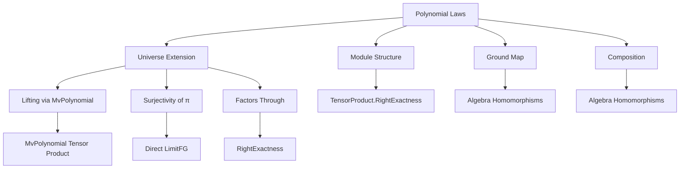
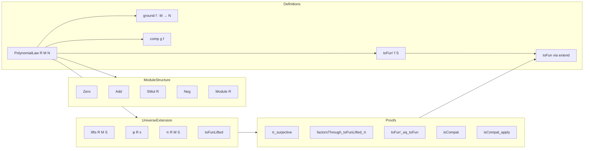

### Technical Brief: `Basic.lean` — Polynomial Laws on Modules

---

#### **1. Key Definitions & Theorems**

| Name | Type / Signature | Purpose |
|------|------------------|---------|
| `PolynomialLaw R M N` | `Type u` | Type of *polynomial laws* from $R$-module $M$ to $N$, i.e., natural transformations $S \otimes_R M \to S \otimes_R N$ for all $R$-algebras $S$ (in same universe as $R$). |
| `toFun' f S` | `S ⊗[R] M → S ⊗[R] N` | Underlying family of maps for a polynomial law `f`, defined only for algebras `S` in universe `u`. |
| `isCompat' f φ` | Compatibility condition: `φ.rTensor N ∘ toFun' f S = toFun' f S' ∘ φ.rTensor M` | Ensures naturality of the family `toFun'` across $R$-algebra maps $\varphi : S \to S'$. |
| `ground f` | `M → N` | The *ground map* induced by `f` over base algebra `R`, via isomorphisms $R \otimes_R M \cong M$. |
| `lground f` | `(M →ₚₗ[R] N) →ₗ[R] (M → N)` | Linear map version of `ground`. |
| `comp g f` | `M →ₚₗ[R] P` | Composition of polynomial laws. |
| `toFun f S` | `S ⊗[R] M → S ⊗[R] N` | Universe-polymorphic extension of `toFun'`, defined via lifting to finitely generated subalgebras and direct limits. |
| `isCompat f φ` | `rTensor N φ.toLinearMap ∘ toFun f S = toFun f T ∘ rTensor M φ.toLinearMap` | Naturality of `toFun` across arbitrary algebra maps. |
| `toFun'_eq_toFun` | `toFun' f S = toFun f S` | For algebras `S` in universe `u`, `toFun'` and `toFun` coincide. |
| `exists_lift t` | `∃ n, ψ : MvPolynomial (Fin n) R →ₐ[R] S, p, ψ.rTensor M p = t` | Every tensor element `t ∈ S ⊗ M` lifts to some `MvPolynomial R n ⊗ M`. |
| `π_surjective` | `Function.Surjective (π R M S)` | Projection from `lifts` to tensor product is surjective — key for extending definitions. |
| `factorsThrough_toFunLifted_π` | `Function.FactorsThrough (toFunLifted f S) (π R M S)` | Ensures `toFun` is well-defined via `Function.extend`. |

---

#### **2. Naming Conventions**

- **Prefixes / Suffixes**:
  - `toFun'`: primed version for universe-restricted definition.
  - `toFun`: universe-polymorphic extension.
  - `isCompat'` / `isCompat_apply'`: primed compatibility condition and its application form.
  - `isCompat` / `isCompat_apply`: full versions.
  - `ground`: base map (evaluation at $R$).
  - `lground`: linearized version of `ground`.
  - `lift`, `lifts`, `φ`, `π`, `toFunLifted`: auxiliary constructions for lifting tensors.
  - `comp`: composition.
  - `id`, `neg`, `add`, `smul`: module operations on polynomial laws.

- **Notation**:
  - `M →ₚₗ[R] N` for `PolynomialLaw R M N`.
  - `1 ⊗ₜ x` for simple tensors.

---

#### **3. Tactic Stack**

- **Core tactics**:
  - `aesop`: used in `isCompat'` proof to discharge compatibility condition.
  - `simp only [...]`: heavily used to simplify definitions and apply lemmas.
  - `ext`: extensionality for functions, maps, and polynomial laws.
  - `rw [...]`: rewriting using equalities like `toFun_eq_rTensor_φ_toFun'`, `isCompat_apply`, etc.
  - `convert`: for partial equality with proof obligations.
  - `obtain ⟨...⟩`: destructuring existential quantifiers (e.g., `exists_lift`, `π_surjective`).
  - `set ... with h`: naming intermediate terms for clarity.
  - `congr`: congruence for function equality.
  - `nth_rewrite`: for rewriting at specific positions.

- **Advanced**:
  - `rTensor_surjective`, `rangeRestrict_surjective`: used to lift elements in tensor products.
  - `quotientKerEquivRangeₐ`: algebra isomorphism for subalgebra quotients.

---

#### **4. Proof Logic**

- **Structure**:
  1. **Universe-restricted definition** (`toFun'`, `isCompat'`) → basic module structure (`add`, `smul`, etc.).
  2. **Lifting machinery**:
     - Define `lifts` as finite subsets of $S$ paired with tensors over `MvPolynomial`.
     - Define `φ`, `π`, `toFunLifted`.
     - Prove `π_surjective`, `factorsThrough_toFunLifted_π`, `exists_lift`.
  3. **Extension to all universes**:
     - Define `toFun` via `Function.extend`.
     - Prove `toFun'_eq_toFun`, `isCompat`, `toFun_comp`, etc.
  4. **Module & ring structure**:
     - Show `PolynomialLaw R M N` is an `R`-module (semiring case), then `AddCommGroup` (ring case).
  5. **Ground map**:
     - Define `ground`, prove `ground_id`, `one_tmul_ground`, etc.
  6. **Composition**:
     - Define `comp`, prove associativity, identity, compatibility with `toFun`.

- **Typical proof pattern**:
  - Use `π_surjective` to lift arbitrary tensor element `t` to some `⟨s, p⟩`.
  - Reduce goal to `MvPolynomial`-level using `toFun_eq_rTensor_φ_toFun'`.
  - Apply `isCompat_apply'` or module properties at the `MvPolynomial` level.
  - Use naturality and algebra homomorphism properties to descend back.

---

#### **5. Imports & Dependencies**

| Import | Purpose |
|--------|---------|
| `Mathlib.LinearAlgebra.TensorProduct.RightExactness` | Tensor product properties, right exactness, maps like `rTensor`. |
| `Mathlib.RingTheory.Congruence.Hom` | Algebra homomorphisms, quotients, `quotientKerEquivRangeₐ`. |
| `Mathlib.RingTheory.FiniteType` | Finitely generated algebras/subalgebras, `FG`, `adjoin`. |
| `Mathlib.RingTheory.TensorProduct.DirectLimitFG` | Commutation of tensor products with direct limits over finitely generated subalgebras. |

---

#### **6. Mermaid Diagrams**

##### **Dependency Graph (Theory Scope)**

##### **Overview of File Structure**

---

#### **7. Summary**

This file formalizes **Roby’s theory of polynomial laws** in Lean 4, starting from a universe-restricted definition and extending it to arbitrary universes using:
- **Finitely generated subalgebras**,
- **MvPolynomial lifting**,
- **Tensor product direct limit commutation**.

It establishes that polynomial laws form an $R$-module (and abelian group in the ring case), admit composition, and have a well-behaved ground map. The key technical contribution is the **universe-polymorphic extension** of `toFun'` and `isCompat'`, enabled by surjectivity of the projection `π` and lifting lemmas like `exists_lift`.

The formalization is robust for further development (e.g., coefficients, relation to polynomials on free finite modules), and reflects modern Lean 4 best practices: universe polymorphism, careful lifting, and heavy use of `simp`-friendly definitions.
