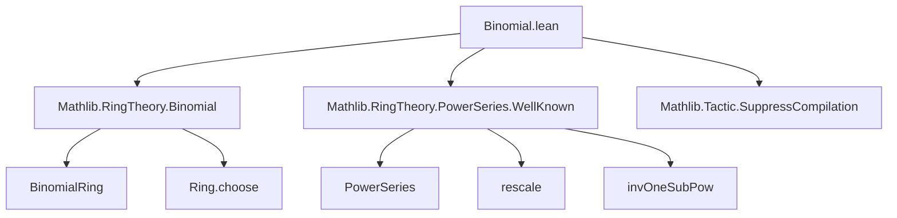

**Technical Brief: `Binomial.lean` (Lean 4 Formalization)**  
*Domain: Formal Power Series over Commutative Binomial Rings*  
*Author: Scott Carnahan (2024)*  
*License: Apache 2.0*

---

### 1. KEY DEFINITIONS & THEOREMS

| Name | Type / Signature | Purpose |
|------|------------------|---------|
| `binomialSeries` | `def binomialSeries (A) [One A] [SMul R A] (r : R) : PowerSeries A` | Defines the formal power series $\sum_{n=0}^\infty \binom{r}{n} \cdot 1_A \cdot X^n$, generalizing $(1+X)^r$ to arbitrary commutative binomial rings $R$. |
| `binomialSeries_coeff` | `coeff n (binomialSeries A r) = Ring.choose r n • 1` | Coefficient extraction: the $n$-th coefficient is the binomial coefficient $\binom{r}{n}$ scaled by $1_A$. |
| `binomialSeries_add` | `binomialSeries A (r + s) = binomialSeries A r * binomialSeries A s` | Key structural property: exponent addition corresponds to power series multiplication — i.e., $(1+X)^{r+s} = (1+X)^r \cdot (1+X)^s$. |
| `binomialSeries_nat` | `binomialSeries A (d : R) = (1 + X)^d` for $d \in \mathbb{N}$ | Compatibility with classical polynomial binomial expansion: when $r = d \in \mathbb{N}$, the series truncates to the usual polynomial $(1+X)^d$. |
| `binomialSeries_zero` | `binomialSeries A 0 = 1` | Special case of `binomialSeries_nat` for $d = 0$. |
| `rescale_neg_one_invOneSubPow` | `rescale (-1) (invOneSubPow A d) = binomialSeries A (-d)` | Relates the rescaled inverse geometric series $(1 - X)^{-d}$ under $X \mapsto -X$ to binomial series with negative integer exponent. |

> **Note**: `Ring.choose r n` denotes the generalized binomial coefficient in a binomial ring (i.e., $\binom{r}{n} = \frac{r(r-1)\cdots(r-n+1)}{n!}$).

---

### 2. NAMING CONVENTIONS

- **Prefixes**:
  - `binomialSeries_`: for definitions/lemmas about the main object.
  - `coeff_`, `constantCoeff_`: for coefficient-related operations.
  - `rescale_`: for change-of-variable operations on power series.
- **Suffixes**:
  - `_coeff`: coefficient-level lemmas.
  - `_nat`: when $r$ is a natural number.
  - `_zero`: base case $r = 0$.
- **Type variables**:
  - `R`: base commutative binomial ring.
  - `A`: target ring/algebra over $R$ (often `PowerSeries A` or `Polynomial A`).

---

### 3. TACTIC STACK

| Tactic | Usage Frequency | Purpose |
|--------|-----------------|---------|
| `ext` | High | Extensionality for power series (proving equality by coefficient comparison). |
| `simp` | Very High | Simplification using `@[simp]` lemmas (`binomialSeries_coeff`, `coeff_mul`, etc.). |
| `rw` | High | Rewriting with lemmas like `Ring.add_choose_eq`, `Ring.choose_neg`, `Nat.choose_symm_add`. |
| `cases` | Medium | Inductive cases on natural numbers (`d`, `n`) or equality hypotheses. |
| `norm_cast` | Medium | Cast simplification between $\mathbb{Z}, \mathbb{N}, R$. |
| `abel`, `lia` | Low–Medium | Solving linear arithmetic in $\mathbb{Z}$ (e.g., $-1 - d = -(d+1)$). |
| `refine sum_congr ...` | Medium | Structured summation manipulation in `binomialSeries_add`. |
| `have hright : ...` | Medium | Intermediate equalities (e.g., linking polynomial and power series). |

---

### 4. PROOF LOGIC

- **General Strategy**:
  1. **Extensionality**: Prove power series equality by `ext n` → reduce to coefficient-wise equality.
  2. **Coefficient Expansion**: Use `binomialSeries_coeff`, `coeff_mul`, `sum_smul`, and binomial identities (`Ring.add_choose_eq`, `Ring.choose_neg`, `Nat.choose_symm_add`).
  3. **Algebraic Simplification**: Apply `Algebra.mul_smul_comm`, `mul_smul`, `zsmul_eq_mul`, and cast simplifications (`norm_cast`, `← Int.cast_negOnePow_natCast`).
  4. **Case Analysis**: For negative integers or naturals, split into `d = 0` or `d = succ d'`, often using `cases d`.
  5. **Leverage Known Structures**: Use `BinomialRing R` to guarantee binomial identities hold (e.g., $\binom{r+s}{n} = \sum_{i+j=n} \binom{r}{i}\binom{s}{j}$).

- **Typical Flow** (e.g., `binomialSeries_add`):
  ```lean
  ext n
  simp only [binomialSeries_coeff, Ring.add_choose_eq, coeff_mul, ...]
  refine sum_congr rfl fun ab hab => ?_
  rw [mul_comm, mul_smul]
  ```

---

### 5. IMPORTS & DEPENDENCIES

| Module | Role |
|--------|------|
| `Mathlib.RingTheory.Binomial` | Provides `BinomialRing`, `Ring.choose`, and key binomial identities (`add_choose_eq`, `neg`, `natCast`, etc.). |
| `Mathlib.RingTheory.PowerSeries.WellKnown` | Defines `rescale`, `invOneSubPow`, and standard power series constructions. |
| `Mathlib.Tactic.SuppressCompilation` | Used for `suppress_compilation` to avoid code generation overhead (proof-only module). |

> **Core Theory Context**:  
> - `CommRing R` + `BinomialRing R`: ensures $R$ supports generalized binomial coefficients and identities.  
> - `[Ring A] [Algebra R A]`: allows scalar extension of coefficients from $R$ to $A$.

---

### 6. MERMAID DIAGRAMS

#### Dependency Graph (Module-Level)



#### Overview of Theory Flow

```mermaid
flowchart LR
  R[CommRing R + BinomialRing R] --> A[PowerSeries A]
  A -->|def| B[binomialSeries r]
  B -->|coeff| C[Ring.choose r n • 1]
  B -->|prop| D[binomialSeries_add]
  B -->|prop| E[binomialSeries_nat]
  B -->|prop| F[rescale_neg_one_invOneSubPow]
  D -->|generalizes| G[(1+X)^r]
  E -->|specializes| H[(1+X)^d for d ∈ ℕ]
  F -->|relates| I[(1-X)^{-d} ↔ (1+X)^{-d}]
```

---

### 7. TODO & Future Work

- Extend `binomialSeries` to act as an **$R$-module action** on $1 + X A[[X]]$ when $A$ is an $R$-algebra.
- Formalize continuity/topological properties (e.g., convergence in $I$-adic topology).
- Connect to **Mahler expansions** or **$p$-adic interpolation** of binomial coefficients.

--- 

*End of Technical Brief*
