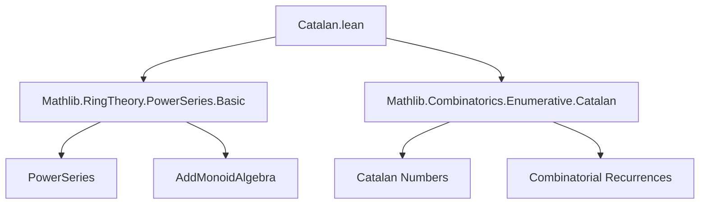

**Technical Brief: Catalan Power Series (Catalan.lean)**  
*Formalization in Lean 4 (Mathlib)*  

---

### 1. Key Definitions & Theorems  

| Name | Type | Purpose |
|------|------|---------|
| `catalanSeries` | `PowerSeries ℕ` | Defines the Catalan generating function as a formal power series: $C(X) = \sum_{n \ge 0} \mathrm{Catalan}_n X^n$ |
| `catalanSeries_coeff` | `∀ n, coeff n catalanSeries = catalan n` | Confirms that the $n$-th coefficient of `catalanSeries` is the $n$-th Catalan number |
| `catalanSeries_constantCoeff` | `constantCoeff catalanSeries = 1` | Verifies the constant term is $\mathrm{Catalan}_0 = 1$ |
| `catalanSeries_sq_mul_X_add_one` | `catalanSeries ^ 2 * X + 1 = catalanSeries` | Proves the functional equation $C(X) = 1 + X C(X)^2$, the defining quadratic equation for the Catalan generating function |

---

### 2. Naming Conventions  

- **Prefixes**:  
  - `catalanSeries_`: Standard prefix for definitions/lemmas about the Catalan power series.  
  - `coeff_`, `constantCoeff_`: Standard Mathlib naming for coefficient-related operations.  
- **Suffixes**:  
  - `_coeff`: For lemmas about coefficients.  
  - `_constantCoeff`: For constant-term properties.  
  - `_sq_mul_X_add_one`: Descriptive suffix encoding the structure of the functional equation.  

No special infix or operator notation used.

---

### 3. Tactic Stack  

The proof of `catalanSeries_sq_mul_X_add_one` uses:  
- `ext n`: Extensionality to reduce to coefficient-wise equality.  
- `cases n with | zero | succ n =>`: Structural induction on natural numbers.  
- `simp` / `simp_rw`: Simplification using `@[simp]` lemmas and rewriting with `catalan_succ'` (the recurrence for Catalan numbers).  
- `add_comm`, `map_add`, `coeff_one`, `if_neg`, `zero_add`, `coeff_succ_mul_X`, `sq`, `coeff_mul`: Standard `PowerSeries` and `AddMonoidAlgebra` lemmas.  

No heavy automation (e.g., `aesop`, `ring`, `linarith`) is used—proof is mostly algebraic simplification.

---

### 4. Proof Logic  

The proof proceeds by:  
1. **Extensionality**: Reduce equality of power series to equality of all coefficients.  
2. **Case analysis on $n$**:  
   - **Base case $n = 0$**: Direct simplification using `catalan_zero = 1`.  
   - **Inductive step $n = m+1$**:  
     - Expand both sides using coefficient lemmas (`coeff_mul`, `coeff_sq`, `coeff_succ_mul_X`).  
     - Apply `catalan_succ'`, the standard Catalan recurrence:  
       $$
       \mathrm{Catalan}_{n+1} = \sum_{i=0}^{n} \mathrm{Catalan}_i \cdot \mathrm{Catalan}_{n-i}
       $$  
     - Simplify using arithmetic and `simp_rw` to match both sides.  

This mirrors the combinatorial derivation of the generating function equation.

---

### 5. Imports & Dependencies  

| Import | Role |
|--------|------|
| `Mathlib.RingTheory.PowerSeries.Basic` | Provides `PowerSeries`, `coeff`, `constantCoeff`, multiplication, squaring, etc. |
| `Mathlib.Combinatorics.Enumerative.Catalan` | Supplies `catalan : ℕ → ℕ`, `catalan_zero`, `catalan_succ'`, and related lemmas. |

No additional algebraic structures (e.g., fields, topology) are used—this is a purely formal-power-series treatment over $\mathbb{N}$.

---

### 6. Mermaid Diagrams  

#### Dependency Graph  

#### File Overview  

---

### 7. Notes on Formalization Quality  

- Clean separation of definition (`def`) and properties (`@[simp]` lemmas).  
- Uses `ext` + `cases` + `simp_rw` pattern, aligning with Lean 4 best practices for power series.  
- `catalanSeries` is defined via `PowerSeries.mk`, avoiding explicit summation syntax (appropriate for formal power series).  
- The functional equation is stated *without* division by $X$, avoiding issues of invertibility in $\mathbb{N}[[X]]$.  

---

### 8. Future Work (as per TODO)  

- Formalize $\sqrt{1 - 4X}$ in $\mathbb{Q}[[X]]$ or $\mathbb{R}[[X]]$.  
- Prove `catalanSeries = (1 - sqrt (1 - 4 * X)) / (2 * X)` (as a power series identity).  
- Derive the closed formula $\mathrm{Catalan}_n = \frac{1}{n+1}\binom{2n}{n}$ via coefficient extraction.  

--- 

*End of Technical Brief.*
