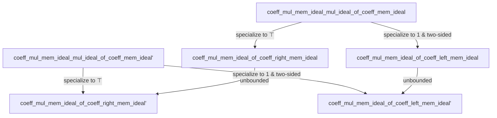

### Technical Brief: `CoeffMulMem.lean`

---

#### **1. Key Definitions & Theorems**

| Name | Type / Signature | Purpose |
|------|------------------|---------|
| `coeff_mul_mem_ideal_mul_ideal_of_coeff_mem_ideal` | `∀ i ≤ n, coeff i f ∈ I → ∀ i ≤ n, coeff i g ∈ J → ∀ i ≤ n, coeff i (f * g) ∈ I * J` | Shows that if coefficients of `f` and `g` up to degree `n` lie in ideals `I` and `J`, then coefficients of `f * g` up to degree `n` lie in the product ideal `I * J`. |
| `coeff_mul_mem_ideal_mul_ideal_of_coeff_mem_ideal'` | `∀ i, coeff i f ∈ I → ∀ i, coeff i g ∈ J → ∀ i, coeff i (f * g) ∈ I * J` | Global (all-degree) version of the above. |
| `coeff_mul_mem_ideal_of_coeff_right_mem_ideal` | `∀ i ≤ n, coeff i g ∈ I → ∀ i ≤ n, coeff i (f * g) ∈ I` | If all coefficients of `g` up to degree `n` lie in `I`, then so do those of `f * g`. Uses `I * ⊤ = I`. |
| `coeff_mul_mem_ideal_of_coeff_right_mem_ideal'` | `∀ i, coeff i g ∈ I → ∀ i, coeff i (f * g) ∈ I` | Global version of the above. |
| `coeff_mul_mem_ideal_of_coeff_left_mem_ideal` | `[I.IsTwoSided] → ∀ i ≤ n, coeff i f ∈ I → ∀ i ≤ n, coeff i (f * g) ∈ I` | If all coefficients of `f` up to degree `n` lie in a *two-sided* ideal `I`, then so do those of `f * g`. Uses `⊤ * I = I`. |
| `coeff_mul_mem_ideal_of_coeff_left_mem_ideal'` | `[I.IsTwoSided] → ∀ i, coeff i f ∈ I → ∀ i, coeff i (f * g) ∈ I` | Global version of the above. |

> **Note**: The two-sided hypothesis on `I` is needed for `⊤ * I = I` to hold (in noncommutative settings, only `I * ⊤ ⊆ I`, but equality requires two-sidedness).

---

#### **2. Naming Conventions**

- **Prefixes**:
  - `coeff_`: indicates reasoning about coefficients of power series.
  - `mul_`: indicates multiplication-related behavior.
  - `mem_ideal`: indicates membership in an ideal.
- **Suffixes**:
  - `_of_coeff_…`: specifies the hypothesis pattern (e.g., `of_coeff_right_mem_ideal` means “if right factor’s coefficients are in ideal…”).
  - `'` (prime): denotes the *global* (unbounded) version of the theorem (i.e., for all `i`, not just `i ≤ n`).
- **Structure**:
  - `coeff_mul_mem_ideal_mul_ideal_of_coeff_mem_ideal`  
    → `coeff` of `mul` is `mem` in `ideal_mul_ideal` *because* `coeff`s are `mem` in `ideal`s.

---

#### **3. Tactic Stack**

- `rw [coeff_mul]`: expands definition of coefficient of product.
- `exact Ideal.sum_mem _ fun p hp ↦ Ideal.mul_mem_mul …`: uses ideal sum closure and multiplication closure.
- `simpa using …`: simplifies and rewrites using target type and given proof.
- `by simp`: used to discharge trivial goals (e.g., `⊤`-ideal membership).
- `le_rfl`: used to supply trivial inequality `i ≤ i`.

No heavy automation (e.g., `linarith`, `ring`, `aesop`) is used—proofs are mostly direct ideal-theoretic reasoning.

---

#### **4. Proof Logic**

- **Core idea**: Use the formula for coefficients of a product:
  $$
  \text{coeff}_i(f * g) = \sum_{p \in \text{antidiagonal}(i)} \text{coeff}_{p.1}(f) \cdot \text{coeff}_{p.2}(g)
  $$
- For bounded case (`i ≤ n`), antidiagonal pairs `(p.1, p.2)` satisfy `p.1 ≤ i ≤ n` and `p.2 ≤ i ≤ n`, so hypotheses apply.
- For unbounded case, reduce to bounded case with `i ≤ i`.
- Left/right versions reduce to the product-ideal case by:
  - Using `I * ⊤ = I` (right factor case),
  - Using `⊤ * I = I` (left factor case, requires `I` two-sided).

Induction is *not* used—proofs are direct via ideal properties.

---

#### **5. Imports**

- `Mathlib.RingTheory.Ideal.Operations`: basic ideal operations (`*`, `⊤`, etc.).
- `Mathlib.RingTheory.Ideal.BigOperators`: `Ideal.sum_mem`, used for sums over finite sets.
- `Mathlib.RingTheory.PowerSeries.Basic`: `PowerSeries`, `coeff`, `*`, `coeff_mul`.

> These imports define the ambient algebraic structure: semirings, ideals, and formal power series.

---

#### **6. Mermaid Diagrams**

##### **Dependency Graph (Theorems)**



##### **Overview of File & Theory Context**

```mermaid
flowchart LR
  subgraph "CoeffMulMem.lean"
    A[Main Theorems on coeff(f*g) ∈ ideals]
  end

  subgraph "Ideal Theory"
    B[Operations on ideals]
    C[Big operators & sums]
  end

  subgraph "Power Series"
    D[Basic definitions: A⟦X⟧, coeff, *]
  end

  A -->|uses| B
  A -->|uses| C
  A -->|uses| D
  B -->|imported from| Mathlib.RingTheory.Ideal.Operations
  C -->|imported from| Mathlib.RingTheory.Ideal.BigOperators
  D -->|imported from| Mathlib.RingTheory.PowerSeries.Basic
```

---

#### **7. Summary**

This file formalizes foundational closure properties of coefficients under multiplication in formal power series rings, leveraging ideal theory. It distinguishes between bounded (`≤ n`) and global (`∀ i`) versions, and carefully handles left/right multiplication using `⊤` and two-sidedness. The proofs are elementary but illustrative of how Lean’s ideal API supports structured algebraic reasoning.
