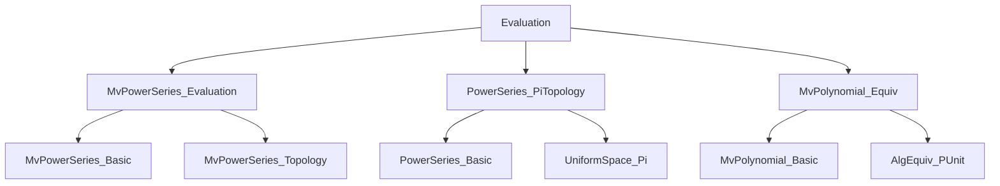
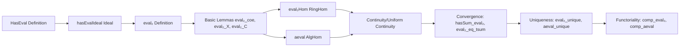

### Technical Brief: `Evaluation.lean`

---

#### **1. Key Definitions & Theorems**

| Name | Type / Signature | Purpose |
|------|------------------|---------|
| `HasEval` | `a : S → Prop` | Abbreviation for `IsTopologicallyNilpotent a`; characterizes points where evaluation is well-behaved. |
| `hasEvalIdeal` | `Ideal S` | Ideal of all topologically nilpotent elements in `S`. |
| `eval₂` | `PowerSeries R → S` | Evaluation of a univariate power series at `a`, via coercion to multivariate case over `Unit`. |
| `eval₂Hom` | `Continuous φ → HasEval a → PowerSeries R →+* S` | Ring homomorphism induced by evaluation at `a`. |
| `aeval` | `HasEval a → PowerSeries R →ₐ[R] S` | Algebra homomorphism (over `R`) induced by evaluation at `a`. |
| `eval₂_coe` | `f : Polynomial R → eval₂ φ a f = f.eval₂ φ a` | Compatibility with polynomial evaluation. |
| `eval₂_X` | `eval₂ φ a X = a` | Evaluation of the indeterminate `X` yields `a`. |
| `eval₂_C` | `eval₂ φ a (C r) = φ r` | Evaluation of constant series yields `φ(r)`. |
| `eval₂_eq_tsum` | `f.eval₂ φ a = ∑' d, φ (coeff d f) * a ^ d` | Evaluation equals the sum of monomials (when conditions hold). |
| `uniformContinuous_eval₂` | `UniformContinuous (eval₂ φ a)` | Evaluation map is uniformly continuous under assumptions. |
| `continuous_eval₂` | `Continuous (eval₂ φ a)` | Follows from uniform continuity. |
| `hasSum_eval₂` | `HasSum (λ d ↦ φ (coeff d f) * a ^ d) (f.eval₂ φ a)` | Series defining evaluation converges to the result. |
| `aeval_eq_sum` | `aeval ha f = ∑' d, coeff d f • a ^ d` | Algebra evaluation equals the same tsum, using module action. |
| `comp_aeval` | `ε ∘ aeval ha = aeval (ha.map hε)` | Compatibility of algebra evaluation with base change. |

---

#### **2. Naming Conventions**

- **Prefixes**:
  - `hasEval`: for properties of topologically nilpotent elements.
  - `eval₂`: for evaluation maps (binary: `φ` and `a`).
  - `aeval`: for algebra evaluation (unary in `a`, implicit `φ = algebraMap`).
  - `hasSum_`, `tsum_eq`: for convergence and representation theorems.

- **Suffixes**:
  - `_Hom`: ring homomorphism version.
  - `_unique`: uniqueness of extension from polynomials.
  - `_coe`: coercion compatibility lemmas.
  - `_map`: behavior under ring/algebra morphisms.

- **Pattern**: `eval₂_*`, `aeval_*`, `hasEval_*`, `mem_hasEvalIdeal_iff`.

---

#### **3. Tactic Stack**

Frequently used tactics in proofs:

- `simp only [...] at ha ⊢`: targeted simplification using `hasEval_iff`, `hasEvalIdeal`, etc.
- `rw [...]`: rewriting using definitions (`eval₂`, `coe_eval₂Hom`, etc.).
- `convert ...; simp; congr`: for equality proofs via convergence (`hasSum_eval₂`).
- `apply ...; intro ...`: for homomorphism/continuity uniqueness arguments.
- `exact ...`: for direct application of lemmas like `ha.add`, `ha.mul_left`.
- `ext`: for extensionality in `Unit`-indexed families.
- `rw [← ...]`: to relate polynomial and power series via `MvPolynomial.pUnitAlgEquiv`.

---

#### **4. Proof Logic**

- **Structure**:
  1. **Setup**: Assume `R`, `S` commutative rings with topological structure (`IsTopologicalRing`, `IsLinearTopology`, etc.).
  2. **Define `HasEval`**: As `IsTopologicallyNilpotent`, then prove closure properties (add, mul, map).
  3. **Construct `hasEvalIdeal`**: Show it's an ideal using closure lemmas.
  4. **Define `eval₂`**: Via `MvPowerSeries.eval₂` over `Unit`.
  5. **Prove basic properties** (`eval₂_coe`, `eval₂_X`, `eval₂_C`) using `MvPolynomial` coercion lemmas.
  6. **Lift to homomorphisms** (`eval₂Hom`, `aeval`) using continuity and `HasEval`.
  7. **Convergence & uniqueness**:
     - Show series converges (`hasSum_eval₂`).
     - Derive equality with tsum (`eval₂_eq_tsum`, `aeval_eq_sum`).
     - Prove uniqueness of extension from polynomials (`eval₂_unique`, `aeval_unique`).
  8. **Functoriality**: `comp_eval₂`, `comp_aeval`.

- **Inductive/Recursive Structure**: Not used directly; relies on density of polynomials in power series and uniform continuity.

---

#### **5. Imports**

| Module | Role |
|--------|------|
| `Mathlib.RingTheory.MvPowerSeries.Evaluation` | Core multivariate evaluation theory (used as backend). |
| `Mathlib.RingTheory.PowerSeries.PiTopology` | Topology on power series (product topology, uniform structure). |
| `Mathlib.Algebra.MvPolynomial.Equiv` | Equivalence `MvPolynomial Unit R ≃ Polynomial R` (key for univariate reduction). |

---

#### **6. Mermaid Diagrams**

##### **Dependency Graph (Module-Level)**

##### **Overview of File Structure**

---

#### **7. Theory Context**

- **Scope**: Univariate power series evaluation theory, built as a *special case* of multivariate evaluation over `Unit`.
- **Key Insight**: Leverages `MvPolynomial.pUnitAlgEquiv` to reduce univariate polynomial/power series to multivariate, then reuses `MvPowerSeries.eval₂` infrastructure.
- **Topological Assumptions**:
  - `S` must be a **complete, separated, linearly topologized ring** (basis of ideals at 0).
  - `a` must be **topologically nilpotent** (`a^n → 0`).
  - `φ` must be **continuous** for meaningful evaluation.
- **Applications**: Formalizes analytic functions, power series solutions to equations, and functional calculus in non-archimedean settings.

--- 

Let me know if you'd like a formalized dependency graph (e.g., for `leanpkg`), or a summary of how this module interfaces with `MvPowerSeries.Evaluation`.
