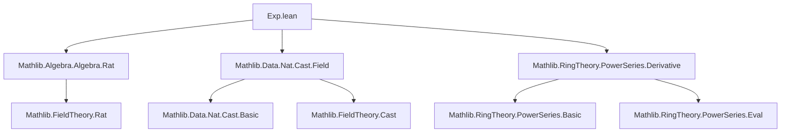
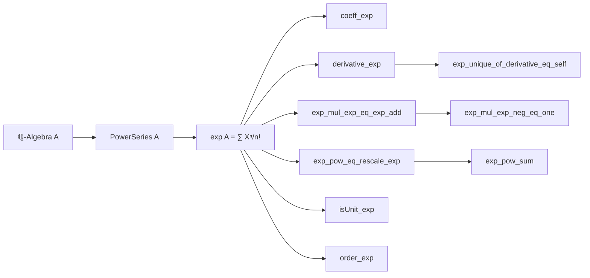

### Technical Brief: Exponential Power Series in Lean 4 (Exp.lean)

---

#### **1. Key Definitions & Theorems**

| Name | Type / Signature | Purpose |
|------|------------------|---------|
| `exp A` | `PowerSeries A` | Defines the exponential power series over a ℚ-algebra `A`: $\sum_{n=0}^\infty \frac{X^n}{n!}$ |
| `coeff_exp` | `coeff n (exp A) = algebraMap ℚ A (1 / n !)` | Computes the $n$-th coefficient of `exp A` |
| `constantCoeff_exp` | `constantCoeff (exp A) = 1` | Constant term of `exp A` is $1$ |
| `map_exp` | `map f (exp A) = exp A'` | `exp` commutes with ℚ-algebra homomorphisms |
| `derivative_exp` | `d⁄dX A (exp A) = exp A` | Satisfies the differential equation $D(\exp) = \exp$ |
| `exp_unique_of_derivative_eq_self` | `{f : PowerSeries A} → d⁄dX f = f → constantCoeff f = 1 → f = exp A` | Uniqueness: only `exp` has derivative equal to itself and constant term $1$ (under torsion-freeness) |
| `isUnit_exp` | `IsUnit (exp A)` | `exp A` is invertible in `PowerSeries A` |
| `order_exp` | `(exp A).order = 0` | Order (lowest nonzero degree term) of `exp A` is $0$ |
| `exp_mul_exp_eq_exp_add` | `rescale a (exp A) * rescale b (exp A) = rescale (a + b) (exp A)` | Functional equation: $e^{aX} \cdot e^{bX} = e^{(a+b)X}$ |
| `exp_mul_exp_neg_eq_one` | `exp A * evalNegHom (exp A) = 1` | $e^X \cdot e^{-X} = 1$ |
| `exp_pow_eq_rescale_exp` | `exp A ^ k = rescale (k : A) (exp A)` | $(e^X)^k = e^{kX}$ |
| `exp_pow_sum` | `∑ k ∈ range n, exp A ^ k = PowerSeries.mk fun p => ∑ k ∈ range n, k^p / p! * X^p` | Finite sum of powers of `exp` expands coefficientwise |

---

#### **2. Naming Conventions**

- **Prefixes**:
  - `coeff_`, `constantCoeff_`, `derivative_`, `order_`, `map_`, `isUnit_`: standard `PowerSeries`-related operations.
  - `exp_`: all properties specific to the exponential series.
- **Suffixes**:
  - `_eq_`: equality theorems (e.g., `exp_mul_exp_eq_exp_add`).
  - `_eq_self`: identity-like properties (e.g., `derivative_exp`).
  - `_of_`: characterizations or conditions (e.g., `exp_unique_of_derivative_eq_self`).
- **`rescale`**: used for scaling the indeterminate $X \mapsto aX$; appears in functional equations.

---

#### **3. Tactic Stack**

| Tactic | Usage Frequency | Purpose |
|--------|-----------------|---------|
| `ext` | Very High | Prove equality of power series by extensionality (coefficient-wise). |
| `simp` / `simp only` | Very High | Simplify using `@[simp]` lemmas (`coeff_exp`, `constantCoeff_exp`, etc.). |
| `rw` | High | Rewrite using hypotheses or known equalities (e.g., `ih`, `hd`). |
| `induction` | Medium | Structural induction on `n` (especially in `exp_unique_of_derivative_eq_self`). |
| `field_simp`, `ring`, `norm_cast` | Medium | Handle rational arithmetic and field simplifications (e.g., factorial identities). |
| `congr 1` | Medium | Reduce goal to proving equality of arguments (e.g., after `field_simp`). |
| `convert ... using 1 <;> ring` | Medium | Flexible rewriting + final simplification (e.g., in `exp_mul_exp_eq_exp_add`). |
| `smul_right_inj` | Low | Cancel scalar multiplication in torsion-free modules. |

---

#### **4. Proof Logic**

- **Structure**:
  - Most proofs follow a **coefficient-wise strategy**: reduce to proving equality in each degree $n$ via `ext n`.
  - **Inductive proofs** (e.g., uniqueness, power formulas) rely on the recurrence:
    $$
    (n+1) \cdot [X^{n+1}]f = [X^n]f
    $$
    derived from $f' = f$.
  - **Functional equations** (`exp_mul_exp_eq_exp_add`, etc.) use:
    - Coefficient of product: convolution.
    - Binomial theorem (`add_pow`).
    - Factorial divisibility (`factorial_mul_factorial_dvd_factorial`).
    - Properties of `algebraMap ℚ A` (e.g., `map_mul`, `cast_div_charZero`).
  - **Invertibility & order** use `isUnit_iff_constantCoeff` and `order_zero_of_unit`.

- **Key logical flow**:
  1. Expand both sides coefficient-wise.
  2. Apply known identities (binomial, factorial, algebra map).
  3. Simplify using `field_simp`, `ring`, or cancellation lemmas.
  4. Conclude via `congr` or `smul_right_inj`.

---

#### **5. Imports & Dependencies**

| Module | Role |
|--------|------|
| `Mathlib.Algebra.Algebra.Rat` | ℚ-algebra structure, `algebraMap ℚ A`. |
| `Mathlib.Data.Nat.Cast.Field` | Rational number casting, factorial inverses, `1 / n!`. |
| `Mathlib.RingTheory.PowerSeries.Derivative` | Derivative operator `d⁄dX`, `coeff_derivative`, `derivative_mul`, etc. |

**Additional dependencies implied**:
- `Mathlib.RingTheory.PowerSeries.Basic` (for `PowerSeries`, `coeff`, `mk`, `constantCoeff`, `order`, `IsUnit`).
- `Mathlib.RingTheory.PowerSeries.Eval` (for `rescale`, `evalNegHom`).
- `Mathlib.Algebra.Module.Torsion` (for `IsAddTorsionFree` in uniqueness theorem).
- `Mathlib.Data.Nat.Choose.Basic` (for `n.choose x`, `choose_eq_factorial_div_factorial`).

---

#### **6. Mermaid Diagrams**

##### **Dependency Graph (Module-Level)**

##### **Theoretical Overview (Conceptual Flow)**

---

#### **7. Summary**

This module formalizes the exponential power series over ℚ-algebras, establishing its foundational calculus and algebraic properties. It leverages:
- **Structural properties** of power series (coefficients, derivative, order).
- **Rational arithmetic** (via `algebraMap ℚ A` and `1 / n!`).
- **Functional equations** mirroring classical analysis (addition, inversion, scaling).
- **Uniqueness** via differential equations and torsion-freeness.

The formalization is highly structured, with proofs emphasizing **coefficient-wise reasoning**, **induction**, and **algebraic simplification**, aligning with Lean’s `PowerSeries` library conventions.

--- 

*Prepared for Domain-Specific AI Agent Training — Focus: Formalized Analysis, Algebra, and Calculus over Power Series.*
