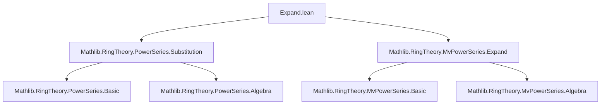

**Technical Brief: `Expand.lean` — Power Series Expansion in Lean 4**

---

### 1. **Key Definitions & Theorems**

| Name | Type / Signature | Purpose |
|------|------------------|---------|
| `expand` | `PowerSeries R →ₐ[R] PowerSeries R` | Algebra homomorphism expanding exponents by factor `p ≠ 0`: $ \sum a_n X^n \mapsto \sum a_n X^{pn} $. Defined via `MvPowerSeries.expand`. |
| `expand_apply` | `expand p hp f = subst (X ^ p) f` | Describes action of `expand` as substitution $X \mapsto X^p$. |
| `expand_C` | `expand p hp (C r) = C r` | Constants are fixed under expansion. |
| `expand_mul_eq_comp` | `expand (p * q) = expand p ∘ expand q` (when $p,q \ne 0$) | Compatibility with multiplication of expansion factors: functoriality. |
| `expand_mul` | `φ.expand (p*q) = (φ.expand q).expand p` | Equivalent formulation of above for elements. |
| `expand_smul` | `expand p (a • φ) = a • φ.expand p` | Compatibility with scalar multiplication. |
| `expand_X` | `expand p (X) = X ^ p` | Action on the generator $X$. |
| `expand_monomial` | `expand p (monomial d r) = monomial (p*d) r` | Action on monomials. |
| `expand_one` | `expand 1 = id` | Identity expansion is identity map. |
| `map_expand` | `map f (expand p φ) = expand p (map f φ)` | Commutes with base ring homomorphisms. |
| `expand_subst` | `(subst f φ).expand p = subst (f.expand p) φ` | Compatibility with substitution (for multivariate case). |
| `coeff_expand_mul` | `coeff (p*m) (expand p φ) = coeff m φ` | Coefficient extraction at multiples of $p$. |
| `constantCoeff_expand` | `constantCoeff (expand p φ) = constantCoeff φ` | Constant term preserved. |
| `coeff_expand_of_not_dvd` | If $p \nmid m$, then `coeff m (expand p φ) = 0` | Non-multiples vanish. |
| `support_expand_subset` / `support_expand` | Support transforms as image under $p \cdot -$ | Structural description of support. |
| `coeff_expand` | `coeff n (expand p φ) = if p ∣ n then φ.coeff (n/p) else 0` | Full coefficient formula. |
| `order_expand` | `order (expand p φ) = p • order φ` | Order (lowest-degree term) scales by $p$. |

---

### 2. **Naming Conventions**

- **Prefixes**:
  - `expand_`: for functions/properties of the expansion map.
  - `coeff_expand_`: for coefficient-related lemmas.
  - `constantCoeff_expand`: for constant term properties.
- **Suffixes**:
  - `_apply`: for evaluation form (`expand_apply`).
  - `_eq_comp`: for composition/functoriality (`expand_mul_eq_comp`).
  - `_subset` / `_eq`: for support inclusion/equality (`support_expand_subset`, `support_expand`).
- **Variable naming**:
  - `p`, `q`: expansion factors (natural numbers, nonzero).
  - `hp`, `hq`: proofs of nonzeroness (`p ≠ 0`, `q ≠ 0`).
  - `φ`, `f`: power series.
  - `r`, `a`: ring elements.

---

### 3. **Tactic Stack**

Frequently used tactics in proofs:
- `simp` / `simp_rw`: for simplification using definitions and lemmas.
- `conv_lhs` / `conv_rhs`: for targeted rewriting in expressions.
- `rw`: rewriting using equalities.
- `ext1`, `ext`: extensionality for functions/series.
- `split_ifs`: to handle `if ... then ... else ...`.
- `obtain ⟨q, hq⟩` / `cases h`: for divisibility reasoning.
- `simpa`: simplification + discharge.
- `ring`: for commutative ring arithmetic (e.g., in `expand_C`, `expand_mul`).
- `aesop`: likely used implicitly in `simp`-based automation.

---

### 4. **Proof Logic**

- **Structure**: Most proofs follow a pattern:
  1. **Definition unfolding**: via `simp [expand, MvPowerSeries.expand, ...]`.
  2. **Extensionality**: `ext1 i` for series equality.
  3. **Coefficient analysis**: reduce to `coeff_expand_mul`, `coeff_expand_of_not_dvd`, or `coeff_expand`.
  4. **Divisibility case analysis**: `split_ifs` on `p ∣ n`.
  5. **Algebraic manipulation**: `ring`, `simp`, `rw` for homomorphism properties.
- **Induction**: Not explicitly used here; relies on `MvPowerSeries` infrastructure and functional extensionality.
- **Leverage multivariate theory**: Many lemmas are lifted from `MvPowerSeries.expand`.

---

### 5. **Imports**

- `Mathlib.RingTheory.PowerSeries.Substitution`: for `subst`, `X`, `HasSubst`, etc.
- `Mathlib.RingTheory.MvPowerSeries.Expand`: defines multivariate expansion and key lemmas (`MvPowerSeries.expand`, `MvPowerSeries.expand_monomial`, `MvPowerSeries.coeff_expand_smul`, etc.).

> **Note**: The module is built atop multivariate power series, with univariate `PowerSeries` identified as `MvPowerSeries Unit`.

---

### 6. **Mermaid Diagrams**

#### **Dependency Graph**



#### **Overview of Theory Flow**

```mermaid
flowchart LR
  MvPowerSeries[Multivariate Power Series] -->|Define expand| ExpandDef[expand : R⟦X⟧ →ₐ[R] R⟦X⟧]
  ExpandDef -->|Specialize to univariate| PowerSeries[PowerSeries R]
  PowerSeries -->|Coefficients| CoeffLemmas[(coeff_expand, support_expand, order_expand)]
  PowerSeries -->|Homomorphism| HomProps[expand_C, expand_mul, map_expand]
  PowerSeries -->|Substitution| SubstCompat[expand_subst]
```

---

### 7. **Summary**

This module formalizes the *expansion* operation on (univariate) power series: substituting $X \mapsto X^p$ for $p \ne 0$. It establishes that this operation is an $R$-algebra endomorphism, commutes with ring homomorphisms and substitution, and gives precise formulas for coefficients, support, and order. The development is concise and leverages multivariate power series infrastructure (`MvPowerSeries.expand`) for most heavy lifting.

The TODO comment indicates future work: extending `rename`, `eval₂Hom`, `eval₂`, and `eval` analogues to the power series setting — currently missing in `Mathlib`.
