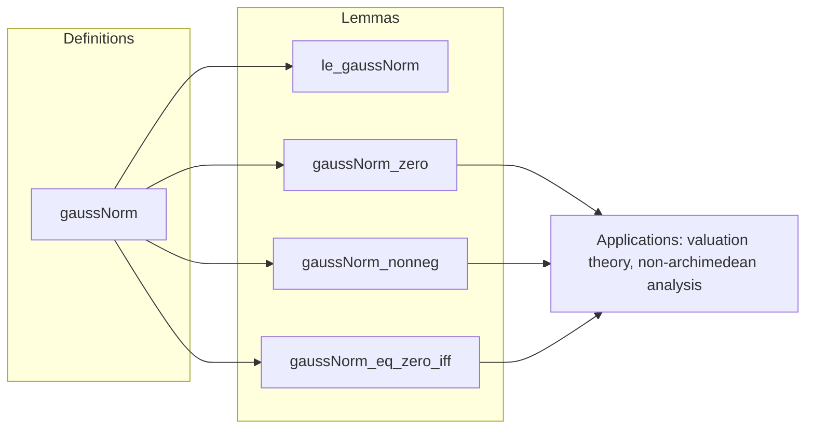

**Technical Brief: `GaussNorm.lean` (PowerSeries.gaussNorm)**  
*Domain: Formalized mathematics — analysis of power series over semirings with a Gauss norm construction.*

---

### 1. **Key Definitions & Theorems**

| Name | Type / Signature | Purpose |
|------|------------------|---------|
| `gaussNorm` | `gaussNorm (v : F) (c : ℝ) (f : R⟦X⟧) : ℝ` | Defines the Gauss norm of a power series $ f \in R\llbracket X \rrbracket $ as $ \sup_{i \in \mathbb{N}} v(f_i) \cdot c^i $, where $ f_i = f.coeff\ i $. |
| `le_gaussNorm` | `hbd : BddAbove {x | ∃ i, v (f.coeff i) * c ^ i = x} → ∀ i, v (f.coeff i) * c ^ i ≤ f.gaussNorm v c` | Establishes that each term in the defining set is bounded above by the supremum (i.e., the Gauss norm). |
| `gaussNorm_zero` | `gaussNorm v c 0 = 0` | The Gauss norm of the zero power series is zero, assuming `v` preserves zero (`ZeroHomClass`). |
| `gaussNorm_nonneg` | `0 ≤ f.gaussNorm v c` | If `v` is non-negative (`NonnegHomClass`), then the Gauss norm is non-negative. |
| `gaussNorm_eq_zero_iff` | `f.gaussNorm v c = 0 ↔ f = 0` | Under conditions: `v` preserves zero, `v(x)=0 ⇔ x=0`, `c > 0`, and boundedness of the defining set, the Gauss norm vanishes iff the series is zero. |

---

### 2. **Naming Conventions**

- **Prefixes**:
  - `gaussNorm_`: for definitions and lemmas about the Gauss norm.
  - `le_`, `eq_`, `nonneg_`: standard Lean naming for inequality/equality/non-negativity lemmas.
- **Suffixes**:
  - `_zero`: for properties of the zero element.
  - `_iff`: for equivalence statements.
- **Variable naming**:
  - `v : F` — a function-like map $ R \to \mathbb{R} $ (e.g., valuation or norm).
  - `c : ℝ` — scaling constant (often radius or convergence parameter).
  - `f : R⟦X⟧` — power series.

---

### 3. **Tactic Stack**

- `simp`: used for simplifying goals involving `gaussNorm`, especially with zero or basic algebraic facts.
- `by_cases`: to split on boundedness of the defining set (e.g., `hbd`).
- ` positivity`: to prove strict positivity using `0 < c` and `v(x) > 0` when $ x \ne 0 $.
- `apply ne_of_gt`, `contrapose!`: for equivalence proofs involving non-zero elements.
- `calc`: for chaining inequalities (e.g., in `gaussNorm_nonneg` and `gaussNorm_eq_zero_iff`).
- `exact`, `refine`: for constructing proofs with intermediate steps.

---

### 4. **Proof Logic**

- **Structure**:
  - **Definition**: `gaussNorm` is defined as a supremum (`⨆ i : ℕ`), i.e., a least upper bound over $ \mathbb{N} $.
  - **Non-negativity**: Proven by splitting on boundedness of the range; uses `pow_nonneg` and `mul_nonneg`.
  - **Zero characterization**:
    - One direction (`→`) uses contrapositive: assume $ f \ne 0 $, then $ \exists n,\ f.coeff\ n \ne 0 $, and by injectivity of `v` (via `h_eq_zero`), $ v(f.coeff\ n) > 0 $, and since $ c > 0 $, the term $ v(f.coeff\ n) \cdot c^n > 0 $, so the supremum is > 0.
    - The other direction (`←`) is immediate from `gaussNorm_zero`.

- **Key logical tools**:
  - `exists_coeff_ne_zero_iff_ne_zero`: characterizes non-zero power series via existence of non-zero coefficient.
  - `ciSup_le_iff` / `le_ciSup`: for bounding supremum from above/below.

---

### 5. **Imports**

| Import | Role |
|--------|------|
| `Mathlib.Data.Real.Archimedean` | Ensures real numbers behave as expected (e.g., Archimedean property used implicitly in suprema reasoning). |
| `Mathlib.RingTheory.PowerSeries.Order` | Provides foundational definitions and properties of power series (e.g., `coeff`, `zero`, etc.). |

> Note: The file is part of a larger theory; it references `Polynomial.gaussNorm` via `Polynomial.gaussNorm_coe_powerSeries`, indicating compatibility with the polynomial Gauss norm.

---

### 6. **Mermaid Diagrams**

#### **Dependency Graph (Module-Level)**

```mermaid
graph TD
  A[GaussNorm.lean] --> B[Mathlib.Data.Real.Archimedean]
  A --> C[Mathlib.RingTheory.PowerSeries.Order]
  A --> D[Mathlib.RingTheory.Polynomial.GaussNorm] %% implicit via comment
  D --> C
```

#### **Overview of File Structure**



#### **Theoretical Context**

```mermaid
graph LR
  subgraph "Ring Theory"
    PS[PowerSeries R⟦X⟧]
    Poly[Polynomial R[X]]
  end

  subgraph "Valuation Theory"
    V[Function v : R → ℝ]
    G[gaussNorm v c]
  end

  PS -->|coeff| V
  Poly -->|coerce| PS
  V -->|sup over i| G
  G -->|used in| NA[Non-Archimedean Analysis]
```

---

### 7. **Summary**

This file formalizes the **Gauss norm** for **power series** over a semiring $ R $, extending the polynomial case. It provides foundational properties: non-negativity, zero characterization, and basic bounding lemmas. The formalization is clean, modular, and leverages Lean’s typeclass system (`ZeroHomClass`, `NonnegHomClass`) to abstract over valuation-like maps. It sets the stage for further development in non-archimedean functional analysis or $ p $-adic geometry.

--- 

Let me know if you'd like a formalization checklist or a comparison with `Polynomial.gaussNorm`.
