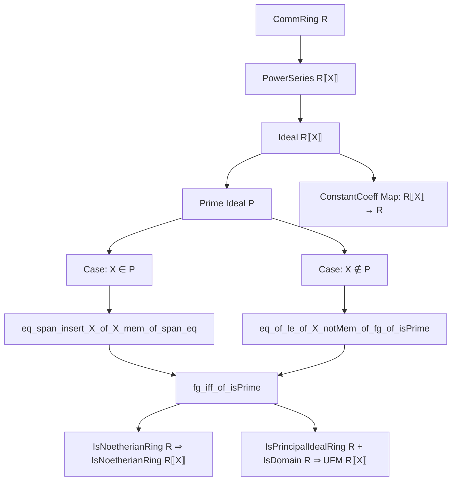
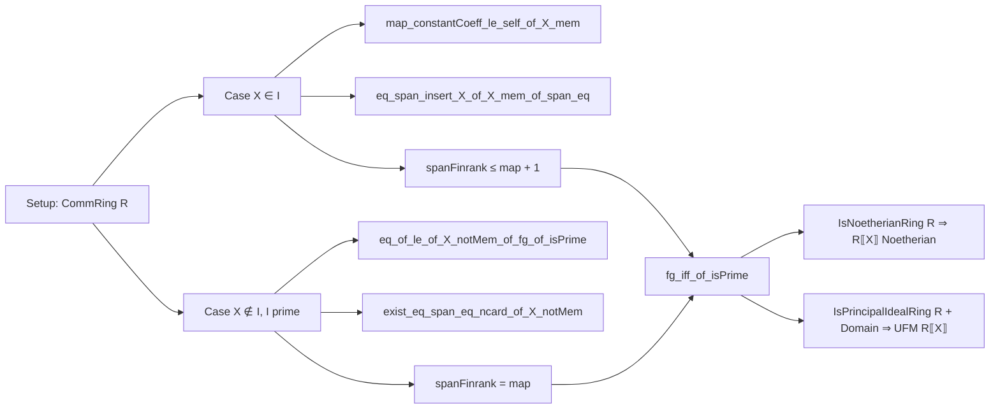

### Technical Brief: `Ideal.lean` — Ideals in Power Series Rings

---

#### **1. Key Definitions & Theorems**

| Name | Type / Signature | Purpose |
|------|------------------|---------|
| `map_constantCoeff_le_self_of_X_mem` | `X ∈ I → I.map (C ∘ constantCoeff) ≤ I` | Shows that if $X \in I$, then applying `constantCoeff` and lifting back via `C` stays in $I$. |
| `eq_span_insert_X_of_X_mem_of_span_eq` | `X ∈ I → span S = I.map constantCoeff → I = span (insert X (C '' S))` | Characterizes ideals containing $X$: generated by $X$ and lifts of generators of the constant coefficient ideal. |
| `eq_of_le_of_X_notMem_of_fg_of_isPrime` | `J ≤ I`, `X ∉ I`, `I.IsPrime`, `J.FG`, `I.map constantCoeff ≤ J.map constantCoeff ⇒ I = J` | Core structural lemma: under primality and $X \notin I$, containment of constant-coefficient ideals implies equality. |
| `exist_eq_span_eq_ncard_of_X_notMem` | `X ∉ I`, `I.IsPrime`, `span S = I.map constantCoeff`, `S.Finite ⇒ ∃ T, I = span T ∧ T.ncard = S.ncard` | For $X \notin I$, $I$ is generated by a set of same cardinality as generators of its constant-coefficient ideal. |
| `fg_iff_of_isPrime` | `P.IsPrime ⇒ P.FG ↔ (P.map constantCoeff).FG` | Prime ideals in $R⟦X⟧$ are finitely generated iff their constant-coefficient images are. |
| `spanFinrank_le_spanFinrank_map_constantCoeff_add_one_of_isPrime` | `P.IsPrime ⇒ spanFinrank P ≤ spanFinrank (P.map constantCoeff) + 1` | Bounds the minimal number of generators of a prime ideal $P$ by that of its constant-coefficient image +1. |
| `instance [IsNoetherianRing R] : IsNoetherianRing R⟦X⟧` | — | Proves $R⟦X⟧$ is Noetherian if $R$ is, via prime-ideal criterion. |
| `instance [IsPrincipalIdealRing R] [IsDomain R] : UniqueFactorizationMonoid R⟦X⟧` | — | Extends UFM property from $R$ to $R⟦X⟧$, crucially requiring $R$ to be a PID (not just UFD). |

---

#### **2. Naming Conventions**

- **Prefixes**:
  - `map_`: relates to image under ring homomorphisms (e.g., `map_constantCoeff`).
  - `eq_of_le_...`: equality proofs via antisymmetry using containment.
  - `exist_...`: existence of generating sets with cardinality control.
  - `fg_...`: finitely generated properties.
  - `spanFinrank_...`: bounds on minimal generator count.

- **Suffixes**:
  - `_of_X_mem`, `_of_X_notMem`: case distinction on whether $X$ belongs to the ideal.
  - `_of_isPrime`: primality assumption.
  - `_of_fg`: finite generation assumption.

- **Function names**:
  - `C` = `C : R → R⟦X⟧`, the constant power series embedding.
  - `constantCoeff` = coefficient map $R⟦X⟧ → R$.
  - `span`, `map`, `insert`, `image`, `trunc`, `mk`, `coeff`, `shift`, `sub`, `sum`, `mul`.

---

#### **3. Tactic Stack**

| Tactic | Usage Frequency | Purpose |
|--------|-----------------|---------|
| `rw` | Very High | Rewriting definitions (e.g., `eq_X_mul_shift_add_const`, `eq_shift_mul_X_add_const`). |
| `simp` / `simp only` | High | Simplifying goals using algebraic identities, `span`, `map`, `mem_span`, etc. |
| `exact` / `refine` | High | Constructing proofs stepwise, especially in induction or existential goals. |
| `induction` | Medium | Structural induction on `n` for truncation identities. |
| `nth_rw` | Medium | Targeted rewriting at specific positions (e.g., `nth_rw 1 [eq_span_insert_X_of_X_mem_of_span_eq]`). |
| `choose!` | Medium | Dependent choice for constructing sequences like $G(n)$. |
| `by_cases` | Medium | Splitting on membership of $X$ or finiteness. |
| `lift ... to Finset` | Low | Converting sets to finite sets for `FG`/`spanFinrank`. |
| `aesop` / `ring` / `linarith` | Not present | Not used; proofs are mostly algebraic and manual. |

---

#### **4. Proof Logic**

The proofs follow a **case analysis on $X \in I$ or $X \notin I$**, with heavy use of:

- **Induction** on truncation degrees to relate power series to their coefficients.
- **Prime ideal properties**: e.g., $ab \in P \Rightarrow a \in P$ or $b \in P$, used to propagate membership through recursive constructions.
- **Span characterizations**: via `mem_span_singleton_sup`, `map_span`, `span_le`, etc.
- **Cardinality control**: using `ncard`, `finite_toSet`, `injOn`, `image_eq` to preserve generator count.
- **Submodule induction**: for verifying that constructed generators span the ideal.

**Typical flow**:
1. Assume $X \in I$: reduce to constant-coefficient ideal + $X$.
2. Assume $X \notin I$ and $I$ prime: use containment of constant-coefficient ideals to force equality.
3. Use finite generation of $I.map constantCoeff$ to lift generators (with or without $X$).
4. Derive bounds on `spanFinrank`, then apply to global results like Noetherianity.

---

#### **5. Imports**

| Module | Role |
|--------|------|
| `Mathlib.Algebra.Module.SpanRank` | `spanFinrank`, rank bounds, finite generation. |
| `Mathlib.RingTheory.Noetherian.OfPrime` | Characterization of Noetherian rings via prime ideals. |
| `Mathlib.RingTheory.PowerSeries.Inverse` | Basic power series algebra (e.g., inverses, units). |
| `Mathlib.RingTheory.PowerSeries.Trunc` | Truncation operator, key for coefficient extraction and induction. |
| `Mathlib.RingTheory.UniqueFactorizationDomain.Kaplansky` | Kaplansky’s criterion for UFM, used in final UFM proof. |

---

#### **8. Mermaid Diagrams**

##### **Dependency Graph (Theoretical Structure)**

##### **File Overview (Logical Flow)**

---

#### **Summary**

This file provides a **fine-grained structural analysis** of ideals in $R⟦X⟧$, especially prime ideals, by leveraging the behavior of the constant coefficient map. It yields:
- Explicit generator bounds (`spanFinrank` ≤ `map` + 1),
- Equivalence of finite generation for prime ideals and their images,
- A constructive proof of Noetherianity,
- A path to UFM for power series over PIDs.

The proofs are highly algebraic, avoiding heavy automation, and rely on careful manipulation of power series expansions, truncations, and coefficient-wise constructions.
