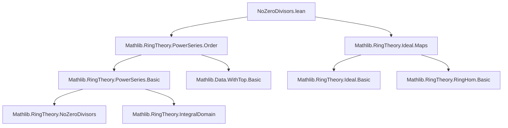

**Technical Brief: `NoZeroDivisors.lean` (Mathlib)**  
*Domain: Ring Theory — Power Series over Rings with No Zero Divisors*

---

### 1. **Key Definitions & Theorems**

| Name | Type / Signature | Purpose |
|------|------------------|---------|
| `NoZeroDivisors R⟦X⟧` | `instance [NoZeroDivisors R] : NoZeroDivisors R⟦X⟧` | Proves that if $R$ has no zero divisors, then the power series ring $R⟦X⟧$ also has no zero divisors. Uses the *order* function and `WithTop.add_eq_top`. |
| `IsDomain R⟦X⟧` | `instance [Ring R] [IsDomain R] : IsDomain R⟦X⟧` | Shows $R⟦X⟧$ is an integral domain when $R$ is. Follows from previous instance via `NoZeroDivisors.to_isDomain`. |
| `span_X_isPrime` | `(Ideal.span ({X} : Set R⟦X⟧)).IsPrime` | Proves the principal ideal $(X) \subseteq R⟦X⟧$ is prime when $R$ is a domain. Uses `X_dvd_iff` and `RingHom.ker_isPrime`. |
| `X_prime` | `Prime (X : R⟦X⟧)` | Shows the element $X$ is prime in $R⟦X⟧$. Derived from `span_X_isPrime` and `Ideal.span_singleton_prime`. |
| `X_irreducible` | `Irreducible (X : R⟦X⟧)` | Follows from `X_prime.irreducible`. |
| `rescale_injective` | `{a : R} → a ≠ 0 → Function.Injective (rescale a)` | Proves the rescaling map $p(X) \mapsto p(aX)$ is injective when $a \ne 0$ in a domain. Uses coefficient-wise analysis and `mul_right_inj'`. |

---

### 2. **Naming Conventions**

- **Prefixes**:
  - `is_`: e.g., `IsDomain`, `IsPrime` — property predicates.
  - `span_`: e.g., `span_X_isPrime` — ideal generated by a set.
  - `X_`: e.g., `X_prime`, `X_irreducible` — properties of the indeterminate $X$.
  - `rescale_`: e.g., `rescale_injective` — named after the operation.

- **Suffixes**:
  - `_isPrime`, `_irreducible`, `_injective` — indicate the property being proved.

- **Variable naming**:
  - Greek letters (`φ`, `ψ`) for power series.
  - `p`, `q` for generic power series in `rescale_injective`.
  - `n` for natural numbers (coeff indices).

---

### 3. **Tactic Stack**

| Tactic | Usage Frequency | Role |
|--------|-----------------|------|
| `simp_rw` | High | Rewriting with `order_mul`, `← order_eq_top`, etc. |
| `exact` | Medium | Finalizing proofs after simplification. |
| `rw` | High | Applying lemmas like `X_dvd_iff`, `Ideal.ext`, `RingHom.mem_ker`. |
| `intro` | Medium | Introducing hypotheses/variables. |
| `rwa` | Medium | Rewriting and then applying assumptions (e.g., in `rescale_injective`). |
| `congr_arg` | Low | Applying function to both sides (e.g., `coeff 1`). |
| `simpa` | Low | Simplifying with a target (e.g., `map_zero`). |
| `apply` | Medium | Applying lemmas like `Ideal.ext`, `RingHom.ker_isPrime`. |

No heavy automation (e.g., `aesop`, `linarith`) — proofs are mostly structural and rely on ring-theoretic lemmas.

---

### 4. **Proof Logic**

- **Core strategy**: Use the *order* function on power series:
  - `order φ = ⊤` iff `φ = 0`.
  - `order (φ * ψ) = order φ + order ψ` (in `WithTop ℝ`).
  - Hence, if `φ * ψ = 0`, then `order φ + order ψ = ⊤`, implying at least one order is `⊤`, i.e., one factor is zero.

- **Structure of main proof**:
  1. Assume `φ * ψ = 0`.
  2. Rewrite using `order_mul` and `order_eq_top`.
  3. Apply `WithTop.add_eq_top.mp` to deduce `order φ = ⊤` or `order ψ = ⊤`.
  4. Conclude `φ = 0` or `ψ = 0`.

- **Prime ideal proof**:
  - Show $(X) = \ker(\text{constantCoeff})$.
  - Use that kernel of a ring hom to a domain is prime.
  - Then lift to element-level primality via `Ideal.span_singleton_prime`.

- **Injectivity of rescaling**:
  - Work coefficient-wise (`PowerSeries.ext_iff`).
  - Use `coeff_rescale` to express coefficients of `rescale a p`.
  - Apply `mul_right_inj'` for nonzero `a`.

---

### 5. **Imports & Dependencies**

| Module | Role |
|--------|------|
| `Mathlib.RingTheory.PowerSeries.Order` | Provides `order`, `order_mul`, `order_eq_top`, `X_dvd_iff`, `coeff_rescale`, etc. |
| `Mathlib.RingTheory.Ideal.Maps` | Provides `RingHom.ker_isPrime`, `RingHom.mem_ker`, `Ideal.mem_span_singleton`. |
| `Mathlib.RingTheory.NoZeroDivisors` | Implicit via `NoZeroDivisors` typeclass. |
| `Mathlib.RingTheory.IntegralDomain` | Implicit via `IsDomain`, `to_isDomain`. |
| `Mathlib.RingTheory.PowerSeries.Basic` | Implicit via `R⟦X⟧`, `X`, `coeff`, `rescale`, `Ideal.span`, etc. |

---

### 6. **Mermaid Diagrams**

#### **Dependency Graph (Module-Level)**



#### **Overview of Theoretical Flow**

```mermaid
flowchart LR
  R[Semiring R] -->|NoZeroDivisors| R_X[R⟦X⟧]
  R -->|Ring + IsDomain| R_X_ID[IsDomain R⟦X⟧]
  R_X -->|X_dvd_iff + order| span_X[(X) ⊆ R⟦X⟧]
  span_X -->|ker(constantCoeff)| prime_span[(X) is prime]
  prime_span --> X_prime[X is prime]
  X_prime --> X_irr[X is irreducible]
  R -->|a ≠ 0| rescale_inj[rescale a is injective]
```

---

### 7. **Summary**

This module establishes foundational algebraic properties of power series rings over rings with no zero divisors and integral domains. The key insight is that the *order* function behaves additively under multiplication, mirroring the behavior of valuations, and enables a clean proof that $R⟦X⟧$ inherits the no-zero-divisors property. It further shows that the indeterminate $X$ is prime (hence irreducible), and that rescaling by a nonzero coefficient preserves injectivity — all crucial for deeper structure theory (e.g., unique factorization, Weierstrass preparation).
