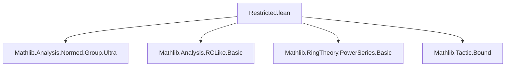
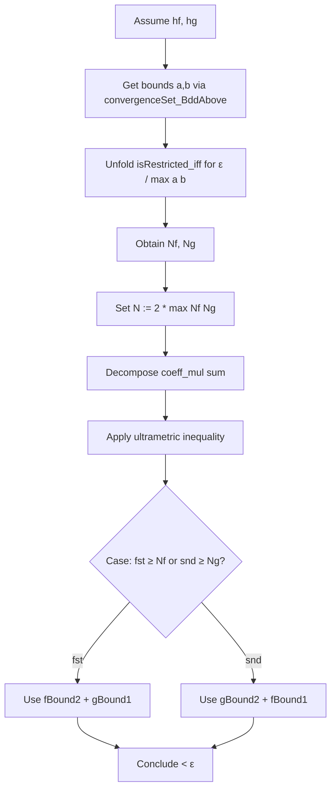

### Technical Brief: `Restricted.lean`

---

#### **1. Key Definitions & Theorems**

| Name | Type / Signature | Purpose |
|------|------------------|---------|
| `IsRestricted` | `def IsRestricted (f : PowerSeries R) := Tendsto (fun i ↦ ‖coeff i f‖ * c ^ i) atTop (𝓝 0)` | Defines when a power series is *restricted* w.r.t. a real parameter `c`: the weighted coefficients tend to zero. |
| `isRestricted_iff` | `lemma isRestricted_iff {f : PowerSeries R} : IsRestricted c f ↔ ∀ ε > 0, ∃ N, ∀ n ≥ N, ‖coeff n f‖ * |c|^n < ε` | Equivalent ε–N characterization of `IsRestricted`. |
| `isRestricted_iff_abs` | `lemma isRestricted_iff_abs : IsRestricted c f ↔ IsRestricted |c| f` | Shows restriction depends only on `|c|`. |
| `zero`, `one`, `monomial`, `C` | `lemma zero`, `one`, `monomial`, `C` | Base cases: zero, one, monomials, and constant series are restricted. |
| `add`, `neg`, `smul` | `lemma add`, `neg`, `smul` | Closure under addition, negation, and scalar multiplication. |
| `convergenceSet` | `def convergenceSet (f : PowerSeries R) : Set ℝ := {‖coeff i f‖ * c^i | i : ℕ}` | Set of weighted coefficient norms; used to apply boundedness arguments. |
| `convergenceSet_BddAbove` | `lemma convergenceSet_BddAbove {hf : IsRestricted c f} : BddAbove (convergenceSet c f)` | If `f` is restricted, the set of weighted coefficients is bounded above. |
| `mul` | `lemma mul {hf : IsRestricted c f} {hg : IsRestricted c g} : IsRestricted c (f * g)` | Closure under multiplication (nontrivial; uses ultrametric inequality and boundedness of `convergenceSet`). |

---

#### **2. Naming Conventions**

- **Predicates**: `isRestricted_`, `convergenceSet_` — prefix `isRestricted_` for lemmas about the predicate; `convergenceSet_` for lemmas about the set.
- **Constants**: `zero`, `one`, `C`, `monomial` — standard algebraic constructors.
- **Operations**: `add`, `neg`, `smul`, `mul` — closure under basic algebraic operations.
- **Auxiliary**: `fBound1`, `fBound2`, `gBound1`, `gBound2` — local bounds extracted in `mul` proof.

---

#### **3. Tactic Stack**

Frequently used tactics:
- `simp` / `simp_rw` — for simplifying definitions (`isRestricted`, `coeff`, `norm`, etc.)
- `grw` — rewriting with `norm_mul_le`, `pow_add`, etc., often in normed ring contexts.
- `aesop` / `grind` — for linear arithmetic and norm inequalities (note: `grind` deprecated in newer nightly builds).
- `bound` — from `Mathlib.Tactic.Bound`, used to bound expressions using known inequalities.
- `gcongr`, `congr'`, `gcongr` — for congruence reasoning with inequalities.
- `rcases`, `obtain`, `rintro` — for destructuring existential/universal hypotheses.
- `omega`, `lia`, `linarith` — for handling linear arithmetic over reals/naturals.

---

#### **4. Proof Logic**

- **Structure**: Proofs follow a standard *ε–N* style for limits at `atTop`, often:
  1. Unfold `isRestricted_iff`.
  2. Introduce `ε > 0`.
  3. Extract bounds `N_f`, `N_g` from hypotheses.
  4. Combine bounds (e.g., `max`, `2 * max`) to get a global `N`.
- **Multiplication proof (`mul`)** is more complex:
  - Uses `convergenceSet_BddAbove` to get uniform bounds `a`, `b` on *all* weighted coefficients.
  - Splits the convolution sum in `coeff_mul` using `exists_norm_finset_sum_le`.
  - Applies ultrametric inequality (`norm_add_le` → `norm_sum_le`).
  - Uses case analysis on whether `fst` or `snd` is large to apply either `fBound2` or `gBound2`.
  - Final inequality uses algebraic manipulation (`div_mul_comm`, `mul_le_iff_le_one_left/right`).

---

#### **5. Imports & Scope**

**Primary Dependencies**:
- `Mathlib.Analysis.Normed.Group.Ultra` — ultrametric normed groups, essential for `mul`.
- `Mathlib.Analysis.RCLike.Basic` — real-closed-like structures, used for `abs`, `norm`, `pow`.
- `Mathlib.RingTheory.PowerSeries.Basic` — core power series definitions (`coeff`, `mul`, `monomial`, `C`).
- `Mathlib.Tactic.Bound` — for `bound` tactic.

**Scope & Notation**:
- `open PowerSeries Filter`
- `open scoped Topology`
- `norm` and `abs` interpreted via `Real.norm_eq_abs`, `abs_norm`.

---

#### **6. Mermaid Diagrams**

##### **Dependency Graph (Module-Level)**



##### **Theory Overview (Conceptual Flow)**

```mermaid
flowchart LR
  A[PowerSeries R] --> B[IsRestricted c f]
  B --> C[Zero, One, C, Monomial]
  B --> D[Add, Neg, Smul]
  B --> E[Mul (requires Ultra)]
  C --> F[Closed under algebra ops]
  D --> F
  E --> F
  F --> G[Restricted power series form a subring]
```

##### **Proof Structure for `mul`**



---

#### **7. Notes & Adaptation Points**

- **Deprecation**: `grind` tactic removed in `nightly-2025-10-26`; replaced with `ring` + `linarith` or manual `rw`.
- **Ultrametric assumption**: Critical for `mul`; without it, the inequality `norm (f * g) ≤ norm f * norm g` may not suffice for convergence control.
- **`convergenceSet`**: A technical device to extract uniform boundedness; not standard in classical analysis but common in non-archimedean contexts.

--- 

Let me know if you'd like a formalized summary of the subring structure (`IsRestricted c` is a subring of `PowerSeries R`) or a tactic-level trace of the `mul` proof.
