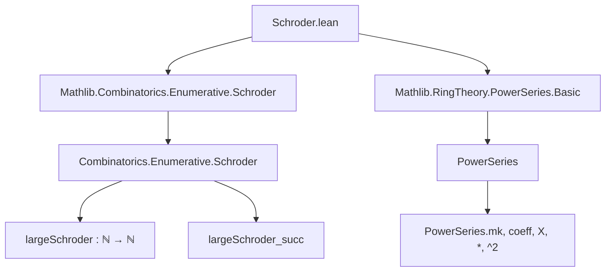
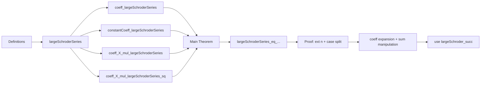

### Technical Brief: `Schroder.lean`

---

#### **1. Key Definitions & Theorems**

| Name | Type / Signature | Purpose |
|------|------------------|---------|
| `largeSchroderSeries` | `PowerSeries ℕ` | Power series whose coefficients are the *large Schröder numbers* (`largeSchroder n`). |
| `coeff_largeSchroderSeries` | `coeff n largeSchroderSeries = largeSchroder n` | Confirms that the $n$-th coefficient of `largeSchroderSeries` is the $n$-th large Schröder number. |
| `constantCoeff_largeSchroderSeries` | `constantCoeff largeSchroderSeries = 1` | Initial coefficient (degree 0) is 1. |
| `coeff_X_mul_largeSchroderSeries` | For $n > 0$, `coeff n (X * largeSchroderSeries) = largeSchroder (n - 1)` | Shifts coefficients left by one (multiplication by $X$). |
| `coeff_X_mul_largeSchroderSeries_sq` | For $n > 0$, `coeff n (X * largeSchroderSeries^2) = ∑ i ∈ range n, largeSchroder i * largeSchroder (n - 1 - i)` | Convolution formula for coefficients of $X \cdot S(X)^2$. |
| `largeSchroderSeries_eq_one_add_X_mul_largeSchroderSeries_add_X_mul_largeSchroderSeries_sq` | `largeSchroderSeries = 1 + X * largeSchroderSeries + X * largeSchroderSeries^2` | Functional equation satisfied by the large Schröder generating function. |

> **Note**: The small Schröder series is *not yet formalized* (see `TODO`).

---

#### **2. Naming Conventions**

- **Prefixes**:
  - `largeSchroder`: Used for large Schröder-related objects.
  - `coeff_`, `constantCoeff_`: Standard `PowerSeries`-related lemmas.
  - `X_mul_`: For lemmas about multiplication by the indeterminate $X$.
- **Suffixes**:
  - `_eq_...`: Equality lemmas.
  - `_sq`: For square of a series (e.g., `X_mul_largeSchroderSeries_sq`).
- **Structure**:
  - `coeff_X_mul_largeSchroderSeries` follows pattern: `coeff_<term>_<expr>`.

---

#### **3. Tactic Stack**

Frequently used tactics in proofs:
- `ext n`: Extensionality over coefficients.
- `by_cases n = 0`: Split on base case.
- `simp only [...]`: Heavy use of `simp` with explicit lemmas (e.g., `coeff_largeSchroderSeries`, `coeff_X_mul_largeSchroderSeries`).
- `rw [...]`: Rewriting using functional equations and coefficient lemmas.
- `sum_congr`, `sum_range_succ`, `sum_Ico_eq_sum_range`: Summation manipulation.
- `grind`: Custom tactic (likely from `Mathlib.Tactic`) for automated simplification of arithmetic and inequalities.
- `aesop`: For trivial goals (e.g., base case $n = 0$).
- `omega`: For linear arithmetic (e.g., proving $0 < n$ from $n \ne 0$).

---

#### **4. Proof Logic**

The main theorem is proven by:
1. **Extensionality**: Reduce to showing equality of coefficients for all $n$.
2. **Case split**: Handle $n = 0$ (trivial via `aesop`) and $n > 0$ separately.
3. **Coefficient expansion**:
   - Expand RHS using `map_add`, `coeff_one`, and lemmas for `X * S`, `X * S^2`.
   - Apply `largeSchroder_succ (n - 1)`, the recurrence for large Schröder numbers.
4. **Sum simplification**:
   - Convert sums over `range n`, `Ico 1 n`, and `Iic (n-1)` using combinatorial identities.
   - Use `sum_range_succ`, `sum_Ico_eq_sum_range`, and arithmetic rewrites (`show n = n - 1 + 1`).
5. **Final simplification**: Cancel terms using `add_tsub_cancel_right`, `Nat.add_left_cancel_iff`.

---

#### **5. Imports & Dependencies**

| Module | Role |
|--------|------|
| `Mathlib.Combinatorics.Enumerative.Schroder` | Defines `largeSchroder : ℕ → ℕ`, its recurrence (`largeSchroder_succ`), and basic properties. |
| `Mathlib.RingTheory.PowerSeries.Basic` | Provides `PowerSeries`, `coeff`, `X`, multiplication, `constantCoeff`, `pow`, etc. |

> **Scope**: This file lies at the intersection of *combinatorics* (enumerative, Schröder numbers) and *algebra* (formal power series over $\mathbb{N}$).

---

#### **6. Mermaid Diagrams**

##### **Dependency Graph**

##### **Overview of File Structure**

---

#### **7. Notes & Observations**

- The file formalizes the *generating function identity* for large Schröder numbers:
  $$
  S(X) = 1 + X S(X) + X S(X)^2
  $$
  which encodes the recurrence:
  $$
  s_0 = 1,\quad s_{n+1} = s_n + \sum_{i=0}^n s_i s_{n-i}
  $$
- The proof is highly computational, relying on careful manipulation of finite sums and coefficient extraction.
- The `TODO` indicates future work on *small Schröder numbers*, whose generating function satisfies:
  $$
  s(X) = 1 + X s(X) + X s(X)^2,\quad \text{but with } s_n = \frac{1}{n+1} \binom{2n}{n} \text{ (scaled differently)}.
  $$

--- 

Let me know if you'd like the small Schröder series formalized next!
