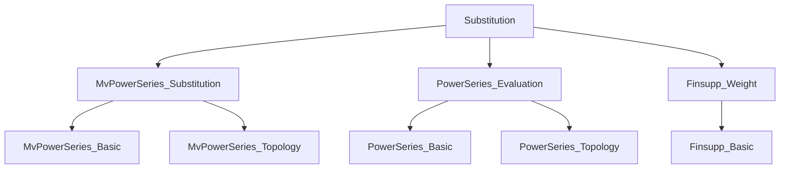
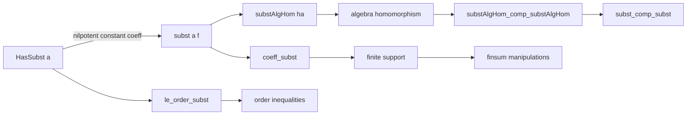

### Technical Brief: Substitution in Power Series (`Substitution.lean`)

---

#### **1. Key Definitions & Theorems**

| Name | Type / Signature | Purpose |
|------|------------------|---------|
| `HasSubst a` | `MvPowerSeries τ S → Prop` | States that the constant coefficient of `a` is nilpotent — the condition for substitution into univariate power series. |
| `hasSubst_iff` | `HasSubst a ↔ MvPowerSeries.HasSubst (Function.const Unit a)` | Equivalence between multivariate and univariate substitution conditions via constant extension. |
| `subst a f` | `MvPowerSeries τ S → PowerSeries R → MvPowerSeries τ S` | Substitution of `a` into `f`, defined as `MvPowerSeries.subst (fun _ ↦ a) f`. |
| `substAlgHom ha` | `HasSubst a → PowerSeries R →ₐ[R] MvPowerSeries τ S` | The algebra homomorphism induced by substitution; the `R`-algebra map sending `X` to `a`. |
| `coeff_subst` | `MvPowerSeries.coeff e (subst a f) = finsum (d ↦ coeff d f • MvPowerSeries.coeff e (a ^ d))` | Coefficient-wise formula for substitution. |
| `constantCoeff_subst` | `constantCoeff (subst a f) = finsum (d ↦ coeff d f • constantCoeff (a ^ d))` | Constant term of substituted series. |
| `le_order_subst` | `a.order * f.order ≤ (f.subst a).order` | Lower bound on the order (least degree nonzero term) of a substituted series. |
| `HasSubst.comp` | `HasSubst a → HasSubst b → HasSubst (substAlgHom hb a)` | Closure of substitution condition under composition of substitution maps. |
| `subst_comp_subst` | `(subst b) ∘ (subst a) = subst (subst b a)` | Associativity of substitution. |

---

#### **2. Naming Conventions**

- **Predicates**: `HasSubst`, `HasEval`, `IsNilpotent`, `IsScalarTower`
- **Constants / constructors**:
  - `X`, `X'`, `X_pow`, `monomial`, `monomial'`
  - `zero`, `zero'`, `add`, `mul_left`, `mul_right`, `smul`, `smul'`, `smul_X`, `smul_X'`
- **Substitution operations**:
  - `subst`, `substAlgHom`, `substAlgHom_coe`, `substAlgHom_X`, `subst_coe`, `subst_X`
  - `subst_add`, `subst_mul`, `subst_pow`, `subst_smul`
- **Coefficient lemmas**:
  - `coeff_subst`, `coeff_subst'`, `coeff_subst_finite`, `coeff_subst_finite'`
- **Order lemmas**:
  - `le_order_subst`, `le_order_subst_left`, `le_order_subst_right`, `le_weightedOrder_subst`
- **Prime suffix (`'`)**: Used to avoid unfolding `Unit`-indexed types (e.g., `zero'`, `monomial'`, `X'`).

---

#### **3. Tactic Stack**

- **Core automation**: `simp`, `rw`, `ext`, `congr`, `apply`, `intro`, `exact`
- **Algebraic simplification**: `ring`, `aesop`, `simp_rw`
- **Topological reasoning**: `isTopologicallyNilpotent_of_constantCoeff_isNilpotent`, `DiscreteTopology` lemmas
- **Finsupp/finite support**: `finsum_congr`, `coeff_subst_finite`, `support`, `finite`
- **Category-theoretic**: `AlgHom.congr_fun`, `AlgHom.comp_apply`, `restrictScalars`, `comp`

---

#### **4. Proof Logic**

- **Inductive structure**: Most proofs are direct applications of:
  - Definitions (`subst`, `HasSubst`, `coeff_subst`)
  - Known lemmas from `MvPowerSeries` (e.g., `MvPowerSeries.coeff_subst`, `MvPowerSeries.substAlgHom`)
  - Reduction to `Unit`-indexed case via `hasSubst_iff`
- **Common pattern**:
  1. Reduce to multivariate case using `hasSubst_iff` or `hasEval_iff`
  2. Apply known `MvPowerSeries` lemmas
  3. Simplify using `coe_substAlgHom`, `substAlgHom_eq_aeval`, or `coeff_subst`
  4. Use finite support (`coeff_subst_finite`) to justify `finsum` manipulations
- **Order inequalities**: Proven via `le_trans`, `mul_le_mul`, and `order_eq_order` simplifications.

---

#### **5. Imports & Dependencies**

| Module | Role |
|--------|------|
| `Mathlib.RingTheory.MvPowerSeries.Substitution` | Core multivariate substitution theory |
| `Mathlib.RingTheory.PowerSeries.Evaluation` | Univariate evaluation/substitution API |
| `Mathlib.Data.Finsupp.Weight` | Weighted order and support reasoning |

---

#### **6. Mermaid Diagrams**

##### **Dependency Graph (Module Level)**

##### **Overview of Theory Flow**

---

#### **7. Theory Scope**

- **Domain**: Formalization of substitution in (univariate and multivariate) formal power series over commutative rings.
- **Key constraint**: Substitution is only valid when the substituted series has nilpotent constant term.
- **Novelty**: Specialized API for `PowerSeries` (univariate), avoiding `Unit`-indexing overhead, with primed variants for convenience.
- **Applications**: Enables composition of power series, analysis of order/weighted order, and algebraic manipulation in contexts like deformation theory or local algebra.

--- 

Let me know if you'd like a formalized dependency graph (e.g., `.lean`-level imports) or a proof strategy catalog.
