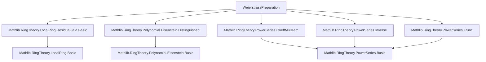

Here's a structured technical brief based on the provided Lean 4 file `WeierstrassPreparation.lean`:

---

### **1. Key Definitions & Theorems**

| Name | Type / Purpose |
|------|----------------|
| `PowerSeries.IsWeierstrassDivisionAt f g q r I` | `Prop`: asserts $ f = g \cdot q + r $, where $ r $ is a polynomial of degree $< n$, and $ n = \operatorname{ord}_{A/I}(g) $. |
| `PowerSeries.IsWeierstrassDivision` | Abbreviation of `IsWeierstrassDivisionAt` for local rings w.r.t. maximal ideal. |
| `PowerSeries.IsWeierstrassDivisorAt g I` | `Prop`: asserts the coefficient of $ g $ at index $ \operatorname{ord}_{A/I}(g) $ is a unit. Ensures $ g $ is a valid divisor in Weierstrass division under $ I $-adic completeness. |
| `PowerSeries.IsWeierstrassDivisor` | Local version of `IsWeierstrassDivisorAt`. |
| `PowerSeries.IsWeierstrassFactorizationAt g f h I` | `Prop`: asserts $ g = f \cdot h $, where $ f $ is a *distinguished* polynomial at $ I $, and $ h $ is a unit. |
| `PowerSeries.IsWeierstrassFactorization` | Local version of `IsWeierstrassFactorizationAt`. |
| `PowerSeries.exists_isWeierstrassDivision` | **Weierstrass division theorem**: existence of $ q, r $ such that $ f = g \cdot q + r $ under completeness and $ \overline{g} \ne 0 $. |
| `PowerSeries.IsWeierstrassDivision.elim`, `unique` | Uniqueness of $ q, r $ in Weierstrass division (Hausdorff case / complete case). |
| `PowerSeries.exists_isWeierstrassFactorization` | **Weierstrass preparation theorem**: existence of $ f $ (distinguished) and unit $ h $ with $ g = f \cdot h $. |
| `PowerSeries.IsWeierstrassFactorization.elim`, `unique` | Uniqueness of $ f, h $ in Weierstrass factorization. |
| `Polynomial.IsDistinguishedAt.algEquivQuotient` | Isomorphism $ A[X]/(f) \cong_A A[[X]]/(f) $ for distinguished $ f $. |
| `PowerSeries.IsWeierstrassFactorizationAt.algEquivQuotient` | Isomorphism $ A[X]/(f) \cong_A A[[X]]/(g) $ induced by $ g = f \cdot h $. |
| `PowerSeries.algEquivQuotientWeierstrassDistinguished` | Isomorphism $ A[X]/(f) \cong_A A[[X]]/(g) $, where $ f = \texttt{weierstrassDistinguished}\ g $. |

---

### **2. Naming Conventions**

- **Prefixes**:
  - `isWeierstrass...`: predicates (e.g., `isWeierstrassDivisionAt`, `isWeierstrassDivisorAt`).
  - `weierstrass...`: computational functions (e.g., `weierstrassDiv`, `weierstrassMod`).
- **Suffixes**:
  - `At`: parameterized by an ideal $ I $.
  - No suffix: local-ring version (uses `maximalIdeal`).
- **Operators**:
  - Infix operators: `/ʷ` (quotient), `%ʷ` (remainder).
- **Helper names**:
  - `seq`, `divCoeff`, `div`, `mod`, `mod'`: parts of constructive proof (inductive sequence, limit, remainder map).
  - `elim`, `unique`: standard Lean naming for uniqueness/elimination lemmas.

---

### **3. Tactic Stack**

Frequently used tactics:
- `simp`, `simp_rw`, `rw`, `ext`, `ring`, `linarith`
- `exact`, `refine`, `apply`, `assumption`
- `contrapose!`, `swap`, `by_cases`, `split_ifs`
- `induction ... using Nat.le_induction`
- `subsingleton_or_nontrivial`, `nontriviality`
- `convert`, `congr`, `nth_rw`
- `isUnit_of_subsingleton`, `isUnit_iff_constantCoeff`
- `Ideal.*_mem_*`, `coeff_*_mem_*`, `pow_succ'`, `mul_left_comm`, etc.

---

### **4. Proof Logic**

- **Inductive construction** of the quotient $ q $ via sequence $ q_k $, using $ I $-adic completeness to define the limit.
- **Uniqueness proofs** rely on:
  - $ g \cdot q = r $ with $ \deg(r) < \operatorname{ord}(g) $ implies $ q = r = 0 $ (via $ I $-adic Hausdorff condition).
  - Then apply to $ g \cdot (q - q') = r' - r $.
- **Factorization** derived from division: set $ f = \texttt{mod}(g) $, $ h = \texttt{div}(g) $, then use distinguishedness of $ f $ and unitness of $ h $.
- **Isomorphisms** constructed via universal properties of quotients and algebra maps; often use `algEquivQuotient` and `Ideal.quotientEquivAlgOfEq`.

---

### **5. Imports**

Core dependencies defining the scope:
```lean
Mathlib.RingTheory.LocalRing.ResidueField.Basic
Mathlib.RingTheory.Polynomial.Eisenstein.Distinguished
Mathlib.RingTheory.PowerSeries.CoeffMulMem
Mathlib.RingTheory.PowerSeries.Inverse
Mathlib.RingTheory.PowerSeries.Trunc
```
These provide:
- Local ring structure, residue field, maximal ideal.
- Distinguished polynomials (Eisenstein-style).
- Power series arithmetic, coefficient lemmas, truncation, inverses.

---

### **6. Mermaid Diagrams**

#### **Dependency Graph (Module-Level)**



#### **Overview of Theory Flow**

```mermaid
graph LR
  A[Complete Local Ring A] --> B[Residue Field k = A/𝔪]
  B --> C[Order of g̅ ∈ k⟦X⟧]
  C --> D{g̅ ≠ 0?}
  D -->|Yes| E[IsWeierstrassDivisorAt g 𝔪]
  E --> F[Construct q = div, r = mod]
  F --> G[Weierstrass Division: f = g·q + r]
  G --> H[Define f = r, h = q⁻¹·g]
  H --> I[Weierstrass Factorization: g = f·h]
  I --> J[Distinguished f + unit h]
  J --> K[A[X]/(f) ≅ A[[X]]/(g)]
```

---

Let me know if you'd like a formalized summary of the main theorems in `lean`-style type signatures or a dependency graph of definitions (e.g., `weierstrassDiv` → `seq`, etc.).
