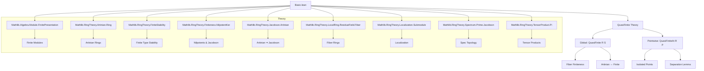
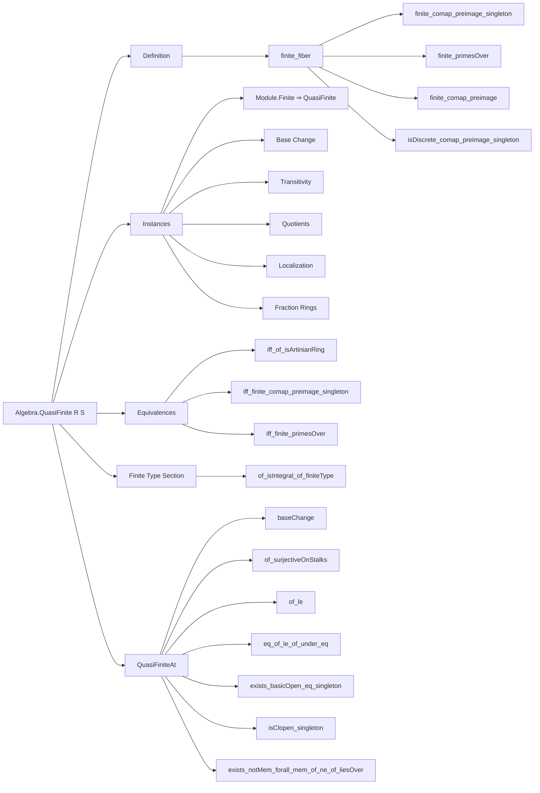

**Technical Brief: Quasi-Finite Algebras in Lean 4 (Basic.lean)**  
*Based on `Basic.lean` from the Yang library (2025), licensed Apache 2.0*

---

### 1. KEY DEFINITIONS & THEOREMS

| Name | Type / Signature | Purpose |
|------|------------------|---------|
| `Algebra.QuasiFinite R S` | `Prop` | $S$ is *quasi-finite* over $R$ iff for every prime ideal $P \subseteq R$, the fiber ring $\kappa(P) \otimes_R S$ is finite-dimensional over the residue field $\kappa(P) = R_P / P R_P$. |
| `Algebra.QuasiFiniteAt R p` | `Prop` | $S$ is *quasi-finite at a prime* $p \subseteq S$ iff the localization $S_p$ is quasi-finite over $R$. |
| `finite_comap_preimage_singleton` | `[QuasiFinite R S] → (P : PrimeSpectrum R) → (comap⁻¹' {P}).Finite` | Quasi-finite algebras have *finite fibers* over $\Spec S \to \Spec R$. |
| `iff_of_isArtinianRing` | `[IsArtinianRing R] → QuasiFinite R S ↔ Module.Finite R S` | Over Artinian rings, quasi-finiteness coincides with module-finiteness. |
| `iff_finite_comap_preimage_singleton` | `[FiniteType R S] → QuasiFinite R S ↔ ∀ x, (comap⁻¹' {x}).Finite` | For finite-type algebras, quasi-finiteness ⇔ finite fibers (Stacks Project 00PL equivalence). |
| `trans` | `[QuasiFinite R S] → [QuasiFinite S T] → QuasiFinite R T` | Quasi-finiteness is transitive. |
| `of_surjective_algHom` | `[QuasiFinite R S] → (f : S →ₐ[R] T) → Function.Surjective f → QuasiFinite R T` | Surjective algebra maps preserve quasi-finiteness. |
| `of_isLocalization` | `[QuasiFinite R S] → (M : Submonoid S) → IsLocalization M T → QuasiFinite R T` | Localization preserves quasi-finiteness. |
| `QuasiFiniteAt.baseChange` | `[QuasiFiniteAt R p] → (q : Ideal (A ⊗[R] S)) [q.IsPrime] → p = q.comap includeRight → QuasiFiniteAt A q` | Base change preserves quasi-finiteness at stalks. |
| `QuasiFiniteAt.exists_basicOpen_eq_singleton` | `[IsArtinianRing R] [EssFiniteType R S] [QuasiFiniteAt R p] → ∃ f ∉ p, basicOpen f = {p}` | In Artinian base, quasi-finite-at-$p$ implies $p$ is isolated in $\Spec S$. |
| `QuasiFiniteAt.isClopen_singleton` | `[IsArtinianRing R] [FiniteType R S] [QuasiFiniteAt R p] → IsClopen {p}` | Isolated points in $\Spec S$ are clopen under Artinian base. |
| `Ideal.exists_notMem_forall_mem_of_ne_of_liesOver` | `[EssFiniteType R S] [QuasiFiniteAt R q] [q.LiesOver p] → ∃ s ∉ q, ∀ q' ≠ q, q'.LiesOver p → s ∈ q'` | Separation lemma: points in same fiber can be separated by a function vanishing on all but one. |

---

### 2. NAMING CONVENTIONS

- **Class/instance names**:  
  - `QuasiFinite` (class), `QuasiFiniteAt` (abbrev)  
  - Suffix `-At` for *pointwise* properties (`QuasiFiniteAt R p`).
- **Lemma prefixes**:  
  - `finite_...`, `isDiscrete_...`, `iff_...`, `of_...`, `trans`, `baseChange`, `eq_of_le_of_under_eq`  
  - `exists_...` for existence lemmas (e.g., `exists_basicOpen_eq_singleton`).
- **Variable patterns**:  
  - `(R S)` or `(R S T)` in `variable (R S) in` blocks → scoped lemmas.
  - `P`, `Q` for ideals; `p`, `q` for primes (often `PrimeSpectrum R` or `Ideal R [IsPrime]`).
- **Fiber notation**:  
  - `P.Fiber S` = $\kappa(P) \otimes_R S$  
  - `P.under R` = $P \cap R$ (for $P \subseteq S$)  
  - `primesOver S` = $\{ Q \in \Spec S \mid Q \cap R = P \}$

---

### 3. TACTIC STACK

| Tactic | Frequency | Role |
|--------|-----------|------|
| `refine` / `exact` | High | Structured proof construction, especially for `Module.Finite` and `QuasiFinite` instances. |
| `simp` / `simp only` | Very High | Simplifying algebraic expressions, tensor products, localization maps, and fiber equivalences. |
| `rw` | High | Rewriting using equivalences, e.g., `Ideal.under_under`, `Localization.AtPrime.comap_maximalIdeal`. |
| `convert` | Medium | Aligning goals via transitivity of equivalences (e.g., tensor product associativity/conjugation). |
| `congr` | Medium | Proving extensionality of functions/ideals (e.g., `congr($...).1.1`). |
| `by_cases` / `by_contra` | Medium | Handling prime/non-prime cases (e.g., `finite_primesOver`). |
| `aesop` / `linarith` | Low | Not used — proofs are mostly algebraic and constructive. |
| `ext` / `funext` | Medium | Proving equality of ring homs, ideals, or sets (e.g., `ext1`, `ext`). |
| `dsimp`, `change`, `have : ...` | High | Intermediate lemmas and definitional simplifications. |

---

### 4. PROOF LOGIC

- **Inductive structure**:  
  Most proofs follow a *fiberwise reduction* strategy:
  1. Reduce to residue fields: use `P.Fiber S ≃ κ(P) ⊗ S`.
  2. Apply known results about finite modules over Artinian/local rings (e.g., `Module.Finite.of_quasiFinite`, `of_finite`).
  3. Use localization properties: `Localization.atPrime`, `IsLocalization.liftAlgHom`, `exists_mk'_eq`.
  4. For pointwise properties (`QuasiFiniteAt`), pass to stalks and use `SurjectiveOnStalks`, `localRingHom`.

- **Common patterns**:
  - **Equivalence chaining**: Build composite algebra isomorphisms via `TensorProduct.comm`, `cancelBaseChange`, `quotIdealMapEquivTensorQuot`.
  - **Fiberwise discrete topology**: Use `isDiscrete_comap_preimage_singleton` + `isDiscrete_univ_iff`.
  - **Isolated points**: Combine `exists_basicOpen_eq_singleton` with `isOpen_singleton_tfae_of_isNoetherian_of_isJacobsonRing`.
  - **Separation**: Use `exists_smul_eq_one_tmul` to lift separation from fiber to total space.

- **Key logical flow**:
  ```text
  QuasiFinite R S
    ⇒ κ(P) ⊗ S finite over κ(P)
    ⇒ fiber over P is Artinian ⇒ finite spectrum
    ⇒ comap⁻¹' {P} finite & discrete
    ⇒ Spec S → Spec R has finite, discrete fibers
    ⇒ (if finite type) ⇔ quasi-finite
  ```

---

### 5. IMPORTS & SCOPE

| Module | Role |
|--------|------|
| `Mathlib.Algebra.Module.FinitePresentation` | Finite presentation, localization of f.p. modules |
| `Mathlib.RingTheory.Artinian.Ring` | Artinian rings, Krull dimension ≤ 0 |
| `Mathlib.RingTheory.FiniteStability` | Stability of finite-type/finite under quotients, tensor |
| `Mathlib.RingTheory.Finiteness.NilpotentKer` | Nilpotent kernels, Jacobson radical |
| `Mathlib.RingTheory.Jacobson.Artinian` | Artinian ⇒ Jacobson |
| `Mathlib.RingTheory.LocalRing.ResidueField.Fiber` | Fiber rings, residue field extensions |
| `Mathlib.RingTheory.Localization.Submodule` | Localization of submodules, tensor-hom adjunction |
| `Mathlib.RingTheory.Spectrum.Prime.Jacobson` | Jacobson rings, topology on $\Spec$ |
| `Mathlib.RingTheory.TensorProduct.Pi` | Tensor product with products, base change |

**Scope**: This file formalizes the *local* and *global* theory of quasi-finite algebras, bridging commutative algebra (Artinian rings, localization) and algebraic geometry (finite fibers, isolated points, clopen subsets of $\Spec$). It serves as a foundation for further work on étale, unramified, and finite morphisms.

---

### 6. MERMAID DIAGRAMS

#### Dependency Graph (Top-Level)



#### Overview of File Structure



--- 

*End of Technical Brief.*
