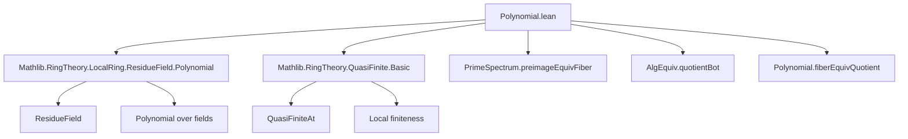

**Technical Brief: Polynomial.lean — Quasi-finite Primes in Polynomial Algebras**

---

### 1. **Key Definitions & Theorems**

| Name | Type / Signature | Purpose |
|------|------------------|---------|
| `not_quasiFiniteAt` | `∀ {P : Ideal R[X]}, P.IsPrime → ¬ Algebra.QuasiFiniteAt R P` | Shows that the polynomial ring $R[X]$ is *never* quasi-finite over $R$ at any prime ideal $P$. Core negative result. |
| `map_under_lt_comap_of_quasiFiniteAt` | `∀ (f : R[X] →ₐ[R] S) (P : Ideal S) [P.IsPrime] [Algebra.QuasiFiniteAt R P], (P.under R).map C < P.comap f` | Under quasi-finiteness of $P$ over $R$, the extension of the contraction $P \cap R$ to $R[X]$ is *strictly contained* in the comap of $P$ along $f$. Used to derive contradictions via transcendence. |
| `not_ker_le_map_C_of_surjective_of_quasiFiniteAt` | `∀ (f : R[X] →ₐ[R] S) (hf : Function.Surjective f) (P : Ideal S) [P.IsPrime] [Algebra.QuasiFiniteAt R P], ¬ RingHom.ker f ≤ (P.under R).map C` | If $P$ is quasi-finite over $R$, then the kernel of a surjective algebra map $R[X] \twoheadrightarrow S$ cannot lie inside the extension of $P \cap R$ to $R[X]$. Key structural constraint for quasi-finite primes in quotients. |

**Auxiliary notions used**:
- `P.under R`: contraction of $P$ along $R \to R[X]$, i.e., $P \cap R$.
- `P.over R`: extension of $P \cap R$ to $R[X]$, i.e., $(P \cap R)[X]$.
- `C`: `Polynomial.C`, the constant polynomial map $R \to R[X]$.
- `Algebra.QuasiFiniteAt R P`: $S_P$ is a finitely generated $R_{P \cap R}$-module (localization at $P$).
- `residueFieldMapCAlgEquiv`, `fiberEquivQuotient`, `primeSpectrum.preimageEquivFiber`: structural equivalences used to reduce to residue fields.

---

### 2. **Naming Conventions**

- **Contraction/Extension**:
  - `under`: contraction along structure map (e.g., `P.under R`).
  - `over`: extension of contraction (implicit via `.map C`).
  - `comap` / `map`: standard ring homomorphism ideal operations.

- **Residue fields**:
  - `ResidueField`: residue field at a prime ideal.
  - `fiberEquivQuotient`, `residueFieldMapCAlgEquiv`: equivalences involving fiber products and residue fields.

- **Algebraic properties**:
  - `isIntegral`, `isAlgebraic`, `transcendental_X`: properties of $X$ over base rings/fields.
  - `QuasiFiniteAt`, `QuasiFinite`: finiteness conditions in algebraic geometry.

- **Tactics & proof shorthands**:
  - `algebraize`: rewrites using `algebraMap_eq` and simplifies algebra maps.
  - `congr($(…).1.1)`: extracts and reuses equivalence data.

---

### 3. **Tactic Stack**

| Tactic | Frequency | Role |
|--------|-----------|------|
| `intro` / `intro H` | High | Standard assumption introduction. |
| `wlog` | Medium | WLOG reduction to field case (key in `not_quasiFiniteAt`). |
| `rw`, `simp`, `simp_rw` | High | Rewriting definitions (`QuasiFiniteAt`, `under`, `comap`, `map`). |
| `exact`, `apply` | High | Applying lemmas like `transcendental_X`, `not_quasiFiniteAt`, `of_injective`. |
| `have`, `obtain` | High | Introducing intermediate facts and existential witnesses (e.g., prime ideals in fibers). |
| `algebraize` | Medium | Simplifying algebra maps and constant polynomial embeddings. |
| `ring`, `linarith` | Low | Used implicitly in field/ring arithmetic (e.g., injectivity/surjectivity of linear maps). |
| `aesop` | Not present | Not used — proofs are highly structured and manual. |

---

### 4. **Proof Logic**

The proofs follow a **geometric descent + field reduction + transcendence contradiction** pattern:

1. **Field Reduction (`wlog`)**:
   - Reduce to the case where $R$ is a field (via localization/residue field base change).
   - Use `PrimeSpectrum.preimageEquivFiber` to lift primes from the fiber over $R/\mathfrak{p}$.

2. **Localization & Module Finiteness**:
   - Translate `Algebra.QuasiFiniteAt` into module-theoretic finiteness: $S_P$ finite over $R_{\mathfrak{p}}$.
   - Use injectivity/surjectivity of structure maps on residue fields to deduce finite generation over function fields.

3. **Contradiction via Transcendence**:
   - Use `transcendental_X`: $X$ is transcendental over any field $K$, hence $K[X]$ is *not* finite over $K$.
   - Derive contradiction with assumed quasi-finiteness.

4. **Ideal Inclusion Arguments**:
   - In `not_ker_le_map_C_of_surjective_of_quasiFiniteAt`, assume kernel lies in $(P \cap R)[X]$, descend to residue fields, and apply `not_quasiFiniteAt` to the pulled-back prime.

---

### 5. **Imports & Scope**

| Import | Purpose |
|--------|---------|
| `Mathlib.RingTheory.LocalRing.ResidueField.Polynomial` | Residue field constructions and polynomial algebra over them. |
| `Mathlib.RingTheory.QuasiFinite.Basic` | Definition and basic properties of quasi-finite algebras (e.g., `QuasiFiniteAt`, `QuasiFinite`). |

**Domain**: Commutative algebra, especially local properties of polynomial algebras and quasi-finiteness in algebraic geometry.

---

### 6. **Mermaid Diagrams**

#### Dependency Graph (Top-Level)



#### Overview of Proof Flow (for `not_quasiFiniteAt`)

```mermaid
flowchart LR
  A[Assume P ⊆ R[X] prime, quasi-finite] --> B[WLOG R is a field]
  B --> C[Consider fiber over p = P ∩ R]
  C --> D[Pull back prime Q in fiber]
  D --> E[Use base change: Q gives quasi-finite prime in p.ResidueField[X]]
  E --> F[But X is transcendental over p.ResidueField]
  F --> G[Contradiction with quasi-finiteness]
  G --> H[¬ Algebra.QuasiFiniteAt R P]
```

#### Ideal Inclusion Logic (`not_ker_le_map_C_of_surjective_of_quasiFiniteAt`)

```mermaid
flowchart LR
  A[Assume ker f ≤ (P ∩ R)[X]] --> B[Descend to residue field k = (P ∩ R).ResidueField]
  B --> C[Show induced map k[X] → S_P is injective]
  C --> D[Pull back prime Q in k[X] mapping to P]
  D --> E[Q gives quasi-finite prime over k]
  E --> F[Contradiction via not_quasiFiniteAt]
  F --> G[¬ ker f ≤ (P ∩ R)[X]]
```

---

### 7. **Summary**

This module establishes foundational constraints on quasi-finite primes in polynomial algebras:  
- **No prime of $R[X]$ is quasi-finite over $R$** (global negative result).  
- **Quasi-finite primes in quotients $R[X]/I$ cannot arise from $I$ lying in $(P \cap R)[X]$** — a key structural lemma for descent arguments.  
- Relies heavily on **residue field reductions**, **transcendence of $X$**, and **localization techniques**.

These results are essential for deeper analysis of quasi-finite morphisms in algebraic geometry, especially in proving openness or finiteness properties of fibers.
