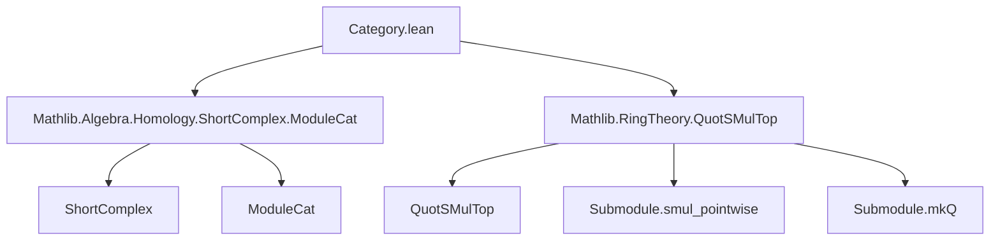
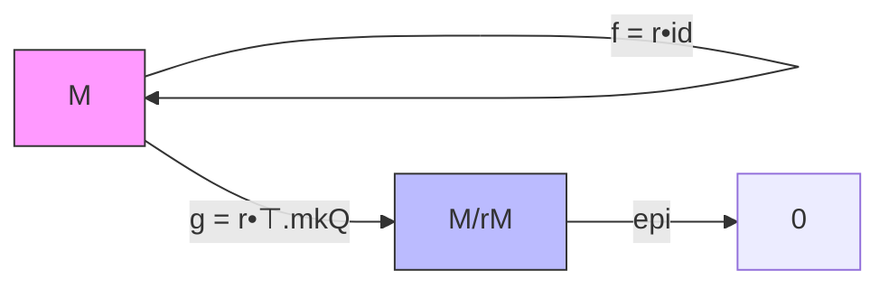

**Technical Metadata Brief: `Category.lean` (Category-theoretic constructions for `IsSMulRegular`)**

---

### 1. **Key Definitions & Theorems**

| Name | Type / Signature | Purpose |
|------|------------------|---------|
| `LinearMap.exact_smul_id_smul_top_mkQ` | `∀ (M : Type v) [_:AddCommGroup M] [_:Module R M] (r : R), Function.Exact (r • LinearMap.id) (r • ⊤).mkQ` | Shows that the composite of scalar multiplication by `r` and the quotient map is zero, and that the image of the first equals the kernel of the second. |
| `ModuleCat.smulShortComplex` | `R → ShortComplex (ModuleCat R)` | Constructs a short complex $M \xrightarrow{r} M \xrightarrow{r} M / rM$ in `ModuleCat R`. |
| `ModuleCat.smulShortComplex_exact` | `∀ r, (smulShortComplex M r).Exact` | Proves the constructed complex is exact (i.e., $\operatorname{im} f = \ker g$). |
| `ModuleCat.smulShortComplex_g_epi` | `∀ r, Epi (smulShortComplex M r).g` | Shows the second map (quotient) is an epimorphism (surjective in `ModuleCat`). |
| `IsSMulRegular.smulShortComplex_shortExact` | `∀ r, IsSMulRegular M r → (smulShortComplex M r).ShortExact` | If `r` is regular on `M`, then the complex is *short exact* (i.e., `f` is monic + exact + `g` epi). |

---

### 2. **Naming Conventions**

- **Prefixes**:
  - `smul_`: for constructions involving scalar multiplication (`smulShortComplex`, `smulShortComplex_exact`, `smulShortComplex_g_epi`).
  - `exact_`: for exactness lemmas (`exact_smul_id_smul_top_mkQ`).
- **Suffixes**:
  - `_mkQ`: for maps involving quotient maps (`mkQ` = `Submodule.mkQ`).
  - `__epi`, `_mono`: for categorical properties (epimorphism/monomorphism).
- **Structure names**:
  - `smulShortComplex`: compound noun describing the object (scalar-multiplication-induced short complex).
- **Variable naming**:
  - `r` for scalar, `M` for module, `f`, `g` for complex maps.

---

### 3. **Tactic Stack**

| Tactic | Usage Frequency | Role |
|--------|-----------------|------|
| `simp` | High | Simplifies using `simps`, definitional equalities, and lemmas like `exact_smul_id_smul_top_mkQ`. |
| `ext` | Medium | Used to prove extensionality of linear maps or module homs. |
| `exact` | Medium | Applies known equalities (e.g., from `exact_smul_id_smul_top_mkQ.apply_apply_eq_zero`). |
| `simpa` | Medium | Refines `simp` with additional lemmas (e.g., `ModuleCat.epi_iff_surjective`). |
| `intro` | Low | Used in manual exactness proofs (e.g., `intro x`). |

No heavy automation (`aesop`, `ring`, `linarith`) appears—proofs are mostly definitional or rely on module-theoretic lemmas.

---

### 4. **Proof Logic**

- **Structure**:  
  1. **Define** the short complex via `smulShortComplex`, using `r • LinearMap.id` and `r • ⊤.mkQ`.  
  2. **Verify zero composite** using `exact_smul_id_smul_top_mkQ.apply_apply_eq_zero`.  
  3. **Prove exactness** by showing $\operatorname{im}(r) = \ker(r)$ in the quotient, via `exact_smul_id_smul_top_mkQ`.  
  4. **Show epimorphism** of `g` using surjectivity of `mkQ`.  
  5. **Upgrade to short exactness** under `IsSMulRegular M r`, which gives injectivity of `r • LinearMap.id`, i.e., `mono_f`.

- **Logical flow**:  
  `def → zero → exact → epi → (reg ⇒ mono) → shortExact`.

---

### 5. **Imports**

| Import | Purpose |
|--------|---------|
| `Mathlib.Algebra.Homology.ShortComplex.ModuleCat` | Provides `ShortComplex`, `ShortExact`, and categorical machinery in `ModuleCat`. |
| `Mathlib.RingTheory.QuotSMulTop` | Supplies `QuotSMulTop`, `Submodule.smul_pointwise`, and `mkQ` constructions. |

> **Note**: `CategoryTheory`, `Ideal`, and `Pointwise` are opened locally.

---

### 6. **Mermaid Diagrams**

#### **Dependency Graph (Module-Level)**

#### **Overview of `smulShortComplex` Construction**

- **Exactness**: $\operatorname{im}(f) = \ker(g)$  
- **Short exact iff `r` is regular**: `mono_f ⇔ IsSMulRegular M r`

---

### 7. **Theoretical Context**

- **Goal**: Connect algebraic regularity (`IsSMulRegular`) with categorical exactness in `ModuleCat`.
- **Key insight**: The sequence $M \xrightarrow{r} M \to M/rM$ is always exact at the middle and right; it becomes *short exact* precisely when $r$ acts injectively.
- **Use case**: Enables homological arguments (e.g., long exact sequences in homology) from module-theoretic regularity assumptions.

--- 

Let me know if you'd like the corresponding `short_exact_of_iso` or derived lemmas (e.g., behavior under base change).
