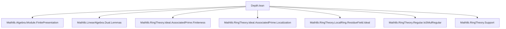

### Technical Brief: `Depth.lean`

---

#### **1. Key Definitions & Theorems**

| Name | Type / Signature | Purpose |
|------|------------------|---------|
| `IsSMulRegular M r` | `Prop` | $r \in R$ acts *regularly* on $M$: $r \cdot m = 0 \Rightarrow m = 0$. |
| `Module.annihilator R N` | `Ideal R` | $\mathrm{Ann}_R(N) = \{ r \in R \mid r \cdot N = 0 \}$. |
| `Subsingleton (N →ₗ[R] M)` | `Prop` | All $R$-linear maps $N \to M$ are equal (i.e., at most one such map exists). |
| `linearMap_subsingleton_of_mem_annihilator` | `∀ {r}, IsSMulRegular M r → r ∈ ann(N) → Subsingleton(N →ₗ[R] M)` | If a regular element of $M$ annihilates $N$, then $\mathrm{Hom}(N,M)$ is subsingleton. |
| `subsingleton_linearMap_iff` | `Subsingleton(N →ₗ[R] M) ↔ ∃ r ∈ ann(N), IsSMulRegular M r` | Main equivalence: Hom-space is subsingleton iff there exists an $M$-regular element in $\mathrm{ann}(N)$. Requires Noetherian + finite module assumptions. |

---

#### **2. Naming Conventions**

- **Prefixes**:
  - `linearMap_...`: properties about linear maps.
  - `subsingleton_...`: subsingltonness of hom-sets.
  - `IsSMulRegular...`: regularity of scalars on modules.
- **Suffixes**:
  - `_iff`: biconditional statements.
  - `_of_...`: implication from a condition (e.g., `of_mem_annihilator`).
- **Variables**:
  - `R`: base commutative ring.
  - `M, N`: $R$-modules.
  - `r`: scalar element.
  - `p`, `p'`: prime ideals / prime spectrum elements.
  - `Rₚ`, `Nₚ`, `Mₚ`: localizations at prime $p$.

---

#### **3. Tactic Stack**

Frequently used tactics in this file:

| Tactic | Role |
|--------|------|
| `ext` | Extensionality for functions/modules (e.g., `LinearMap.ext`). |
| `simp` / `simpa` | Simplification with rewrite lemmas (e.g., `map_smul`, `smul_zero`). |
| `rw` | Rewriting using equivalences/implications (e.g., `Module.mem_annihilator.mp`). |
| `apply` / `exact` | Goal-directed proof construction. |
| `rcases` / `cases` | Destructive case analysis on existentials/disjunctions. |
| `by_contra!` | Proof by contradiction (with `not_not` simplification). |
| `convert` | Flexible equality proof (allows mismatched goals with convertible sides). |
| `contrapose!` | Turn implication into contrapositive form. |
| `let _ := ...` | Introduce local definitions (e.g., localizations, quotients). |
| `induction ... using ...` | Structural induction on quotient elements. |

---

#### **4. Proof Logic**

The proof of `subsingleton_linearMap_iff` follows this logical flow:

1. **Forward direction (`→`)**:
   - Assume `Subsingleton(N →ₗ[R] M)`.
   - If $M = 0$, trivial: pick $r = 0$.
   - Else, assume for contradiction that no regular element of $M$ lies in $\mathrm{ann}(N)$.
   - Use `biUnion_associatedPrimes_eq_compl_regular` to show $\mathrm{ann}(N) \subseteq \bigcup \mathrm{Ass}(M)$.
   - By finiteness of associated primes (Noetherian + finite $M$), get a prime $p \in \mathrm{Ass}(M)$ with $\mathrm{ann}(N) \subseteq p$.
   - Localize at $p$: get $Rₚ$, $Nₚ$, $Mₚ$.
   - Pass to residue field $k = Rₚ / \mathfrak{m}_p$, and consider induced maps $Nₚ \to k$, $k \to Mₚ$.
   - Construct a nonzero map $Nₚ \to Mₚ$ using existence of nonzero functional on $Nₚ'$ (quotient by maximal ideal action).
   - Use finite presentation of $N$ to descend this map to $N \to M$, contradicting subsingltonness.

2. **Backward direction (`←`)**:
   - Given $r \in \mathrm{ann}(N)$ regular on $M$, show any two maps $f, g : N \to M$ are equal.
   - Use `ext`, reduce to $f(x) = g(x)$.
   - Note $r \cdot (f(x) - g(x)) = 0$, so $f(x) = g(x)$ by regularity.

---

#### **5. Imports & Scope**

**Primary Dependencies**:
- `Mathlib.Algebra.Module.FinitePresentation`: finite presentation of modules (used for descent).
- `Mathlib.LinearAlgebra.Dual.Lemmas`: dual module constructions, functionals.
- `Mathlib.RingTheory.Ideal.AssociatedPrime.*`: theory of associated primes, localization, support.
- `Mathlib.RingTheory.LocalRing.ResidueField.Ideal`: residue fields at local rings.
- `Mathlib.RingTheory.Regular.IsSMulRegular`: regular elements on modules.

**Scope**: Commutative algebra, especially depth, regular sequences, associated primes, and homological behavior of modules over Noetherian rings.

---

#### **6. Mermaid Diagrams**

##### **Dependency Graph (Module-Level)**



##### **Theoretical Overview**

```mermaid
graph LR
  A[Hom(N,M) subsingleton] --> B[∃ r ∈ ann(N), IsSMulRegular M r]
  B --> C[ann(N) meets regular elements of M]
  C --> D[Depth[I](M) = 0 ⇒ ann(N) contains M-regular element]
  D --> A
```

##### **Proof Structure (High-Level)**

```mermaid
graph TD
  P1[Assume Subsingleton(N→M)] --> P2{M = 0?}
  P2 -->|Yes| P3[Pick r = 0]
  P2 -->|No| P4[Assume ¬∃ regular r ∈ ann(N)]
  P4 --> P5[ann(N) ⊆ ⋃ Ass(M)]
  P5 --> P6[Get p ∈ Ass(M) with ann(N) ⊆ p]
  P6 --> P7[Localize at p]
  P7 --> P8[Construct nonzero map Nₚ → Mₚ]
  P8 --> P9[Descend to N → M via finite presentation]
  P9 --> P10[Contradiction]

  P11[∃ r ∈ ann(N), regular] --> P12[Use linearMap_subsingleton_of_mem_annihilator]
  P12 --> P13[Hom(N,M) subsingleton]
```

---

#### **7. Summary**

This file establishes a clean criterion for when $\mathrm{Hom}_R(N,M)$ is at most singleton: precisely when $N$ is annihilated by an $M$-regular element. It connects module-theoretic regularity (depth-like conditions) with hom-set triviality, and crucially uses localization, associated primes, and finite presentation to descend a localized nonzero map to the global setting — a typical technique in commutative algebra.

The result is foundational for deeper depth-related theorems (e.g., characterizing depth via regular sequences), and fits into the broader `Depth` theory in Mathlib.
