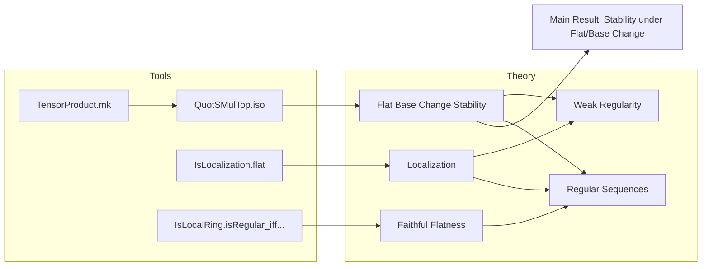

### Technical Brief: `Flat.lean` — Stability of Weakly/Regular Sequences under Flat/Base Change

---

#### **1. Key Definitions & Theorems**

| Name | Type / Signature | Purpose |
|------|------------------|---------|
| `IsWeaklyRegular M rs` | `List R → Prop` | `$r₁, …, rₙ$` is a *weakly regular* sequence on module `$M$`: each `$r_i$` is non-zero-divisor on `$M / (r₁, …, r_{i-1})M$`. |
| `IsRegular M rs` | `List R → Prop` | Stronger: `$r_i$` is *non-zero-divisor* **and** `$M / (r₁, …, r_i)M ≠ 0$` for all `$i$`. |
| `IsBaseChange S f` | `(f : M →ₗ[R] N) → Prop` | `$f$` is a *base change* along `$R → S$`: i.e., `$N ≅ S ⊗_R M$` via `$f$`. |
| `IsLocalizedModule T f` / `IsLocalizedModule.AtPrime p f` | `(f : M →ₗ[R] N) → Prop` | `$f$` realizes `$N$` as the localization of `$M$` at submonoid `$T$` (or at prime `$p$`). |
| `IsRegular.of_flat_of_isBaseChange` | `[Flat R S] → IsWeaklyRegular M rs → IsWeaklyRegular N (rs.map (algebraMap R S))` | **Main theorem**: weak regularity descends along flat base change. |
| `IsRegular.of_faithfullyFlat_of_isBaseChange` | `[FaithfullyFlat R S] → IsRegular M rs → IsRegular N (rs.map (algebraMap R S))` | **Main theorem**: regularity descends along *faithfully* flat base change. |
| `IsRegular.isRegular_of_isLocalizedModule_of_mem` | `[IsLocalizedModule.AtPrime p f] → (∀ r ∈ rs, r ∈ p) → IsRegular N (rs.map (algebraMap R S))` | When localization at prime `$p$`, and all `$r_i ∈ p$`, then image is *regular* (not just weakly regular) under finite/nontrivial assumptions. |

---

#### **2. Naming Conventions**

- **Prefixes**:
  - `is_`: predicate definitions (`IsWeaklyRegular`, `IsRegular`, `IsBaseChange`, `IsLocalizedModule`, `IsLocalRing`)
  - `of_`: implication theorems (e.g., `of_flat`, `of_isBaseChange`, `of_isLocalization`)
  - `map_`: operations involving `List.map` (e.g., `algebraMap R S` applied to list)
- **Suffixes**:
  - `_iff_`: equivalence statements (e.g., `map_smul_top_ne_top_iff_of_faithfullyFlat`)
  - `_congr`: equivalence of structures (e.g., `QuotSMulTop.congr`)
- **Module-theoretic terms**:
  - `quot`, `smul`, `top`, `tensor`, `restrictScalars`, `submodule.map`

---

#### **3. Tactic Stack**

| Tactic | Frequency | Role |
|--------|-----------|------|
| `induction` | High | Structural induction on `rs : List R` |
| `simp` / `simp only [...]` | Very High | Simplify goals using `isWeaklyRegular_cons_iff`, `List.map_cons`, etc. |
| `exact` / `refine` | Medium | Apply known lemmas or construct proofs stepwise |
| `rw` | Medium | Rewrite using equivalences (e.g., `← Ideal.map_ofList`) |
| `have` / `set` | Medium | Introduce intermediate isomorphisms (e.g., `e := ...`) |
| `rcases` / `cases` | Low–Medium | Unpack existential quantifiers (e.g., `List.mem_map`) |
| `simpa` | Medium | Simplify with assumptions (e.g., `simpa using mem r hr`) |
| `aesop` / `ring` / `linarith` | Not present | Not used in this file |

---

#### **4. Proof Logic**

- **Inductive structure** on `rs : List R`:
  - Base case `[]`: trivial (`simp`).
  - Step case `x :: xs`:
    1. Unfold `IsWeaklyRegular` via `isWeaklyRegular_cons_iff`.
    2. Reduce to:
       - `$x$` acts injectively on `$M$` ⇒ `$\overline{x}$` acts injectively on `$N$` (via flatness + base change).
       - Inductive hypothesis for `$xs$` on the quotient module.
    3. Key tool: isomorphism  
       $$
       S \otimes_R M / xM \;\cong\; (S \otimes_R M) / (x \cdot S \otimes_R M)
       $$
       implemented via `QuotSMulTop.algebraMapTensorEquivTensorQuotSMulTop`.
    4. Show the induced map is a base change to apply IH.

- **Faithfully flat case**:
  - Use flatness for weak regularity (as above).
  - For non-vanishing of quotients: use equivalence  
    $$
    S \otimes_R M / (r₁, …, r_i)M \cong N / (r₁, …, r_i)N
    $$
    and faithful flatness to pull back `≠ 0`.

- **Localization case**:
  - Use `IsLocalization.flat` to get flatness.
  - For *regularity* (not just weak), use:
    - `IsLocalization.AtPrime.isLocalRing` ⇒ reduce to maximal ideal condition.
    - `IsLocalRing.isRegular_iff_isWeaklyRegular_of_subset_maximalIdeal`.

---

#### **5. Imports & Dependencies**

| Import | Role |
|--------|------|
| `Mathlib.RingTheory.Flat.FaithfullyFlat.Basic` | Definitions of `Flat`, `FaithfullyFlat`, `IsBaseChange`, `IsLocalRing` |
| `Mathlib.RingTheory.Flat.Localization` | Localization as flat module, `IsLocalizedModule`, `IsLocalization.AtPrime` |
| `Mathlib.RingTheory.Regular.RegularSequence` | Definitions of `IsWeaklyRegular`, `IsRegular`, basic lemmas |

---

#### **6. Mermaid Diagrams**

##### **Dependency Graph (Theorems & Concepts)**

```mermaid
graph TD
  A[CommRing R] --> B[Module R M]
  A --> C[Algebra R S]
  C --> D[Module S N]
  D --> E[IsScalarTower R S N]
  C --> F[Flat R S]
  C --> G[FaithfullyFlat R S]
  B --> H[IsWeaklyRegular M rs]
  B --> I[IsRegular M rs]
  D --> J[IsWeaklyRegular N (rs.map _)]
  D --> K[IsRegular N (rs.map _)]
  C --> L[IsBaseChange S f]
  C --> M[IsLocalizedModule T f]
  C --> N[IsLocalizedModule.AtPrime p f]

  H -- of_flat_of_isBaseChange --> J
  I -- of_faithfullyFlat_of_isBaseChange --> K
  H -- of_isLocalizedModule --> J
  I -- isRegular_of_isLocalizedModule_of_mem --> K
  C -- IsLocalization.flat --> F
  M -- IsLocalizedModule.isBaseChange --> L
  N -- IsLocalization.AtPrime.isLocalRing --> IsLocalRing S
```

##### **Overview of File Structure**



---

#### **7. Summary**

This file establishes **stability of (weakly) regular sequences under flat and faithfully flat base change**, with special attention to **localization at primes**. It leverages:
- The canonical isomorphism `$S \otimes_R M/xM \cong (S \otimes_R M)/x(S \otimes_R M)$`,
- Faithful flatness to detect non-vanishing,
- Localization theory to upgrade weak regularity to regularity under local hypotheses.

The proofs are largely **constructive and modular**, relying on `induction`, `simp`, and explicit construction of base change isomorphisms.

--- 

Let me know if you'd like a formalized dependency graph (e.g., for `leanproject`), or a summary of lemmas used in `QuotSMulTop.algebraMapTensorEquivTensorQuotSMulTop`.
