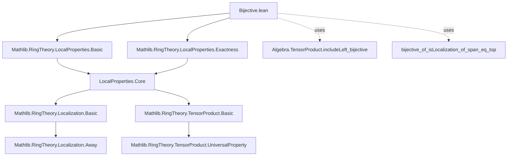
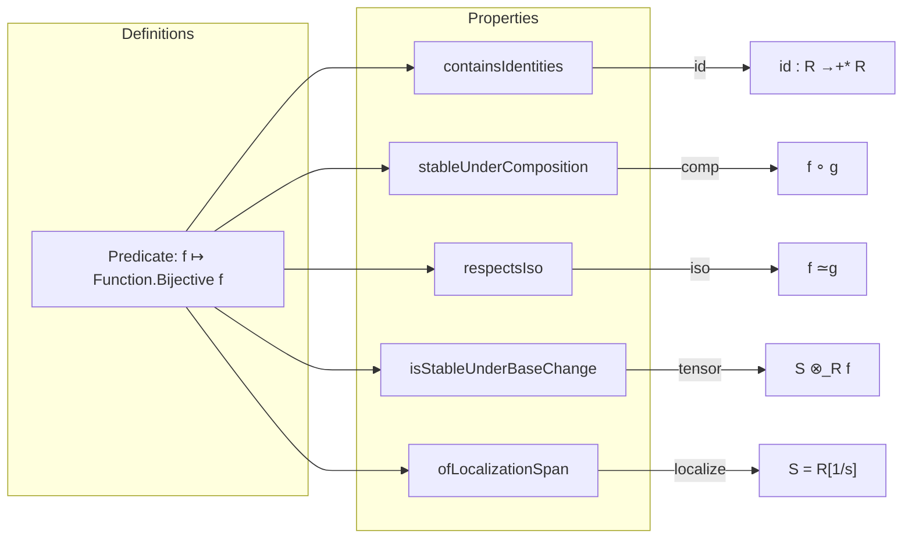

**Technical Brief: `Bijective.lean` — Meta Properties of Bijective Ring Homomorphisms**

---

### 1. **Key Definitions & Theorems**

| Name | Type / Signature | Purpose |
|------|------------------|---------|
| `containsIdentities` | `ContainsIdentities (fun f ↦ Function.Bijective f)` | Shows identity ring homomorphisms are bijective. |
| `stableUnderComposition` | `StableUnderComposition (fun f ↦ Function.Bijective f)` | Shows bijectivity is preserved under composition of ring homomorphisms. |
| `respectsIso` | `RespectsIso (fun f ↦ Function.Bijective f)` | Shows bijectivity is preserved under isomorphism (i.e., if $f$ is bijective and $g \cong f$, then $g$ is bijective). |
| `isStableUnderBaseChange` | `IsStableUnderBaseChange (fun f ↦ Function.Bijective f)` | Shows bijectivity is preserved under base change (tensoring along a ring map). |
| `ofLocalizationSpan` | `OfLocalizationSpan (fun f ↦ Function.Bijective f)` | Shows bijectivity descends along localization at a multiplicative set whose span maps surjectively, using `bijective_of_isLocalization_of_span_eq_top`. |

> **Note**: The predicate `fun f ↦ Function.Bijective f` is used directly—no dedicated `RingHom.Bijective` type class is introduced.

---

### 2. **Naming Conventions**

- **Prefixes**:
  - `containsIdentities`, `stableUnder*`, `respects*`, `isStableUnder*`, `of*`: Standard for properties of subclasses of morphisms in categorical/meta-theoretic contexts (e.g., `ContainsIdentities`, `StableUnderComposition`, `RespectsIso`, `IsStableUnderBaseChange`, `OfLocalizationSpan`).
- **Suffixes**:
  - `*Of*`: Used for descent properties (`ofLocalizationSpan`).
- **No explicit predicate naming** (e.g., `isBijectiveRingHom`)—relies on `Function.Bijective`.

---

### 3. **Tactic Stack**

- `aesop`: Used implicitly in `respectsIso` (via `.mk respectsIso ...`).
- `simp` / `simp_rw`: Likely used in `bijective_of_isLocalization_of_span_eq_top` (external lemma).
- `ring`: Not present—this is a logical/meta-theoretic file, not computational.
- `exact`, `intro`, `apply`, `rw`: Standard in proofs (e.g., `hf`, `hg`, `hs` used directly).
- `algebra.tensor_product.includeLeft_bijective`: Applied via `algebra.tensor_product` namespace.

---

### 4. **Proof Logic**

- **Meta-theoretic verification pattern**:
  1. **Identity**: Show identity maps satisfy the predicate (`containsIdentities`).
  2. **Closure under composition**: Use `Function.bijective.comp` (`stableUnderComposition`).
  3. **Stability under isomorphism**: Use closure under composition + invertibility (`respectsIso`).
  4. **Stability under base change**: Use `Algebra.TensorProduct.includeLeft_bijective` (a known result in `Mathlib`).
  5. **Descent along localization**: Use `bijective_of_isLocalization_of_span_eq_top`, a specialized lemma for localization contexts.

- **Induction or case analysis**: Not used—proofs are direct applications of known lemmas and functional properties.

---

### 5. **Imports**

| Import | Purpose |
|--------|---------|
| `Mathlib.RingTheory.LocalProperties.Basic` | Provides foundational definitions: `ContainsIdentities`, `StableUnderComposition`, `RespectsIso`, `IsStableUnderBaseChange`, `OfLocalizationSpan`. |
| `Mathlib.RingTheory.LocalProperties.Exactness` | Supplies tools for exactness and localization-related properties (e.g., `bijective_of_isLocalization_of_span_eq_top`). |
| `TensorProduct` (via `open TensorProduct`) | Used for base change arguments (e.g., `includeLeft_bijective`). |

---

### 6. **Dependency Graph (Mermaid)**

---

### 7. **Overview Diagram (Mermaid)**

---

### 8. **Theoretical Scope**

This module formalizes **closure properties** of bijective ring homomorphisms in the language of *local properties* (in the sense of Stacks Project / Grothendieck-style descent theory). It shows that bijectivity is a *local property* stable under:

- Identity,
- Composition,
- Isomorphism,
- Base change (tensoring),
- Localization along a multiplicative set with full span.

This is foundational for descent theory: e.g., proving that a ring map is bijective if it becomes bijective after base change to a covering family (e.g., localization at generators of the unit ideal).

--- 

**End of Brief**
