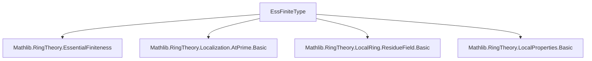
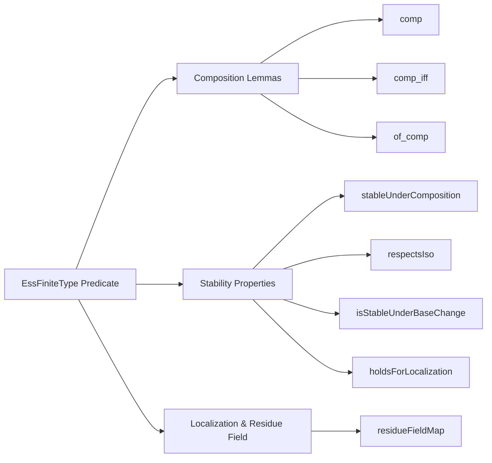

**Technical Metadata Brief: `EssFiniteType.lean`**

---

### 1. **Key Definitions & Theorems**

| Name | Type / Signature | Purpose |
|------|------------------|---------|
| `EssFiniteType` | `R →+* S → Prop` | Predicate stating that a ring homomorphism $ R \to S $ is *essentially of finite type*, i.e., factors as a localization of a finite type algebra. |
| `comp` | `hf : f.EssFiniteType → hg : g.EssFiniteType → (g.comp f).EssFiniteType` | Closure under composition: if $ f $ and $ g $ are essentially of finite type, so is $ g \circ f $. |
| `comp_iff` | `hf : f.EssFiniteType → ((g.comp f).EssFiniteType ↔ g.EssFiniteType)` | When $ f $ is essentially of finite type, $ g \circ f $ is essentially of finite type iff $ g $ is. |
| `of_comp` | `(g.comp f).EssFiniteType → g.EssFiniteType` | If $ g \circ f $ is essentially of finite type, then so is $ g $ (no assumption on $ f $ needed). |
| `stableUnderComposition` | `StableUnderComposition EssFiniteType` | Encodes that the class of essentially finite type maps is closed under composition. |
| `respectsIso` | `RespectsIso EssFiniteType` | The property is invariant under isomorphisms of ring homomorphisms. |
| `isStableUnderBaseChange` | `IsStableUnderBaseChange EssFiniteType` | Stable under base change (pullback along arbitrary ring maps). |
| `holdsForLocalization` | `HoldsForLocalization EssFiniteType` | Localization maps $ R \to S^{-1}R $ are essentially of finite type. |
| `residueFieldMap` | `[IsLocalRing R] → [IsLocalRing S] → [IsLocalHom f] → f.EssFiniteType → (ResidueField.map f).EssFiniteType` | The induced map on residue fields of a local essentially finite type map is essentially of finite type. |

---

### 2. **Naming Conventions**

- **Predicate**: `EssFiniteType` — compound noun, no prefix/suffix beyond standard naming (`FiniteType`, `Ess` for *essentially*).
- **Lemma names**:
  - `comp`, `comp_iff`, `of_comp`: standard categorical composition lemmas.
  - `stableUnderComposition`, `respectsIso`, `isStableUnderBaseChange`, `holdsForLocalization`: named after *properties* they encode (stability, invariance, localization behavior).
  - `residueFieldMap`: descriptive, combines object (`ResidueField.map`) and property (`EssFiniteType`).

No explicit prefixes like `is_`, `mul_`, `dist_` — naming is semantic and aligned with `Mathlib` conventions.

---

### 3. **Tactic Stack**

- `algebraize [...]`: custom tactic (likely from `Mathlib.RingTheory.Algebra.Basic`) to reduce algebraic statements to module/algebra-level reasoning.
- `exact ...`: used to apply lemmas from `Algebra.EssFiniteType`.
- `rw [...] at h ⊢`: rewriting using definitions like `essFiniteType_algebraMap`.
- `infer_instance`: to discharge typeclass goals (e.g., `IsLocalization`).
- `refine ...`: for partial proof construction, especially when using `of_comp`.
- `exact ... .of_isLocalization ...`: leveraging existing structure from localization theory.

No heavy automation (e.g., `aesop`, `ring`, `simp_rw`) — proofs are mostly structural and rely on algebraic lemmas.

---

### 4. **Proof Logic**

- **Pattern**: Most proofs follow a *structural reduction* strategy:
  1. Use `algebraize` to translate ring homomorphism statements into algebra statements.
  2. Apply known lemmas from `Algebra.EssFiniteType` (e.g., `comp`, `comp_iff`, `of_comp`).
  3. For stability properties (`stableUnderComposition`, `respectsIso`, etc.), combine previously proven lemmas.
  4. For localization/residue field cases:
     - Use `rw [essFiniteType_algebraMap]` to unfold definition.
     - Apply `of_isLocalization` or `of_surjective` + `essFiniteType`.
     - Use `comp`/`of_comp` to decompose composite maps.

- **Induction**: Not used — all arguments are *algebraic* and *categorical*, not inductive.

---

### 5. **Imports**

| Import | Role |
|--------|------|
| `Mathlib.RingTheory.EssentialFiniteness` | Core definition and basic properties of `EssFiniteType`. |
| `Mathlib.RingTheory.Localization.AtPrime.Basic` | Localization theory (used in `holdsForLocalization`). |
| `Mathlib.RingTheory.LocalRing.ResidueField.Basic` | Residue fields and induced maps. |
| `Mathlib.RingTheory.LocalProperties.Basic` | General stability properties (e.g., `StableUnderComposition`, `RespectsIso`, `IsStableUnderBaseChange`, `HoldsForLocalization`). |

---

### 8. **Mermaid Diagrams**

#### **Dependency Graph (Module Level)**

#### **Overview of File Structure**

#### **Theoretical Context**

- This file sits in the *local properties* hierarchy of `Mathlib`, extending the theory of ring homomorphism classes (finite type, finite, essentially finite type).
- It connects:
  - **Essential finiteness** (a local property) to:
    - **Localization theory** (via `holdsForLocalization`)
    - **Local ring theory** (via `residueFieldMap`)
    - **Categorical stability** (via `respectsIso`, `isStableUnderBaseChange`)
- Part of a larger effort to formalize *local properties of morphisms* in algebraic geometry (e.g., for stacks, descent, etc.).

--- 

Let me know if you'd like the corresponding `Mathlib` module hierarchy or a comparison with `FiniteType`/`Finite` analogues.
