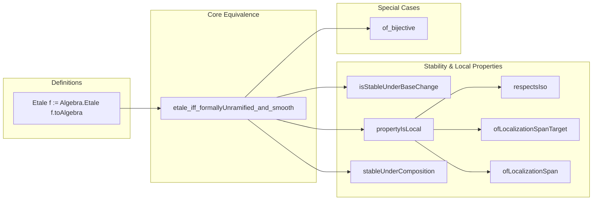

**Technical Brief: Étale Ring Homomorphisms in Lean 4 (`Etale.lean`)**

---

### 1. **Key Definitions & Theorems**

| Name | Type / Signature | Purpose |
|------|------------------|---------|
| `Etale` | `def Etale {R S : Type*} [CommRing R] [CommRing S] (f : R →+* S) : Prop` | Defines a ring homomorphism `f : R →+* S` to be *étale* iff the induced algebra `f.toAlgebra` is étale (i.e., `Algebra.Etale R S`). |
| `Etale.toAlgebra` | `lemma Etale.toAlgebra {f : R →+* S} (hf : Etale f) : Algebra.Etale R S` | Helper lemma for `algebraize` tactic: extracts the algebraic étaleness from the ring-hom version. |
| `etale_algebraMap` | `lemma etale_algebraMap [Algebra R S] : (algebraMap R S).Etale ↔ Algebra.Etale R S` | Relates étaleness of the structure map to the abstract algebra notion. |
| `etale_iff_formallyUnramified_and_smooth` | `lemma etale_iff_formallyUnramified_and_smooth : f.Etale ↔ f.FormallyUnramified ∧ f.Smooth` | **Core equivalence**: étale ⇔ formally unramified ∧ smooth. |
| `Etale.eq_formallyUnramified_and_smooth` | `lemma Etale.eq_formallyUnramified_and_smooth : @Etale = fun R S _ _ f ↦ f.FormallyUnramified ∧ f.Smooth` | Extensionality: identifies `Etale` with the conjunction of the two properties. |
| `Etale.of_bijective` | `lemma Etale.of_bijective {f : R →+* S} (hf : Function.Bijective f) : f.Etale` | Bijective ring maps are étale (uses formally unramified + smooth criteria). |
| `Etale.isStableUnderBaseChange` | `lemma Etale.isStableUnderBaseChange : IsStableUnderBaseChange Etale` | Étale morphisms are stable under base change. |
| `Etale.propertyIsLocal` | `lemma Etale.propertyIsLocal : PropertyIsLocal Etale` | Étale is a local property on the source and target (in the Zariski topology sense). |
| `Etale.respectsIso` | `lemma Etale.respectsIso : RespectsIso Etale` | Étale property is preserved under isomorphisms of rings. |
| `Etale.ofLocalizationSpanTarget`, `Etale.ofLocalizationSpan` | `lemma`s | Consequences of being local: closure under localization spans (source/target variants). |
| `Etale.stableUnderComposition` | `lemma Etale.stableUnderComposition : StableUnderComposition Etale` | Étale morphisms are stable under composition. |

---

### 2. **Naming Conventions**

- **Prefixes**:
  - `etale_`: for lemmas about `Etale` (e.g., `etale_algebraMap`, `etale_iff_...`)
  - `Etale.`: for lemmas *about* the predicate itself (e.g., `Etale.of_bijective`, `Etale.isStableUnder...`)
- **Suffixes**:
  - `_and_`: for conjunctions (e.g., `formallyUnramified_and_smooth`)
  - `of_`, `stableUnder_`, `isStableUnder_`, `propertyIsLocal`, `respectsIso`, `ofLocalizationSpan`: standard pattern for categorical/stability properties.

---

### 3. **Tactic Stack**

- `algebraize [f]`: used to lift ring-hom definitions to algebraic ones (custom tactic for this module).
- `simp only [...]`: simplifies using definitional equivalences (e.g., unfolding `Etale`, `Smooth`, `FormallyUnramified`).
- `exact ...`: for direct proof construction.
- `rw [...]`: rewriting using lemmas (e.g., `eq_formallyUnramified_and_smooth`, `etale_iff_...`).
- `inferInstance`: used to discharge typeclass constraints (e.g., `Algebra R S`, `RingHom f`).
- `ext`: extensionality for proving equality of predicates/functions.

---

### 4. **Proof Logic**

- **Strategy**: Most proofs reduce `Etale f` to `f.FormallyUnramified ∧ f.Smooth` via `etale_iff_formallyUnramified_and_smooth`, then apply known stability/locality/composition lemmas for those two properties.
- **Typical flow**:
  1. Rewrite `Etale f` using `eq_formallyUnramified_and_smooth` or `etale_iff_...`.
  2. Split into two goals (unramified + smooth).
  3. Apply known lemmas: e.g., `FormallyUnramified.of_surjective`, `Smooth.of_bijective`, `FormallyUnramified.stableUnderComposition`, etc.
  4. Reassemble using `⟨...⟩` or `.of_...` constructors.
- **Meta-level reasoning**: Uses `algebraize` to bridge ring-hom and algebra perspectives; relies heavily on typeclass inference (`inferInstance`) and definitional equality.

---

### 5. **Imports**

| Import | Purpose |
|--------|---------|
| `Mathlib.RingTheory.RingHom.Smooth` | Defines `Smooth` ring homomorphisms and their properties. |
| `Mathlib.RingTheory.RingHom.Unramified` | Defines `FormallyUnramified` and related notions. |

> These imports provide the foundational properties (stability, locality, composition) used to characterize étale morphisms.

---

### 6. **Mermaid Diagrams**

#### **Dependency Graph**
```mermaid
graph TD
  A[Etale.lean] --> B[Mathlib.RingTheory.RingHom.Smooth]
  A --> C[Mathlib.RingTheory.RingHom.Unramified]
  B --> D[Mathlib.RingTheory.Smooth]
  C --> E[Mathlib.RingTheory.FormallyUnramified]
  D & E --> F[Mathlib.RingTheory.Algebra.Etale]  %% implicit via Algebra.Etale
  A --> F
```

#### **Overview of File Structure**


---

### 7. **Theoretical Context**

- **Étale morphisms** are characterized as *formally unramified + smooth* ring maps — a standard result in commutative algebra (EGA IV, §17).
- This formalization leverages:
  - `Algebra.Etale` (already defined in Mathlib),
  - Stability/locality properties of `Smooth` and `FormallyUnramified`,
  - The `algebraize` meta-tactic to bridge ring-hom and algebra perspectives.
- The module serves as a *meta-theoretic* companion to the base definition, collecting closure properties needed for further development (e.g., étale cohomology, descent).

--- 

Let me know if you'd like a formalization roadmap for extending this (e.g., to étale groupoids or étale cohomology).
