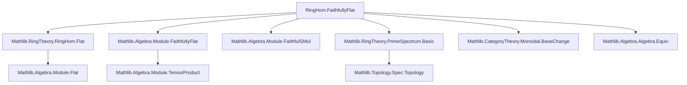

### Technical Brief: `FaithfullyFlat.lean`

---

#### **1. Key Definitions & Theorems**

| Name | Type | Purpose |
|------|------|---------|
| `FaithfullyFlat` | `R →+* S → Prop` | Defines a ring map $ f : R \to S $ as *faithfully flat* iff $ S $ is faithfully flat as an $ R $-module via $ f $. |
| `faithfullyFlat_algebraMap_iff` | `algebraMap R S. FaithfullyFlat ↔ Module.FaithfullyFlat R S` | Equates faithfulness of the structure map with module-theoretic faithfulness. |
| `iff_flat_and_comap_surjective` | `f.FaithfullyFlat ↔ f.Flat ∧ Function.Surjective (PrimeSpectrum.comap f)` | Characterizes faithful flatness as *flatness + surjectivity on prime spectra*. |
| `eq_and` | `FaithfullyFlat = fun f ↦ f.Flat ∧ Function.Surjective (PrimeSpectrum.comap f)` | Extensional equality showing the definition is equivalent to the above conjunction. |
| `flat` | `hf : f.FaithfullyFlat ⊢ f.Flat` | Extracts flatness from faithful flatness. |
| `stableUnderComposition` | `StableUnderComposition FaithfullyFlat` | Faithfully flat maps are closed under composition. |
| `of_bijective` | `hf : Function.Bijective f ⊢ f.FaithfullyFlat` | Bijective ring maps are faithfully flat. |
| `injective` | `hf : f.FaithfullyFlat ⊢ Function.Injective f` | Faithfully flat maps are injective. |
| `respectsIso` | `RespectsIso FaithfullyFlat` | Faithful flatness is preserved under isomorphisms (i.e., is invariant under ring isomorphisms). |
| `isStableUnderBaseChange` | `IsStableUnderBaseChange FaithfullyFlat` | Faithful flatness is stable under base change (i.e., tensoring). |

---

#### **2. Naming Conventions**

- **Prefixes**:
  - `faithfullyFlat_`: for lemmas about the predicate `FaithfullyFlat`.
  - `flat_`: inherited from `Flat`, used in equivalences (e.g., `flat_algebraMap_iff`).
- **Suffixes**:
  - `_iff`: for biconditional characterizations.
  - `_algebraMap`: for lemmas involving `algebraMap R S`.
- **Class/property names**:
  - `FaithfullyFlat` (definition), `Flat`, `FaithfulSMul`, `PrimeSpectrum.comap`.

---

#### **3. Tactic Stack**

| Tactic | Usage |
|--------|-------|
| `algebraize` | Converts module-theoretic statements to algebraic ones (and vice versa), especially for `algebraMap`. |
| `rw` | Rewriting using equivalences like `faithfullyFlat_algebraMap_iff`, `iff_flat_and_comap_surjective`. |
| `simp only` | Simplifying with specific lemmas (e.g., `FaithfullyFlat` definition). |
| `congr!` | Proving extensionality of definitions via congruence. |
| `exact` / `infer_instance` | Instantiating class instances (e.g., `Module.Flat R S`). |
| `ext` | Extensionality proofs (e.g., for `eq_and`). |
| `refine` + `?_` | Constructing proofs with holes filled later. |
| `have` + `rw` | Intermediate equalities (e.g., for ring isomorphism inverses). |

---

#### **4. Proof Logic**

- **Structure**: Most proofs follow a *definition → equivalence → decomposition* pattern:
  1. Unfold `FaithfullyFlat` via `algebraize` and `faithfullyFlat_algebraMap_iff`.
  2. Apply known equivalences (e.g., `flat_algebraMap_iff`, `PrimeSpectrum.comap_surjective_of_faithfullyFlat`).
  3. Use module-theoretic facts (e.g., `Module.FaithfullyFlat.of_comap_surjective`, `FaithfulSMul.algebraMap_injective`).
  4. For categorical properties (`stableUnderComposition`, `respectsIso`, `isStableUnderBaseChange`), rely on `StableUnderComposition`, `RespectsIso`, and `IsStableUnderBaseChange` infrastructure.

- **Common proof patterns**:
  - *Induction* is not used (no inductive types involved).
  - *Cases on hypotheses* (e.g., `hf : Function.Bijective f`) to extract ring isomorphisms.
  - *Algebraic rewriting* using `algebraMap_toAlgebra`, `RingEquiv.ofBijective`, and `PrimeSpectrum.comap_comp`.

---

#### **5. Imports**

- `Mathlib.RingTheory.RingHom.Flat`: Provides `Flat`, `flat_algebraMap_iff`, and related module-theoretic facts.
- Implicit dependencies:
  - `Mathlib.Algebra.Module.FaithfullyFlat`
  - `Mathlib.Algebra.Module.FaithfulSMul`
  - `Mathlib.RingTheory.PrimeSpectrum.Basic` (for `PrimeSpectrum.comap`)
  - `Mathlib.CategoryTheory.Monoidal.BaseChange`
  - `Mathlib.Algebra.Algebra.Equiv`
  - `Mathlib.Algebra.Algebra.Basic`

---

#### **6. Mermaid Diagrams**

##### **Dependency Graph**



##### **Overview of Theory Flow**

```mermaid
flowchart LR
  subgraph Definitions
    D1[FaithfullyFlat f] 
    D2[Module.FaithfullyFlat R S]
  end

  subgraph Equivalences
    E1[faithfullyFlat_algebraMap_iff]
    E2[iff_flat_and_comap_surjective]
  end

  subgraph Properties
    P1[flat]
    P2[of_bijective]
    P3[injective]
    P4[stableUnderComposition]
    P5[respectsIso]
    P6[isStableUnderBaseChange]
  end

  D1 -- def --> D2
  D2 -- E1 --> algebraMap
  D1 -- E2 --> Flat ∧ Surjective(comap)
  E2 --> P1
  E2 --> P2
  E2 --> P3
  P1 --> P4
  P2 --> P5
  P4 --> P6
```

---

#### **7. Summary**

This module formalizes *faithful flatness* for ring homomorphisms in Lean, aligning with the Stacks Project definition (Tag 00HB). It leverages:
- Module-theoretic faithful flatness,
- Geometric characterization via prime spectra,
- Categorical stability properties (composition, base change, isomorphism invariance).

The proofs are mostly algebraic and rely on `algebraize` to bridge algebra and module perspectives, with heavy use of existing infrastructure for flatness, faithful scalar multiplication, and prime spectrum topology.

--- 

Let me know if you'd like a formalization roadmap or a comparison with other approaches (e.g.,EGA, Stacks Project tags).
