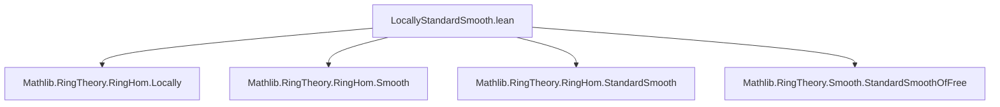
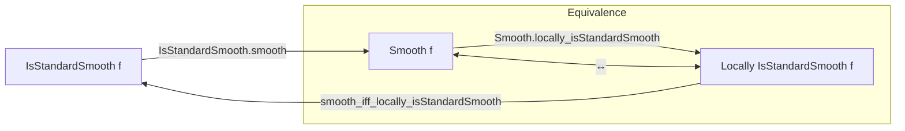

**Technical Brief: `LocallyStandardSmooth.lean`**

---

### 1. **Key Definitions & Theorems**

| Name | Type / Signature | Purpose |
|------|------------------|---------|
| `IsStandardSmooth` | `RingHom → Prop` | Predicate stating a ring homomorphism is *standard smooth* (finitely presented and satisfies the infinitesimal lifting property w.r.t. square-zero extensions). |
| `Smooth` | `RingHom → Prop` | Predicate for *smoothness* of a ring map (locally of finite presentation + formally smooth). |
| `Locally P f` | `∀ (U : Submonoid R), P (Localization.map f U)` | Local property: holds after localization at any multiplicative subset. |
| `IsStandardSmooth.smooth` | `IsStandardSmooth f → Smooth f` | Standard smooth ⇒ smooth (easy direction). |
| `Smooth.locally_isStandardSmooth` | `Smooth f → Locally IsStandardSmooth f` | Smooth ⇒ locally standard smooth (nontrivial direction, uses existence of a covering by standard smooth maps). |
| `smooth_iff_locally_isStandardSmooth` | `Smooth f ↔ Locally IsStandardSmooth f` | Main equivalence: smoothness is equivalent to being *locally* standard smooth. |

---

### 2. **Naming Conventions**

- **Predicate prefixes**:  
  - `IsStandardSmooth`, `Smooth` — standard Lean style for properties of morphisms.
- **Property names**:  
  - `locally_isStandardSmooth` — compound name indicating *locally* satisfies `IsStandardSmooth`.
- **Lemma naming pattern**:  
  - `Property.lemmaName` (e.g., `Smooth.locally_isStandardSmooth`) — indicates the lemma lives in the `Smooth` namespace and concerns a derived property.
- **Tactic-driven naming**:  
  - `algebraize`, `infer_instance` — Lean-specific tactics used to bridge algebraic structures with typeclass inference.

---

### 3. **Tactic Stack**

| Tactic | Usage |
|--------|-------|
| `algebraize [f]` | Converts algebraic statements into ring homomorphism form; used to normalize algebra-related goals. |
| `rw [...]` | Rewriting using definitions (`RingHom.Smooth`, `IsScalarTower.algebraMap_eq`, etc.). |
| `infer_instance` | Solves typeclass goals (e.g., `SMul R S`, `Algebra R S`) automatically. |
| `obtain ⟨s, hs, h⟩ := ...` | Extracts a witness from an existential statement. |
| `refine ⟨..., fun t ht ↦ ?_⟩` | Constructs a dependent pair (here, a localization cover + local standard smoothness). |
| `dsimp only` | Simplifies definitions with `only`-mode (avoids over-simplification). |
| `exact h t ht` | Applies a hypothesis to concrete arguments. |

No heavy automation (e.g., `aesop`, `ring`, `simp`) is used — the proofs are largely *constructive* and rely on algebraic structure and known lemmas.

---

### 4. **Proof Logic**

- **Direction 1 (`IsStandardSmooth.smooth`)**:  
  Immediate from definitions: standard smooth ⇒ smooth (by `algebraize` + `rw [RingHom.Smooth]` + `infer_instance`).

- **Direction 2 (`Smooth.locally_isStandardSmooth`)**:  
  Uses the *local nature* of smoothness:
  1. From `hf : Smooth f`, apply `Algebra.Smooth.exists_span_eq_top_isStandardSmooth` to get a finite cover `s` such that localization at `s` is standard smooth.
  2. For any localization `t` refining `s`, show `IsStandardSmooth` holds by transporting along algebra maps and using `isStandardSmooth_algebraMap`.

- **Equivalence (`smooth_iff_locally_isStandardSmooth`)**:  
  - `→`: Apply `Smooth.locally_isStandardSmooth`.
  - `←`: Use a localization criterion:  
    `locally_of_locally` + `Smooth.ofLocalizationSpanTarget` + `Smooth.propertyIsLocal.respectsIso`.  
    This leverages that smoothness is a *local property* w.r.t. the topology generated by localization spans.

---

### 5. **Imports**

| Import | Role |
|--------|------|
| `Mathlib.RingTheory.RingHom.Locally` | Defines `Locally P f`, localization-based local properties. |
| `Mathlib.RingTheory.RingHom.Smooth` | Defines `Smooth f`, smoothness of ring maps. |
| `Mathlib.RingTheory.RingHom.StandardSmooth` | Defines `IsStandardSmooth f`, standard smoothness. |
| `Mathlib.RingTheory.Smooth.StandardSmoothOfFree` | Provides key lemmas like `exists_span_eq_top_isStandardSmooth`, `isStandardSmooth_algebraMap`. |

These imports define the *core theory* of smoothness and its variants.

---

### 6. **Mermaid Diagrams**

#### **Dependency Graph (Module Level)**



#### **Theoretical Overview (Conceptual Flow)**



#### **Proof Structure (High-Level)**

```mermaid
flowchart LR
  Smooth f
    -->[Smooth.locally_isStandardSmooth]
    Locally IsStandardSmooth f
  Locally IsStandardSmooth f
    -->[smooth_iff_locally_isStandardSmooth (←)]
    Smooth f
  IsStandardSmooth f
    -->[IsStandardSmooth.smooth]
    Smooth f
```

---

### 7. **Summary**

This file establishes a foundational equivalence:  
**Smoothness of a ring homomorphism is equivalent to being locally standard smooth**,  
i.e., smoothness can be checked after localizing at finitely many elements where the map becomes standard smooth.

This bridges *local* (standard smooth) and *global* (smooth) properties — a key step in deformation theory, algebraic geometry, and derived algebraic geometry.

--- 

Let me know if you'd like a formalized dependency graph (e.g., `leanpkg` tree) or a visualization of the `Locally` predicate semantics.
