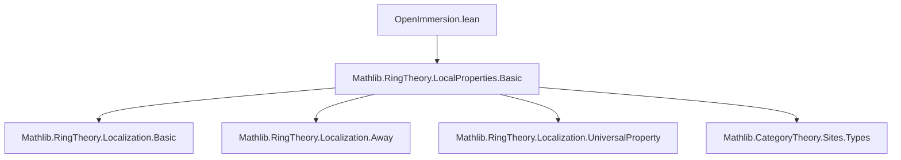
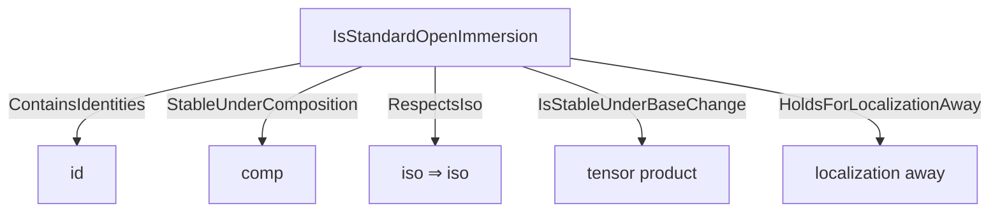

### Technical Brief: `OpenImmersion.lean`

---

#### **1. Key Definitions & Theorems**

| Name | Type | Purpose |
|------|------|---------|
| `Algebra.IsStandardOpenImmersion` | `Prop` | States that an algebra map $ R \to S $ is a localization away from some element $ r \in R $: $ \exists r, \text{IsLocalization.Away } r\ S $. |
| `RingHom.IsStandardOpenImmersion` | `Prop` | Lifts the above to ring homomorphisms: $ f : R \to S $ is a standard open immersion iff its induced algebra structure satisfies `Algebra.IsStandardOpenImmersion`. |
| `IsStandardOpenImmersion.exists_away` | `∃ r : R, IsLocalization.Away r S` | Witness for the localization element. |
| `IsStandardOpenImmersion.trans` | `[Algebra R S] [Algebra S T] [IsScalarTower R S T] → IsStandardOpenImmersion R S → IsStandardOpenImmersion S T → IsStandardOpenImmersion R T` | Transitivity of standard open immersions via composition of localizations. |
| `IsStandardOpenImmersion.of_bijective` | `Function.Bijective f → f.IsStandardOpenImmersion` | Bijective ring maps are standard open immersions (since localization by unit is iso). |
| `IsStandardOpenImmersion.id` | `(RingHom.id R).IsStandardOpenImmersion` | Identity maps are standard open immersions. |
| `IsStandardOpenImmersion.comp` | `f.IsStandardOpenImmersion → g.IsStandardOpenImmersion → (g.comp f).IsStandardOpenImmersion` | Closed under composition. |
| `IsStandardOpenImmersion.algebraMap` | `r : R → [IsLocalization.Away r S] → (algebraMap R S).IsStandardOpenImmersion` | Localization maps $ R \to R_r $ are standard open immersions. |
| `IsStandardOpenImmersion.toAlgebra` | `f.IsStandardOpenImmersion → f.toAlgebra` satisfies `Algebra.IsStandardOpenImmersion` | Bridge between ring-hom and algebra versions. |
| `IsStandardOpenImmersion.isStableUnderBaseChange` | `IsStableUnderBaseChange IsStandardOpenImmersion` | Stable under base change: $ S \otimes_R T $ inherits the property if $ R \to T $ is. |
| `IsStandardOpenImmersion.holdsForLocalizationAway` | `HoldsForLocalizationAway IsStandardOpenImmersion` | Holds for localization away from any element. |

---

#### **2. Naming Conventions**

- **Prefixes**:
  - `isStandardOpenImmersion_`: for lemmas about the predicate (e.g., `isStandardOpenImmersion_algebraMap`).
  - `of_`: for constructing instances from structural properties (`of_bijective`, `of_associated`).
- **Suffixes**:
  - `_algebraMap`: for equivalences involving `algebraMap`.
  - `_trans`, `_comp`, `_id`: for categorical properties (transitivity, composition, identity).
- **Class names**:
  - `IsStandardOpenImmersion` (both for `Algebra` and `RingHom`) — follows Lean’s `is_` predicate convention.

---

#### **3. Tactic Stack**

| Tactic | Usage |
|--------|-------|
| `algebraize` | Converts between ring hom and algebra formulations (e.g., in `comp`, `isStandardOpenImmersion_algebraMap`). |
| `rw [← or →]` | Rewriting using `mk_iff`-generated lemmas (`isStandardOpenImmersion_algebraMap`). |
| `obtain ⟨r, hr⟩ := hf` | Extracting the witness from `exists_away`. |
| `infer_instance` | Automatically constructing instances (e.g., `⟨r, inferInstance⟩`). |
| `exact .trans _ S _` | Applying transitivity lemma with intermediate object `S`. |
| `introv`, `infer_instance`, `refine`, `exact` | Standard proof scripting in this context. |

---

#### **4. Proof Logic**

- **Inductive/constructive style**: Proofs are mostly *constructive*, building witnesses explicitly.
- **Common pattern**:
  1. Extract witnesses $ r, s $ from assumptions using `exists_away`.
  2. Use structural lemmas (`trans`, `mul'`, `of_associated`, `associated_sec_fst`) to combine or lift properties.
  3. Apply `algebraize` to switch between ring and algebra settings.
  4. Use `infer_instance` to discharge class constraints (e.g., `IsLocalization.Away`).
- **Categorical reasoning**: Properties like `stableUnderComposition`, `respectsIso`, `isStableUnderBaseChange` are proven using general infrastructure (`ContainsIdentities`, `StableUnderComposition`, `RespectsIso`, `IsStableUnderBaseChange.mk`).

---

#### **5. Imports & Dependencies**

| Import | Role |
|--------|------|
| `Mathlib.RingTheory.LocalProperties.Basic` | Provides `IsLocalization`, `Away`, `IsLocalization.Away`, `IsLocalization.of_associated`, `associated_sec_fst`, etc. |

This module builds directly on localization theory in Mathlib, especially the `Away` construction and its universal property.

---

#### **6. Mermaid Diagrams**

##### **Dependency Graph (Module-Level)**



##### **Conceptual Overview (Theory Flow)**

```mermaid
graph LR
  A[Ring Hom f: R → S] -->|defines| B[Algebra R S]
  B -->|iff| C[IsStandardOpenImmersion R S]
  C -->|exists| D[∃ r, IsLocalization.Away r S]
  D -->|construction| E[Localization.Away r]
  E -->|base change| F[S ⊗[R] Localization.Away r]
  C -->|closed under| G[Composition]
  C -->|closed under| H[Identity]
  C -->|closed under| I[Base Change]
  C -->|closed under| J[Bijective maps]
```

##### **Categorical Structure**



---

#### **7. Summary**

This module formalizes *standard open immersions* — ring maps that are localizations at a single element — in both the algebraic (`Algebra`) and categorical (`RingHom`) settings. It establishes that this class forms a *stable under composition, contains identities, respects isomorphisms, and is stable under base change* system — making it suitable for gluing in algebraic geometry (e.g., as a Grothendieck topology basis). The proofs rely heavily on the universal properties of localization and the `Away` construction, with heavy use of `algebraize` to bridge ring and module-theoretic perspectives.

--- 

Let me know if you'd like a formalized summary in `leanpkg.toml` format or a dependency graph for the entire `OpenImmersion` project.
