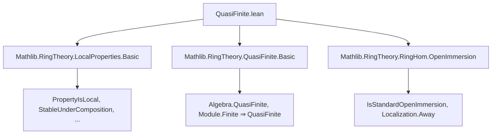
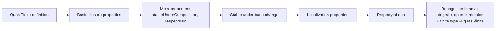

**Technical Brief: `QuasiFinite.lean`**

---

### 1. **Key Definitions & Theorems**

| Name | Type / Signature | Purpose |
|------|------------------|---------|
| `QuasiFinite` | `QuasiFinite {R S : Type*} [CommRing R] [CommRing S] (f : R →+* S) : Prop` | Defines a ring homomorphism `f : R →+* S` as *quasi-finite* iff the induced algebra structure makes `S` a quasi-finite `R`-algebra. |
| `quasiFinite_algebraMap` | `(algebraMap R S).QuasiFinite ↔ Algebra.QuasiFinite R S` | Equates quasi-finiteness of the structure map with quasi-finiteness of the algebra. |
| `QuasiFinite.comp` | `f.QuasiFinite → g.QuasiFinite → (f.comp g).QuasiFinite` | Stability under composition: composition of quasi-finite maps is quasi-finite. |
| `QuasiFinite.of_comp` | `(f.comp g).QuasiFinite → f.QuasiFinite` | If a composite is quasi-finite, then the *target* map is quasi-finite. |
| `QuasiFinite.of_finite` | `f.Finite → f.QuasiFinite` | Finite ring maps are quasi-finite. |
| `QuasiFinite.stableUnderComposition` | `StableUnderComposition QuasiFinite` | Encodes closure under composition as a meta-property. |
| `QuasiFinite.respectsIso` | `RespectsIso QuasiFinite` | Quasi-finiteness is preserved under isomorphism of ring maps. |
| `QuasiFinite.isStableUnderBaseChange` | `IsStableUnderBaseChange QuasiFinite` | Stable under base change (pullback along arbitrary ring maps). |
| `QuasiFinite.holdsForLocalizationAway` | `HoldsForLocalizationAway QuasiFinite` | Holds after localizing away from a single element. |
| `QuasiFinite.ofLocalizationSpanTarget` | `OfLocalizationSpanTarget QuasiFinite` | Holds for maps factoring through localization at a multiplicative set (spanning target). |
| `QuasiFinite.propertyIsLocal` | `PropertyIsLocal QuasiFinite` | Quasi-finiteness is a *local* property on the base (in the sense of Stacks Project Tag 00QX). |
| `QuasiFinite.of_isIntegral_of_finiteType` | `f.IsIntegral → g.IsStandardOpenImmersion → (g.comp f).FiniteType → (g.comp f).QuasiFinite` | A key structural lemma: if `S → T` is a standard open immersion and `R → T` is finite type and integral over `R`, then `R → T` is quasi-finite. |

---

### 2. **Naming Conventions**

- **Prefixes**:
  - `QuasiFinite.`: Main namespace for definitions/lemmas about quasi-finiteness.
  - `is_`, `of_`, `comp`, `respectsIso`, `stableUnder`, `holdsFor`, `ofLocalizationSpan`, `propertyIsLocal`: Standard naming for meta-properties in the *local properties* hierarchy.
- **Suffixes**:
  - `algebraize`: Used in `algebraize` tactic calls to lift algebraic facts to ring-hom level.
  - `toAlgebra`: Helper lemma for `algebraize` (e.g., `QuasiFinite.toAlgebra`).
- **Variable naming**:
  - `f`, `g`, `h`: Ring homomorphisms.
  - `R`, `S`, `T`: Commutative rings.
  - `r`, `s`: Elements/multiplicative sets (e.g., `r : s`).
  - `P`, `J`, `I`: Primes/ideals in spectrum arguments.

---

### 3. **Tactic Stack**

- `algebraize [...]`: Core tactic to lift algebraic properties to ring hom level (custom to this codebase).
- `exact .trans R S T`, `exact .of_restrictScalars R S T`: Use of inferred algebra morphism lemmas.
- `infer_instance`: To discharge typeclass goals (e.g., `Algebra.QuasiFinite` from `Module.Finite`).
- `rw [...] at H ⊢`: Rewriting using equivalences like `quasiFinite_algebraMap`.
- `simp only [...]`, `simp [...]`: Simplification using algebraic identities (e.g., `map_zero`, `Pi.zero_apply`).
- `ext`, `apply eq_zero_of_localization`, `congr($hψ a).symm.trans`: Advanced tactic chaining for equality proofs.
- `have / obtain / suffices`: Standard Lean proof structuring.

---

### 4. **Proof Logic**

- **Meta-property reasoning**: Most lemmas follow a *property hierarchy* pattern:
  - Prove basic closure properties (`comp`, `of_finite`, `respectsIso`).
  - Show stability under base change (`isStableUnderBaseChange`).
  - Prove localness via localization properties (`holdsForLocalizationAway`, `ofLocalizationSpanTarget`).
  - Conclude `PropertyIsLocal` using a standard template (`propertyIsLocal`).
- **Localization arguments**:
  - Use of fiber diagrams over primes, residue fields, and localization maps.
  - Injectivity proofs via localization: reduce to localizations where elements become invertible.
  - Key step: construct a map into a product of finite modules over residue fields, then use Noetherianity and injectivity.
- **Structural lemmas**:
  - `of_isIntegral_of_finiteType`: Combines integrality, open immersion, and finite type to deduce quasi-finiteness — a key “recognition principle”.

---

### 5. **Imports & Dependencies**

| Import | Purpose |
|--------|---------|
| `Mathlib.RingTheory.LocalProperties.Basic` | Framework for local properties (`PropertyIsLocal`, `StableUnderComposition`, etc.). |
| `Mathlib.RingTheory.QuasiFinite.Basic` | Core definitions: `Algebra.QuasiFinite`, basic lemmas. |
| `Mathlib.RingTheory.RingHom.OpenImmersion` | Theory of open immersions (e.g., `IsStandardOpenImmersion`). |

---

### 6. **Mermaid Diagrams**

#### **Dependency Graph (Module-Level)**

#### **Overview of Theory Flow**

---

### 7. **Key Insight**

This file formalizes the *local nature* of quasi-finiteness in commutative algebra, building on a hierarchy of meta-properties (as in the Stacks Project). It culminates in a practical recognition principle (`of_isIntegral_of_finiteType`) used to verify quasi-finiteness in geometric contexts (e.g., morphisms of finite type that are locally open immersions and integral). The heavy use of `algebraize` and localization arguments reflects modern Lean formalization of relative algebraic geometry.
