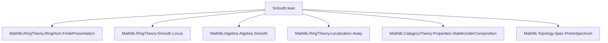
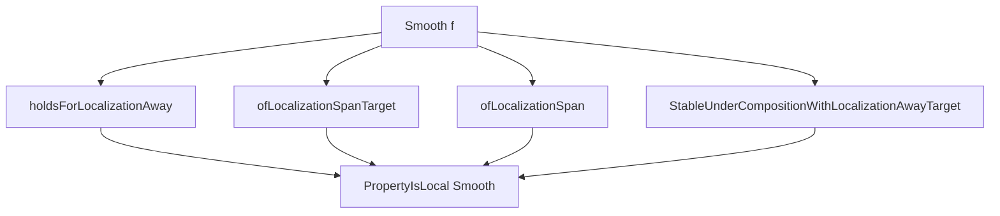

**Technical Brief: Smooth Ring Homomorphisms in Lean 4 (`Smooth.lean`)**  
*Based on the file `Smooth.lean` from the Yang mathlib extension (2025)*

---

### 1. **Key Definitions & Theorems**

| Name | Type / Signature | Purpose |
|------|------------------|---------|
| `FormallySmooth` | `RingHom → Prop` | Defines formal smoothness of a ring homomorphism `f : R →+* S` via `Algebra.FormallySmooth R S` on the induced algebra structure. |
| `Smooth` | `RingHom → Prop` | Defines smoothness: `f` is smooth iff it is formally smooth *and* finitely presented. |
| `formallySmooth_algebraMap` | `(algebraMap R S).FormallySmooth ↔ Algebra.FormallySmooth R S` | Relates smoothness of the structure map to algebra smoothness. |
| `smooth_def` | `f.Smooth ↔ f.FormallySmooth ∧ f.FinitePresentation` | Equivalence characterizing smoothness. |
| `FormallySmooth.of_bijective` | `Function.Bijective f → f.FormallySmooth` | Bijective maps are formally smooth. |
| `Smooth.of_bijective` | `Function.Bijective f → f.Smooth` | Bijective maps are smooth (uses `smooth_def`). |
| `Smooth.comp` | `f.Smooth → g.Smooth → (g.comp f).Smooth` | Smoothness is closed under composition. |
| `Smooth.stableUnderComposition` | `StableUnderComposition Smooth` | Abstract stability under composition. |
| `Smooth.isStableUnderBaseChange` | `IsStableUnderBaseChange Smooth` | Smoothness is preserved under base change. |
| `Smooth.holdsForLocalizationAway` | `HoldsForLocalizationAway Smooth` | Smoothness holds after inverting a single element. |
| `Smooth.propertyIsLocal` | `PropertyIsLocal Smooth` | Smoothness is a local property (in the Zariski topology on `Spec S`). |
| `Smooth.ofLocalizationSpanTarget` | `OfLocalizationSpanTarget Smooth` | Smoothness descends from a covering by basic opens `D(r_i)` where each pullback is smooth. |

---

### 2. **Naming Conventions**

- **Prefixes**:
  - `formallySmooth_`, `smooth_`: for lemmas about the two notions.
  - `of_`, `holdsFor_`, `stableUnder_`, `isStableUnder_`, `localization_`: for structural properties (e.g., `of_bijective`, `holdsForLocalizationAway`, `stableUnderComposition`).
- **Suffixes**:
  - `_algebraMap`: for equivalences involving `algebraMap`.
  - `_iff`: for biconditional lemmas (e.g., `smooth_algebraMap`).
  - `_def`: for definitional equivalences (`smooth_def`).
- **Module/namespace structure**:
  - `RingHom.FormallySmooth`, `RingHom.Smooth`: definitions.
  - `RingHom.Smooth.*`: lemmas about `Smooth`, grouped under `namespace Smooth`.

---

### 3. **Tactic Stack**

| Tactic | Usage Frequency | Purpose |
|--------|-----------------|---------|
| `algebraize` | Very High | Converts algebraic properties to ring homomorphism properties via `toAlgebra`. |
| `rw [...]` | High | Rewriting using equivalences like `smooth_def`, `formallySmooth_algebraMap`. |
| `simp only [...]` | Medium | Simplifying with structured data (e.g., `TopologicalSpace.Opens.coe_iSup`). |
| `exact`, `refine`, `convert` | Medium | Constructing proofs, especially when combining lemmas. |
| `infer_instance` | Low | Inferring algebra structures. |
| `aesop` | Not present | Not used in this file. |
| `ring` | Not present | Not needed (no arithmetic simplification). |

---

### 4. **Proof Logic**

- **Structure**: Proofs follow a *modular descent strategy*:
  1. **Reduction to algebraic setting** via `algebraize` and `toAlgebra`.
  2. **Use of known algebraic lemmas** (e.g., `Algebra.FormallySmooth.of_isLocalization`, `Algebra.Smooth.comp`).
  3. **Logical decomposition** using `smooth_def` to split into formal smoothness + finite presentation.
  4. **Local-to-global arguments** via `PropertyIsLocal` infrastructure:
     - Prove stability under localization away (`holdsForLocalizationAway`).
     - Prove descent along covering by basic opens (`ofLocalizationSpanTarget`).
     - Combine to conclude locality (`propertyIsLocal`).

- **Typical proof pattern**:
  ```lean
  rw [smooth_def]
  exact ⟨formal_smooth_part, finite_presentation_part⟩
  ```

- **Induction is not used**; proofs rely on categorical properties (stability conditions, localization, base change).

---

### 5. **Imports & Dependencies**

| Import | Role |
|--------|------|
| `Mathlib.RingTheory.RingHom.FinitePresentation` | Provides `FinitePresentation` and its stability properties. |
| `Mathlib.RingTheory.Smooth.Locus` | Defines `smoothLocus`, `basicOpen_subset_smoothLocus_iff`, and related topology. |
| `Mathlib.Algebra.Algebra.Smooth` (via `Algebra.FormallySmooth`, `Algebra.Smooth`) | Core algebraic smoothness notions. |
| `Mathlib.RingTheory.Localization.Away`, `Localization.Pi`, `Localization.Span` | For localization and covering arguments. |
| `Mathlib.CategoryTheory.Properties.StableUnder...` | Infrastructure for `StableUnderComposition`, `IsStableUnderBaseChange`, etc. |
| `Mathlib.Topology.Spec.PrimeSpectrum` | For `PrimeSpectrum`, `basicOpen`, `iSup`, topology on `Spec`. |

---

### 6. **Mermaid Diagrams**

#### **Dependency Graph (Module-Level)**



#### **Conceptual Overview (Theory Flow)**

```mermaid
flowchart LR
  A[Ring Hom f: R → S] --> B{Formally Smooth?}
  A --> C{Finite Presentation?}
  B --> D[FormallySmooth f]
  C --> E[FinitePresentation f]
  D & E --> F[Smooth f]
  
  F --> G[Stable under composition]
  F --> H[Stable under base change]
  F --> I[Local property]
  I --> J[Localization away]
  I --> K[Covering by D(r)]
```

#### **Proof Strategy for `propertyIsLocal`**



---

### 7. **Summary**

This file formalizes **smoothness of ring homomorphisms** as a *local property* in the Zariski topology, building on the algebraic notion of smoothness for ring extensions. It leverages:
- The equivalence `f.smooth ↔ f.formallySmooth ∧ f.finitePresentation`,
- Stability under composition, base change, and localization,
- A local-to-global principle (`propertyIsLocal`) proven via descent along basic opens.

The formalization is highly structured, using `algebraize`, `stability` typeclasses, and topological tools (`smoothLocus`, `basicOpen`) to bridge algebra and geometry.

--- 

*End of Technical Brief.*
