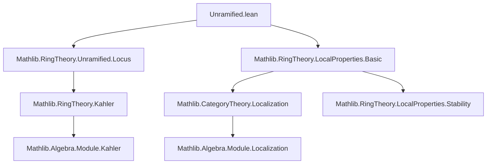
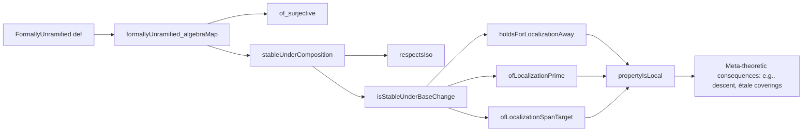

**Technical Brief: `Unramified.lean` — Meta-Properties of Unramified Ring Homomorphisms**

---

### 1. **Key Definitions & Theorems**

| Name | Type / Signature | Purpose |
|------|------------------|---------|
| `FormallyUnramified` | `def FormallyUnramified (f : R →+* S) : Prop` | Defines a ring homomorphism $f : R \to S$ as *formally unramified* iff the module of Kähler differentials $\Omega_{S/R}$ is trivial; equivalently, `Algebra.FormallyUnramified R S` under the induced algebra structure. |
| `formallyUnramified_algebraMap` | `lemma` | Equivalence between `FormallyUnramified (algebraMap R S)` and `Algebra.FormallyUnramified R S`. Used to switch between homomorphism- and algebra-centric views. |
| `of_surjective` | `lemma` | Surjective ring maps are formally unramified. |
| `stableUnderComposition` | `lemma` | Formal unramifiedness is stable under composition: if $f$ and $g$ are formally unramified, so is $g \circ f$. |
| `respectsIso` | `lemma` | Formal unramifiedness respects isomorphisms (via surjectivity of iso). |
| `isStableUnderBaseChange` | `lemma` | Formal unramifiedness is stable under base change (i.e., tensoring along any ring map). |
| `holdsForLocalizationAway` | `lemma` | Formal unramifiedness holds after localizing away from any multiplicative set (e.g., $S_r$). |
| `ofLocalizationPrime` | `lemma` | Formal unramifiedness can be checked at localizations at prime ideals: if $R \to S$ is formally unramified, then so is $R_{\mathfrak{p}} \to S_{\mathfrak{q}}$ for $\mathfrak{q} \mapsto \mathfrak{p}$. |
| `ofLocalizationSpanTarget` | `lemma` | Formal unramifiedness descends from a localization at a single element $s$ to the whole spectrum if it holds on a covering by basic opens $\mathrm{D}(s_i)$. |
| `propertyIsLocal` | `lemma` | Formal unramifiedness is a *local property* on the target (in the Zariski topology), satisfying the four conditions of `PropertyIsLocal`. |

---

### 2. **Naming Conventions**

- **Prefixes**:
  - `formallyUnramified_`: for lemmas about equivalence with algebraic formulation.
  - `of_`: for implications *from* a stronger condition to formal unramifiedness (e.g., `of_surjective`, `ofLocalizationPrime`).
  - `isStableUnder_`, `stableUnder_`, `respects_`, `holdsFor_`, `Of_`: for meta-properties (stability, descent, etc.).
- **Suffixes**:
  - `_algebraMap`: for lemmas relating homomorphism-based and algebra-based definitions.
  - `_iff`: implicit in `algebraize`-based rewrites (e.g., `formallyUnramified_algebraMap`).
- **`algebraize` tactic usage**: indicates automatic translation between `RingHom`- and `Algebra`-centric formulations.

---

### 3. **Tactic Stack**

| Tactic | Frequency / Role |
|--------|------------------|
| `algebraize` | Dominant: used to translate between `RingHom.FormallyUnramified` and `Algebra.FormallyUnramified`. |
| `rw` | Frequent: for rewriting using equivalences like `formallyUnramified_algebraMap`, `← algebraMap_toAlgebra`, etc. |
| `infer_instance` | Used to discharge algebra/structure class instances after rewriting. |
| `exact`, `convert`, `refine` | For constructing proofs using existing lemmas or partial matches. |
| `dsimp` | Simplification of definitional equalities (e.g., in `ofLocalizationSpanTarget`). |
| `simpa` | In `ofLocalizationSpanTarget`, to extract existence of covering elements. |

---

### 4. **Proof Logic**

- **Meta-property proofs** follow a *localization descent* pattern:
  1. Reduce to checking formal unramifiedness at localizations (e.g., at primes or basic opens).
  2. Use known results about Kähler differentials under localization: $\Omega_{S/R} \otimes_S S_f \cong \Omega_{S_f/R}$.
  3. Apply algebraic facts (e.g., $\Omega = 0$ descends along covering families).
- **Structure of `propertyIsLocal`**:
  - Uses `PropertyIsLocal` interface: checks four conditions:
    1. Stability under base change (via `isStableUnderBaseChange.localizationPreserves.away`)
    2. Stability under localization at a single element (`ofLocalizationSpanTarget`)
    3. Stability under localization away from powers (`ofLocalizationSpanTarget.ofLocalizationSpan`)
    4. Stability under composition with localization away (`stableUnderComposition.stableUnderCompositionWithLocalizationAway`)
- **Inductive/pointwise reasoning**: Many proofs reduce to checking at each point $x \in \mathrm{Spec}(S)$, using `Set.eq_univ_iff_forall`.

---

### 5. **Imports & Dependencies**

| Module | Role |
|--------|------|
| `Mathlib.RingTheory.Unramified.Locus` | Provides `unramifiedLocus`, `basicOpen_subset_unramifiedLocus_iff`, and algebraic characterizations. |
| `Mathlib.RingTheory.LocalProperties.Basic` | Defines `PropertyIsLocal`, `StableUnderComposition`, `IsStableUnderBaseChange`, etc., the meta-property interfaces. |
| `Algebra.FormallyUnramified` | Implicit via `algebraize`; provides the core algebraic definition. |
| `Localization` (via `Localization.AtPrime`, `localRingHom`, etc.) | Used for localizations at primes and multiplicative sets. |

---

### 6. **Mermaid Diagrams**

#### **Dependency Graph (Module-Level)**

#### **Overview of File Logic Flow**

---

### 7. **Key Meta-Properties Encoded**

- **Stability**: under composition, base change, isomorphism.
- **Localization behavior**: holds after localization away from elements, at primes, and over basic opens.
- **Locality**: satisfies the four axioms of `PropertyIsLocal`, enabling descent arguments (e.g., in defining étale morphisms as formally unramified + flat + locally of finite presentation).

---

### 8. **Formalization Notes**

- Uses `algebraize` extensively to bridge `RingHom` and `Algebra` worlds — a pattern common in Mathlib for properties defined via module structures.
- Leverages `PrimeSpectrum` and `Localization` infrastructure for pointwise arguments.
- The `ofLocalizationSpanTarget` lemma is critical for Zariski-local descent: it shows that checking formal unramifiedness on a covering by basic opens suffices.

--- 

Let me know if you'd like a companion file (e.g., `Etale.lean`) or a formal proof outline for `propertyIsLocal`.
